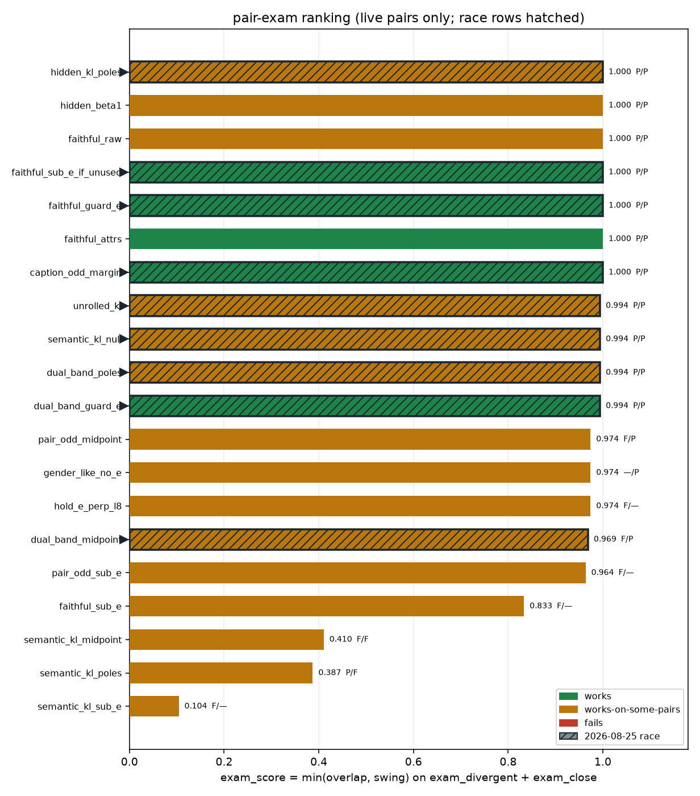
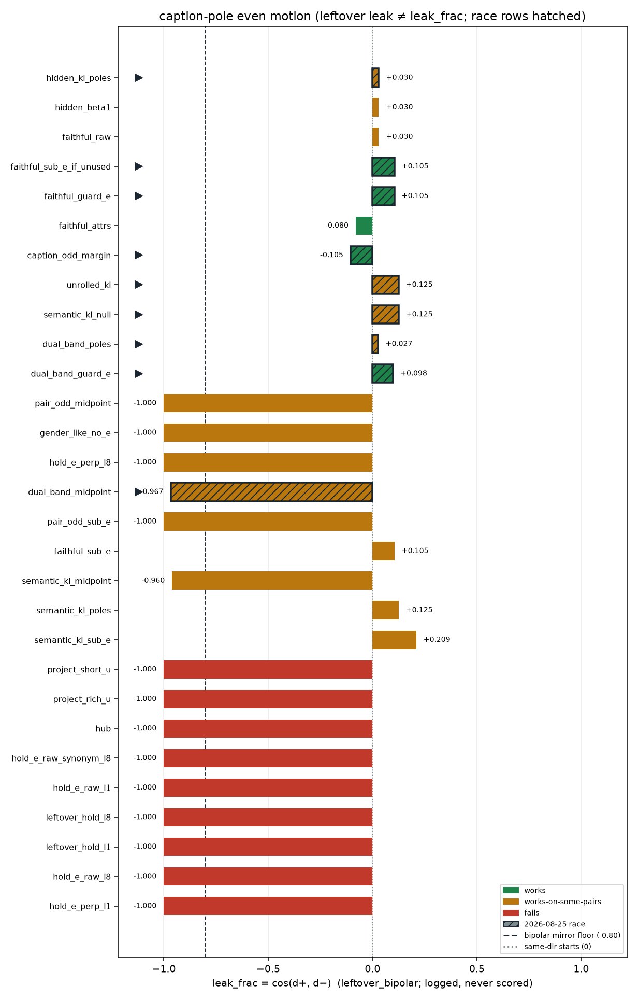
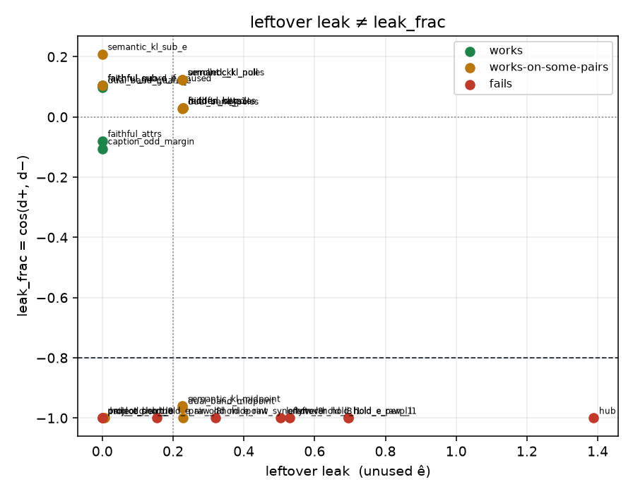
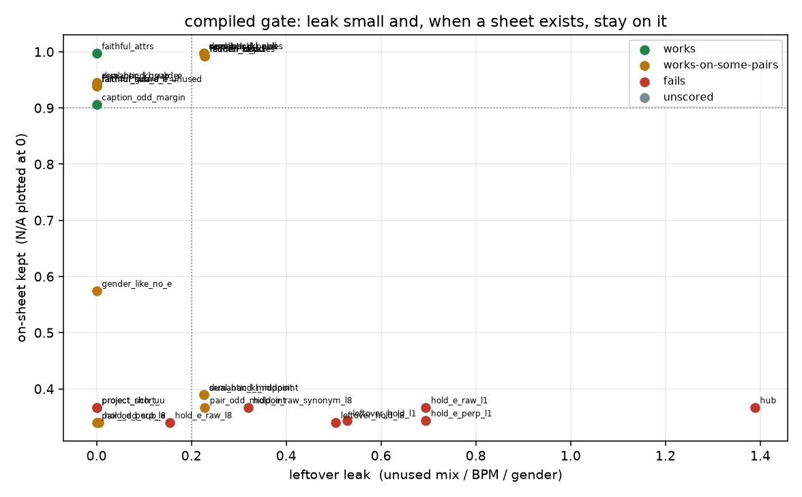

# 2-D / high-D / sheet / pair-exam scoreboard

Generated by `analysis/slider2d/run_lm_scoreboard.py`. CPU only, no Hub,
no GPU, no Music 3 weights. Does not change the live trainer default.

Every other cell in this repo scores one question. This page joins
those real fixture numbers into one table and applies one gate. It
does not invent a loss.

## The exam this board is graded on

Three live Music 3 runs, 2026-08-25, after the #24 wire. rank 8 /
alpha 8 / lr 5e-4 / 800 steps / seed 7 / `--no-early_stop` / endreg 1.0
/ hold 0, pair-odd early-stop gates deliberately off.

| live run | recipe | prompts | c+ | ±1 | p% / n% | loss | ears |
|---|---|---|---:|---:|---:|---:|---|
| `energy-lm-v16` | `--lm_target faithful_sub_e --pole_mode semantic_kl` | `prompts-energy-v4.yaml` | +0.690 | -0.313 | 0.73 / 0.76 | 0.0188 | FAIL — random words, like the midpoint got pulled |
| `energy-lm-v18` | `--lm_target faithful --pole_mode semantic_kl` | `prompts-energy-v4.yaml` | +0.797 | -0.354 | 0.60 / 0.70 | 0.0167 | PASS — sounds pretty good; a genre/BPM ride, and those are the poles |
| `gender-lm-v16` | `--lm_target faithful --pole_mode semantic_kl` | `prompts-gender-v4.yaml` | +0.854 | -0.458 | 0.52 / 0.78 | 0.0091 | FAIL — garbled lyrics; the KL loss is tiny and the hidden never arrived |

Two of those are the **same recipe** on different prompt files, and
the one with the smallest loss, the best `c+` and the lowest `p%` is
one of the two that garbled. So a recipe is not one row: it is a
**recipe × pair** grid. The sortable number is `exam_score` =
`min(overlap, swing)` over the live exam pairs that row is read on.

| live run | fixture row | pair | predicted | ears | agrees | why |
|---|---|---|---|---|---|---|
| `energy-lm-v16` | `semantic_kl_sub_e` | `divergent` | **FAIL** | **FAIL** | yes | alternates between the two songs; no audible swing; because blend teacher + axis eaten by ê + KL-small / hidden-far |
| `energy-lm-v18` | `semantic_kl_poles` | `divergent` | **PASS** | **PASS** | yes | on-continuation (despite KL-small / hidden-far) |
| `gender-lm-v16` | `semantic_kl_poles` | `close` | **FAIL** | **FAIL** | yes | no audible swing; because KL-small / hidden-far |

3 of 3 agree. Full derivation, sweeps and caveats in
[lm-pair-exam.md](lm-pair-exam.md).

## The compiled gate

A recipe WORKS only if **every pair it has a reading on** passes. On a pair-exam cell that means the student's own continuation stays on the pole caption's words (overlap ≥ 0.85, position-wise agreement ≥ 0.75 of the pole's own self-agreement), sings nothing off-caption (≤ 0.05), never alternates between the two songs (≥ 0.9), keeps the pole pair's audible swing (≥ 0.6). Unused-attribute leak is scored on the #22 sheet cells (≤ 0.2), which read one token and can see an attribute tilt the pair-exam rollout averages away. On a #22 sheet cell it means leftover leak ≤ 0.2, on-sheet kept ≥ 0.9, off-sheet mass ≤ 0.05, argmax-on-sheet = 1 and concept swing kept ≥ 0.6. leftover leak is unused ê, not leak_frac = cos(d+, d−). Pair-odd cos, ±1 collapse, leak_frac / same_dir, the pole loss and p%/n% are logged and never scored. The sortable number is exam_score = min(overlap, swing) over the live exam pairs that row is read on (divergent / close). unused_e and the sheet cells are other questions and are not folded in. A pair with no reading is skipped; a recipe with no live-pair reading is null and sorts last. works-on-some-pairs means the recipe passes on at least one pair and fails on another — the verdict the 2026-08-25 live exam forces, because the same recipe is the energy win and the gender garble.

Pair-exam cells, on what the student sings over its own 8-token
continuation:

- continuation overlap with the pole's words: `≥ 0.85`
- position-wise agreement / the pole's own cross-draw agreement: `≥ 0.75`
- off-caption mass: `≤ 0.05`
- coherence, consecutive words from the same song: `≥ 0.9`
- audible swing kept: `≥ 0.6`

#22 sheet cells, on the one token at `<|audio_start|>`:

- leftover leak lock: `0.2`
- on-sheet kept: `≥ 0.9`
- off-sheet mass: `≤ 0.05`
- argmax-on-sheet: `1`
- concept swing kept: `≥ 0.6`

Never an input to any gate:

- pair-odd cos scored: `False`
- ±1 collapse scored: `False`
- pole loss scored: `False`
- p% / n% scored: `False`
- leak_frac scored: `False`
- same_dir scored: `False`

A missing cell is `—`, not a free pass. On the sheet cells a missing
sheet column is not a free pass for a midpoint teacher either: those
rows inherit the leftover sheet of `t± = h0 ± a`, because deleting
`c` is a fact about the target point, not about the hidden width.

## Which pairs each recipe passes

Sorted by `exam_score` descending, nulls last. `exam_score` is
`min(overlap, swing)` on `exam_divergent` (energy-v4) and
`exam_close` (gender-v4) only — unused_e and the sheet cells are
other questions. A pair with no reading is skipped, not a free 1.0.
The verdict stays a label; the number is what a human sorts by.

| recipe | exam_score | divergent | close | unused_e | sheet_leftover | sheet_gender | predicts live | compiled |
|---|---:|---|---|---|---|---|---|---|
| `caption_odd_margin` | 1.000 | pass | pass | pass | pass | pass | — | **works** |
| `faithful_attrs` | 1.000 | pass | pass | pass | pass | pass | — | **works** |
| `faithful_guard_e` | 1.000 | pass | pass | pass | pass | pass | — | **works** |
| `faithful_sub_e_if_unused` | 1.000 | pass | pass | pass | pass | pass | — | **works** |
| `faithful_raw` | 1.000 | pass | pass | pass | **fail** | pass | — | works-on-some-pairs |
| `hidden_beta1` | 1.000 | pass | pass | pass | **fail** | pass | — | works-on-some-pairs |
| `hidden_kl_poles` | 1.000 | pass | pass | pass | **fail** | pass | — | works-on-some-pairs |
| `dual_band_guard_e` | 0.994 | pass | pass | pass | pass | pass | — | **works** |
| `dual_band_poles` | 0.994 | pass | pass | pass | **fail** | pass | — | works-on-some-pairs |
| `semantic_kl_null` | 0.994 | pass | pass | pass | **fail** | pass | — | works-on-some-pairs |
| `unrolled_kl` | 0.994 | pass | pass | pass | **fail** | pass | — | works-on-some-pairs |
| `gender_like_no_e` | 0.974 | — | pass | — | — | **fail** | — | works-on-some-pairs |
| `pair_odd_midpoint` | 0.974 | **fail** | pass | pass | **fail** | **fail** | — | works-on-some-pairs |
| `hold_e_perp_l8` | 0.974 | **fail** | — | pass | **fail** | **fail** | — | works-on-some-pairs |
| `dual_band_midpoint` | 0.969 | **fail** | pass | pass | **fail** | **fail** | — | works-on-some-pairs |
| `pair_odd_sub_e` | 0.964 | **fail** | — | pass | **fail** | **fail** | — | works-on-some-pairs |
| `faithful_sub_e` | 0.833 | **fail** | — | pass | pass | — | — | works-on-some-pairs |
| `semantic_kl_midpoint` | 0.410 | **fail** | **fail** | pass | **fail** | **fail** | — | works-on-some-pairs |
| `semantic_kl_poles` | 0.387 | pass | **fail** | pass | **fail** | pass | `energy-lm-v18` (divergent), `gender-lm-v16` (close) | works-on-some-pairs |
| `semantic_kl_sub_e` | 0.104 | **fail** | — | pass | pass | — | `energy-lm-v16` (divergent) | works-on-some-pairs |
| `hold_e_perp_l1` | N/A | — | — | — | **fail** | **fail** | — | **fails** |
| `hold_e_raw_l1` | N/A | — | — | — | **fail** | **fail** | — | **fails** |
| `hold_e_raw_l8` | N/A | — | — | — | **fail** | **fail** | — | **fails** |
| `hold_e_raw_synonym_l8` | N/A | — | — | — | **fail** | **fail** | — | **fails** |
| `hub` | N/A | — | — | — | **fail** | **fail** | — | **fails** |
| `leftover_hold_l1` | N/A | — | — | — | **fail** | — | — | **fails** |
| `leftover_hold_l8` | N/A | — | — | — | **fail** | — | — | **fails** |
| `project_rich_u` | N/A | — | — | — | **fail** | — | — | **fails** |
| `project_short_u` | N/A | — | — | — | **fail** | **fail** | — | **fails** |

What each cell is:

- `divergent` — divergent pair (energy-v4)
- `close` — close pair (gender-v4)
- `unused_e` — unpinned attribute in `a` (#22's energy-like cell)
- `sheet_leftover` — #22 sheet, unused-ê field
- `sheet_gender` — #22 sheet, clean-pair field

The two `semantic_kl_poles` cells are the load-bearing row: it is the
live energy win on a divergent pair and the live gender garble on a
close one, so no single verdict for the recipe is honest and
`works-on-some-pairs` names which. The combined 2026-08-25 race rows
(`faithful_sub_e_if_unused`, `semantic_kl_null`, `hidden_kl_poles`,
fixture-only `unrolled_kl`, plus the #35 Opus rows `faithful_guard_e`,
`dual_band_poles`, `dual_band_guard_e`, `dual_band_midpoint`) sit
next to the #28 baselines; `faithful_raw` / `faithful_attrs` remain
the hidden-MSE caption pair.

## Short verdict

**Works on every pair it is read on:** `caption_odd_margin`, `faithful_attrs`, `faithful_guard_e`, `faithful_sub_e_if_unused`, `dual_band_guard_e`. `faithful_sub_e_if_unused` is the leftover-gated sibling of `faithful_raw`: subtract leftover ê only when `|ê̂_⊥ · â| < 0.50`. `faithful_attrs` is the data fix — unused gender/BPM pinned in the captions — so leftover ê is not in the text.

**Works on some pairs:** `faithful_raw`, `hidden_beta1`, `hidden_kl_poles`, `dual_band_poles`, `semantic_kl_null`, `unrolled_kl`, `gender_like_no_e`, `pair_odd_midpoint`, `hold_e_perp_l8`, `dual_band_midpoint`, `pair_odd_sub_e`, `faithful_sub_e`, `semantic_kl_midpoint`, `semantic_kl_poles`, `semantic_kl_sub_e`. Each passes at least one pair and fails another. `faithful_raw` (and `hidden_beta1`, which is the same target reached through `--lm_target symmetric --common_beta 1`) and `hidden_kl_poles` pass all three pair cells and are charged only by the unused-ê sheet — a leak gender-v4 has no `leak_*` to trip. `semantic_kl_null` is the one hybrid from PRs #29 / #32 / #33 (trainer aliases `semantic_kl_plus_hidden` and `semantic_kl_pin`). `semantic_kl_poles` is the row the live exam is about: the energy win and the gender garble.

## TRAIN search: divergent pass with negative leak_frac

| recipe | exam_divergent | exam_close | leak_frac | leftover leak |
|---|---:|---:|---:|---:|
| `caption_odd_margin` | pass | pass | -0.105 | +0.000 |
| `faithful_sub_e_if_unused` | pass | pass | +0.105 | +0.000 |
| `faithful_guard_e` | pass | pass | +0.105 | +0.000 |
| `faithful_raw` | pass | pass | +0.030 | +0.228 |
| `pair_odd_midpoint` | **fail** | pass | -1.000 | +0.228 |
| `hub` | — | — | -1.000 | +1.388 |
| `project_short_u` | — | — | -1.000 | +0.000 |

`caption_odd_margin` is the hit. Before training, `|ê̂_⊥·â|` labels
the declared ê as leftover versus restated track, and `lm_blend_guard`
rejects any cleaned target nearer the pair midpoint than its caption.
A rejected divergent pair stays on the raw caption exactly. An admitted
close/unused pair keeps its odd component and an explicit common caption
component capped at `0.9||odd||`; it is a disclosed contraction toward
`h0±a`, not a midpoint renamed as a caption.

**Fails:** 9 recipes — hub, hold-ê raw, short-û and rich-û project, and the high-D leftover holds. None of them has a pair-exam reading; they fail on leftover leak and the sheet alone. A perfect pair-odd lock and a solved pole loss are both failure modes here.

## The full joined table

Every column the older cells contribute, in `exam_score` order.
Pair-odd cos, ±1, `leak_frac` and `same_dir` are **logged, never scored**.
`leftover leak` is unused ê. `leak_frac` is `cos(d+, d−)` of the
fitted ±1 student — caption-pole even motion, not leftover ê.

| recipe | exam_score | leftover leak | leak_frac *(log)* | same_dir *(log)* | on-sheet | kept | off-sheet | argmax | swing | pair-odd cos *(log)* | ±1 *(log)* | intended cos | c+ | perc | rich-kept | compiled |
|---|---:|---:|---:|---:|---:|---:|---:|---:|---:|---:|---:|---:|---:|---:|---:|---|
| `caption_odd_margin` | 1.000 | +0.000 | -0.105 | 0.474 | 0.853 | 0.906 | 0.003 | 1.00 | 1.05 | +0.690 | -0.105 | N/A | +0.690 | N/A | N/A | **works** |
| `faithful_attrs` | 1.000 | +0.000 | -0.080 | 0.480 | 0.938 | 0.997 | 0.005 | 1.00 | 1.02 | +0.735 | -0.080 | +1.000 | +0.735 | N/A | 1.00 | **works** |
| `faithful_guard_e` | 1.000 | +0.000 | +0.105 | 0.526 | 0.883 | 0.939 | 0.001 | 1.00 | 1.11 | +0.621 | +0.105 | N/A | +0.621 | N/A | N/A | **works** |
| `faithful_sub_e_if_unused` | 1.000 | +0.000 | +0.105 | 0.526 | 0.883 | 0.939 | 0.001 | 1.00 | 1.11 | +0.621 | +0.105 | N/A | +0.621 | N/A | N/A | **works** |
| `faithful_raw` | 1.000 | +0.228 | +0.030 | 0.508 | 0.934 | 0.993 | 0.001 | 1.00 | 1.01 | +0.696 | +0.030 | N/A | +0.696 | N/A | N/A | works-on-some-pairs |
| `hidden_beta1` | 1.000 | +0.228 | +0.030 | 0.508 | 0.934 | 0.993 | 0.001 | 1.00 | 1.01 | +0.696 | +0.030 | N/A | +0.696 | N/A | N/A | works-on-some-pairs |
| `hidden_kl_poles` | 1.000 | +0.228 | +0.030 | 0.508 | 0.934 | 0.993 | 0.001 | 1.00 | 1.01 | +0.696 | +0.030 | N/A | +0.696 | N/A | N/A | works-on-some-pairs |
| `dual_band_guard_e` | 0.994 | +0.000 | +0.098 | 0.525 | 0.889 | 0.945 | 0.001 | 1.00 | 1.09 | +0.623 | +0.098 | N/A | +0.623 | N/A | N/A | **works** |
| `dual_band_poles` | 0.994 | +0.226 | +0.027 | 0.507 | 0.938 | 0.997 | 0.001 | 1.00 | 1.00 | +0.697 | +0.027 | N/A | +0.697 | N/A | N/A | works-on-some-pairs |
| `semantic_kl_null` | 0.994 | +0.226 | +0.125 | 0.531 | 0.938 | 0.997 | 0.001 | 1.00 | 1.00 | +0.602 | +0.125 | N/A | +0.602 | N/A | N/A | works-on-some-pairs |
| `unrolled_kl` | 0.994 | +0.226 | +0.125 | 0.531 | 0.938 | 0.997 | 0.001 | 1.00 | 1.00 | +0.602 | +0.125 | N/A | +0.602 | N/A | N/A | works-on-some-pairs |
| `gender_like_no_e` | 0.974 | N/A | -1.000 | 0.000 | 0.540 | 0.575 | 0.415 | 0.00 | 0.27 | +1.000 | -1.000 | +0.987 | +0.987 | 0 | N/A | works-on-some-pairs |
| `pair_odd_midpoint` | 0.974 | +0.228 | -1.000 | 0.000 | 0.345 | 0.367 | 0.406 | 0.00 | 0.27 | +1.000 | -1.000 | N/A | +1.000 | N/A | N/A | works-on-some-pairs |
| `hold_e_perp_l8` | 0.974 | +0.006 | -1.000 | 0.000 | 0.320 | 0.340 | 0.415 | 0.00 | 0.27 | +0.932 | -1.000 | +0.988 | +0.696 | 1 | N/A | works-on-some-pairs |
| `dual_band_midpoint` | 0.969 | +0.227 | -0.967 | 0.114 | 0.366 | 0.390 | 0.406 | 0.33 | 0.26 | +0.992 | -0.967 | N/A | +0.992 | N/A | N/A | works-on-some-pairs |
| `pair_odd_sub_e` | 0.964 | +0.000 | -1.000 | 0.000 | 0.320 | 0.340 | 0.415 | 0.00 | 0.27 | +0.928 | -1.000 | N/A | +0.809 | 1 | N/A | works-on-some-pairs |
| `faithful_sub_e` | 0.833 | +0.000 | +0.105 | 0.526 | 0.883 | 0.939 | 0.001 | 1.00 | 1.11 | +0.621 | +0.105 | N/A | +0.621 | N/A | N/A | works-on-some-pairs |
| `semantic_kl_midpoint` | 0.410 | +0.227 | -0.960 | 0.125 | 0.366 | 0.390 | 0.406 | 0.33 | 0.26 | +0.901 | -0.960 | N/A | +0.901 | N/A | N/A | works-on-some-pairs |
| `semantic_kl_poles` | 0.387 | +0.226 | +0.125 | 0.531 | 0.938 | 0.997 | 0.001 | 1.00 | 1.00 | +0.602 | +0.125 | N/A | +0.602 | N/A | N/A | works-on-some-pairs |
| `semantic_kl_sub_e` | 0.104 | +0.000 | +0.209 | 0.553 | 0.889 | 0.945 | 0.001 | 1.00 | 1.09 | +0.522 | +0.209 | N/A | +0.522 | N/A | N/A | works-on-some-pairs |
| `hold_e_perp_l1` | N/A | +0.694 | -1.000 | 0.000 | 0.323 | 0.344 | 0.415 | 0.00 | 0.27 | +0.955 | -1.000 | +0.821 | +0.936 | 0 | N/A | **fails** |
| `hold_e_raw_l1` | N/A | +0.694 | -1.000 | 0.000 | 0.345 | 0.367 | 0.406 | 0.00 | 0.27 | +1.000 | -1.000 | +0.821 | +0.936 | 0 | N/A | **fails** |
| `hold_e_raw_l8` | N/A | +0.154 | -1.000 | 0.000 | 0.320 | 0.340 | 0.415 | 0.00 | 0.27 | +0.932 | -1.000 | +0.988 | +0.696 | 1 | N/A | **fails** |
| `hold_e_raw_synonym_l8` | N/A | +0.320 | -1.000 | 0.000 | 0.345 | 0.367 | 0.406 | 0.00 | 0.27 | +1.000 | -1.000 | +0.952 | +0.798 | 1 | N/A | **fails** |
| `hub` | N/A | +1.388 | -1.000 | 0.000 | 0.345 | 0.367 | 0.406 | 0.00 | 0.27 | +1.000 | -1.000 | +0.584 | +1.000 | N/A | N/A | **fails** |
| `leftover_hold_l1` | N/A | +0.529 | -1.000 | 0.000 | 0.323 | 0.344 | 0.415 | 0.00 | 0.27 | +0.955 | -1.000 | +0.884 | +0.885 | 0 | N/A | **fails** |
| `leftover_hold_l8` | N/A | +0.504 | -1.000 | 0.000 | 0.320 | 0.340 | 0.415 | 0.00 | 0.27 | +0.932 | -1.000 | +0.893 | +0.822 | 1 | N/A | **fails** |
| `project_rich_u` | N/A | +0.000 | -1.000 | 0.000 | 0.345 | 0.367 | 0.406 | 0.00 | 0.27 | +1.000 | -1.000 | +1.000 | +1.000 | N/A | 1.00 | **fails** |
| `project_short_u` | N/A | +0.000 | -1.000 | 0.000 | 0.345 | 0.367 | 0.406 | 0.00 | 0.27 | +1.000 | -1.000 | +0.781 | +1.000 | N/A | 0.00 | **fails** |



`exam_score` = min(overlap, swing) on `exam_divergent` + `exam_close` only.
Hatched bars are the combined 2026-08-25 race recipes (leftover-gate,
hybrid, hidden_kl, unrolled_kl, and the #35 Opus rows); #28 baselines stay solid.



`leak_frac` = `cos(d+, d−)` from `leftover_bipolar` on the fitted ±1
student. This is **not** leftover leak. Clean bipolar wants
`leak_frac` ≤ -0.80; caption-pole / leftover-gate
no-op recipes keep the common component and sit near 0. Leftover-gate
clears unused ê and does **not** clear this leak. Hatched the same
way as `exam-score.png`. Vertical lines: bipolar-mirror floor
(-0.80) and same-dir starts (0).





## What each row is

- `caption_odd_margin` — caption-side odd margin. One hidden-MSE teacher. |ê̂_⊥·â| and the blend guard keep energy-v4 on the raw caption poles when ê restates the track. On close/unused pairs, remove admitted leftover ê and cap the retained common caption component at 0.9||odd||. This is an explicit contraction toward neu±a, not a renamed midpoint. Fixture: pair exam + sheet leftover/gender.
  - divergent pair: on-continuation
  - close pair: on-continuation
  - unused_e pair: on-continuation
- `faithful_attrs` — faithful + attributes / pin unused. data fix: unused gender/BPM pinned in the captions. Poles become the gender-like sheet. Fixture: Field2D attrs + rich pin-both + gender sheet.
  - divergent pair: on-continuation
  - close pair: on-continuation
  - unused_e pair: on-continuation
- `faithful_guard_e` — blend-guarded ê on real poles. subtract the declared ê_⊥ only while the result is still nearer the pole caption than the pair midpoint (lm_blend_guard). Refuses on energy-v4, where ê restates the axis; accepts on a real leftover. No data fix. Fixture: sheet leftover + sheet gender.
  - divergent pair: on-continuation
  - close pair: on-continuation
  - unused_e pair: on-continuation
- `faithful_sub_e_if_unused` — faithful_sub_e_if_unused (|ê̂_⊥·â| leftover gate). subtract ê_⊥ only when leftover is unused: |ê̂_⊥ · â| < 0.50 (measured unused leftover 0.32–0.39; energy-v4 restates at 0.778). Otherwise keep the raw poles. One --lm_target, no human pick. Fixture: sheet leftover (unused → sub_e) + sheet gender (no ê → raw poles).
  - divergent pair: on-continuation
  - close pair: on-continuation
  - unused_e pair: on-continuation
- `faithful_raw` — faithful / v6 raw poles. raw-pole MSE. Caption target; unused ê rides along. Fixture: sheet leftover + sheet gender.
  - divergent pair: on-continuation
  - close pair: on-continuation
  - unused_e pair: on-continuation
- `hidden_beta1` — pair-odd β=1 / symmetric --common_beta 1. lm_hidden_targets(symmetric, β=1) is the raw poles. Sheet-good, still leaks ê. Fixture: sheet leftover faithful ≡ β=1 + gender hidden_beta1.
  - divergent pair: on-continuation
  - close pair: on-continuation
  - unused_e pair: on-continuation
- `hidden_kl_poles` — real poles / hidden MSE + 0.001× semantic KL. full hidden MSE plus a tiny semantic-policy check. Close to faithful_raw; included because it scored well on both exam pairs. Fixture: pair-exam divergent + close + unused-e + sheet leftover/gender.
  - divergent pair: on-continuation
  - close pair: on-continuation
  - unused_e pair: on-continuation
- `dual_band_guard_e` — dual-band loss + blend-guarded ê. semantic KL where the head reads, hidden MSE on the band it is blind to, aimed at guarded real poles. Fixture: sheet leftover + sheet gender.
  - divergent pair: on-continuation
  - close pair: on-continuation
  - unused_e pair: on-continuation
- `dual_band_poles` — dual-band loss on real poles. lm_dual_band_pole_loss: KL keeps the readable band, MSE pins the band the KL has no gradient on. Distinct from semantic_kl_null (centered SVD projector, not uncentered ker(W) coefficients). Fixture: sheet leftover + sheet gender.
  - divergent pair: on-continuation
  - close pair: on-continuation
  - unused_e pair: on-continuation
- `semantic_kl_null` — semantic_kl + null-space hidden pin. canonical hybrid from #29/#32/#33: next-token KL on the semantic band plus hidden MSE on ker(lm_head). Trainer aliases semantic_kl_plus_hidden and semantic_kl_pin resolve here. Fixture: pair-exam + sheet leftover + sheet gender.
  - divergent pair: on-continuation
  - close pair: on-continuation
  - unused_e pair: on-continuation
- `unrolled_kl` — unrolled semantic_kl onto real poles. KL at token 0 and after the residual mix that carries delivery into the scored band. Fixture-only (live trainer has no frozen mix). Fixture: pair-exam transition + sheet leftover/gender (caption teacher).
  - divergent pair: on-continuation
  - close pair: on-continuation
  - unused_e pair: on-continuation
- `gender_like_no_e` — gender-like (no ê, hold 0). clean pair, hold 0. Live gender-lm-v4 log. Midpoint still deletes c. Fixture: sheet gender v9_hidden + high-D gender_like_no_e. (loss 0.009)
  - close pair: on-continuation
- `pair_odd_midpoint` — pair-odd / v9 hidden midpoint. live --lm_target v9 teacher t± = h0 ± a. Not a caption. Fixture: sheet leftover + sheet gender.
  - divergent pair: continuation drifts off the pole's own
  - close pair: on-continuation
  - unused_e pair: on-continuation
- `hold_e_perp_l8` — hold-ê ê_⊥û λ=8 (live v9). current leftover-ê default. Fixes unused-axis leak, not the sheet. Fixture: sheet leftover hold-ê + overlap ê_⊥û λ=8. (c+ distinct +0.696; loss 0.852)
  - divergent pair: continuation drifts off the pole's own
  - unused_e pair: on-continuation
- `dual_band_midpoint` — dual-band loss on the v9 midpoint (control). ablation: the new loss with the old target. Pins the blind band and still walks off the divergent pair's continuation. Fixture: sheet leftover + sheet gender.
  - divergent pair: continuation drifts off the pole's own
  - close pair: on-continuation
  - unused_e pair: on-continuation
- `pair_odd_sub_e` — pair_odd_sub_e (#20, midpoint − ê_⊥). λ→∞ hold in one step. Leak 0; further off-caption than pair-odd. Fixture: sheet leftover pair_odd_sub_e + high-D leftover subtract. (content-cos +0.893; c+ distinct +0.809; loss 0.000)
  - divergent pair: continuation drifts off the pole's own; because blend teacher + axis eaten by ê
  - unused_e pair: on-continuation
- `faithful_sub_e` — faithful_sub_e (ê-cleaned real poles, hidden MSE). keeps c, drops ê_⊥. Hidden MSE onto a near-caption. Fixture: sheet leftover.
  - divergent pair: continuation drifts off the pole's own; because blend teacher + axis eaten by ê
  - unused_e pair: on-continuation
- `semantic_kl_midpoint` — semantic_kl onto midpoint. KL is not the fix. The target point is. Fixture: sheet leftover + sheet gender.
  - divergent pair: continuation drifts off the pole's own; because KL-small / hidden-far
  - close pair: no audible swing; because KL-small / hidden-far
  - unused_e pair: on-continuation (despite KL-small / hidden-far)
- `semantic_kl_poles` — semantic_kl onto real poles. on-sheet, but unused gender still moves the leak token. Fixture: sheet leftover + sheet gender.
  - divergent pair — live `energy-lm-v18`: on-continuation (despite KL-small / hidden-far)
  - close pair — live `gender-lm-v16`: no audible swing; because KL-small / hidden-far
  - unused_e pair: on-continuation (despite KL-small / hidden-far)
- `semantic_kl_sub_e` — semantic_kl onto ê-cleaned poles. same target as faithful_sub_e; KL ignores the readout null space. Fixture: sheet leftover.
  - divergent pair — live `energy-lm-v16`: alternates between the two songs; no audible swing; because blend teacher + axis eaten by ê + KL-small / hidden-far
  - unused_e pair: on-continuation (despite KL-small / hidden-far)
- `hold_e_perp_l1` — hold-ê ê_⊥û λ=1. live-weak λ. Sheet still aims at h0 ± a. Fixture: overlap leftover ê_⊥û λ=1 + sheet hold λ=1. (loss 0.489)
- `hold_e_raw_l1` — hold-ê raw λ=1. λ=1 is too soft on leftover ê. Teacher is still the midpoint. Fixture: overlap leftover raw + midpoint sheet. (c+ distinct +0.936; loss 0.489)
- `hold_e_raw_l8` — hold-ê raw λ=8 (leftover ê). on leftover ê, raw ≡ ê_⊥û. Leak can look small; sheet is still the midpoint. Fixture: overlap leftover raw λ=8 + hold-ê sheet. (c+ distinct +0.696; loss 0.852)
- `hold_e_raw_synonym_l8` — hold-ê raw λ=8 (synonym ê). ê restates the poles. Raw hold punches the slider. Fixture: overlap synonym raw λ=8 + midpoint sheet. (c+ distinct +0.798; loss 1.270)
- `hub` — hub (published floor + anchor). same odd teacher as pair-odd; even blend-back does not take ê out of a. Sheet inherited from the midpoint. Fixture: live energy/gender + pair-odd sheet.
- `leftover_hold_l1` — energy-like leftover hold-ê λ=1 (high-D). one leftover caption pair cannot name the whole unused remainder. Fixture: high-D leftover λ=1 + sheet hold λ=1. (content-cos +0.884; c+ distinct +0.885; loss 0.099)
- `leftover_hold_l8` — energy-like leftover hold-ê λ=8 (high-D). λ=8 barely moves leftover leak vs λ=1. Sheet still the midpoint. Fixture: high-D leftover λ=8 + sheet hold-ê. (content-cos +0.893; c+ distinct +0.822; loss 0.120)
- `project_rich_u` — project rich û (oracle intended span). oracle û = span{short, slider adjectives}. Still a midpoint in the intended plane, so c is dropped; sheet inherited from pair-odd. Fixture: rich project_rich.
- `project_short_u` — project short û. leak-0 by dropping everything ⊥ short û, including the singer and slider adjectives. Still a midpoint (c deleted); sheet inherited from pair-odd. Fixture: rich project_short + live gender always_project_hold.

## The next live cards the board points at

Live techniques from the 2026-08-25 race plus the #35 Opus flags.
None of these has a listen on this branch. PRs #29 / #32 / #33 are
**one hybrid** (`semantic_kl_null`); the other two names are trainer
aliases, not extra board rows. `dual_band` is a distinct live flag
from that hybrid (centered SVD projector, not uncentered `ker(W)`).

```bash
# scored hit: one target recipe for divergent and close/unused pairs
python conceptmod/textsliders/train_lm_slider_music3.py \
  --name energy-lm-caption-odd-margin \
  --prompts_file conceptmod/textsliders/data/prompts-energy-v4.yaml \
  --lm_target caption_odd_margin --pole_mode hidden \
  --rank 8 --alpha 8 --lr 5e-4 --steps 800 --seed 7 \
  --no-early_stop --endreg_weight 1.0

# leftover gate: subtract ê only when unused
python conceptmod/textsliders/train_lm_slider_music3.py \
  --name energy-lm-v19 \
  --prompts_file conceptmod/textsliders/data/prompts-energy-v4.yaml \
  --lm_target faithful_sub_e_if_unused --pole_mode hidden \
  --rank 8 --alpha 8 --lr 5e-4 --steps 800 --seed 7 \
  --no-early_stop --endreg_weight 1.0

# hybrid KL + unread hidden (aliases: semantic_kl_plus_hidden, semantic_kl_pin)
python conceptmod/textsliders/train_lm_slider_music3.py \
  --name gender-lm-v20 \
  --prompts_file conceptmod/textsliders/data/prompts-gender-v4.yaml \
  --lm_target faithful --pole_mode semantic_kl_null \
  --rank 8 --alpha 8 --lr 5e-4 --steps 800 --seed 7 \
  --no-early_stop --endreg_weight 1.0

# hidden MSE + tiny semantic KL
python conceptmod/textsliders/train_lm_slider_music3.py \
  --name gender-lm-hidden-kl \
  --prompts_file conceptmod/textsliders/data/prompts-gender-v4.yaml \
  --lm_target faithful --pole_mode hidden_kl \
  --rank 8 --alpha 8 --lr 5e-4 --steps 800 --seed 7 \
  --no-early_stop --endreg_weight 1.0

# blend-guarded leftover ê (threshold-free)
python conceptmod/textsliders/train_lm_slider_music3.py \
  --name energy-lm-guard-e \
  --prompts_file conceptmod/textsliders/data/prompts-energy-v4.yaml \
  --lm_target faithful_guard_e --pole_mode hidden \
  --rank 8 --alpha 8 --lr 5e-4 --steps 800 --seed 7 \
  --no-early_stop --endreg_weight 1.0

# dual-band KL + blind-band MSE on real poles
python conceptmod/textsliders/train_lm_slider_music3.py \
  --name gender-lm-dual-band \
  --prompts_file conceptmod/textsliders/data/prompts-gender-v4.yaml \
  --lm_target faithful --pole_mode dual_band \
  --rank 8 --alpha 8 --lr 5e-4 --steps 800 --seed 7 \
  --no-early_stop --endreg_weight 1.0
```

`unrolled_kl` is fixture-only: the live trainer has no frozen mix.
What to watch on a live run: energy should keep the genre/BPM ride
(`energy-lm-v18`) instead of the midpoint pull (`energy-lm-v16`);
gender `p%` / `n%` should leave `gender-lm-v16`'s 0.523 / 0.777.
`c+` will print *worse* than v9 under a caption target; per #22 that
is expected. The listen is the gate. This does not change the live
default, which is still `--lm_target v9` / `--pole_mode hidden`.

## Why these columns are logged and never scored

**leftover leak ≠ leak_frac.** leftover leak is unused ê on the #22
sheet (gated at 0.2). `leak_frac` = `cos(d+, d−)` is caption-pole
even motion from `leftover_bipolar` on the fitted ±1 student, the
same class as pair-odd cos and the ±1 collapse. A leftover-gate
recipe can clear unused ê and still sit at `leak_frac` around
−0.4 to +0.1. Neither `leak_frac` nor `same_dir` is an input to
`exam_score` or the compiled works/fails gate.

**Pair-odd cos and the ±1 collapse** (#22). On the leftover sheet
`v9_hidden` prints `cos(d+, a) = +1.000` and `cos(d+, d−) = −1.000`
while keeping about a third of the caption's on-sheet mass.

**The pole loss and p% / n%** (2026-08-25). `gender-lm-v16` printed
the campaign's smallest pole loss (0.0091) with `p% / n% = 0.523 /
0.777` on the same step, and its lyrics came out garbled. A semantic-KL
loss has zero gradient on the part of the hidden state the semantic
band does not read, so on a close pair it reaches its floor without
the axis arriving at all: the loss cannot distinguish "solved" from
"there was nothing here I could see".

That is why the ordering rule is the pair, and why the previous
version of this board ranked `semantic_kl_sub_e` (live
`energy-lm-v16`, garbled) above `semantic_kl_poles` (live
`energy-lm-v18`, the win): it scored the energy recipes on a
same-song field with an unpinned attribute, which is not what
energy-v4 is. That cell is still here and still the place leak is
scored — it is no longer the energy stand-in.

## Related cells

- [lm-pair-exam.md](lm-pair-exam.md) — the pair cells, the rollout,
  the divergence and visible-share sweeps, and the live exam.
- [lm-sheet-goodhart.md](lm-sheet-goodhart.md) — the sheet readout
  and the four locked recipes.
- [lm-live-cells.md](lm-live-cells.md) — gender-like vs energy-like
  hidden leak.
- [lm-highd-leftover.md](lm-highd-leftover.md) — leftover ê, λ·D/2,
  trainer c+.
- [lm-rich-2d.md](lm-rich-2d.md) — project short û vs rich û.
- [lm-faithful-2d.md](lm-faithful-2d.md) — raw poles vs attributes.
- [lm-hold-overlap.md](lm-hold-overlap.md) — hold-ê raw vs ê_⊥û.

## How to run

```bash
PYTHONPATH=. python analysis/slider2d/run_lm_scoreboard.py --out docs/lm-2d-scoreboard
PYTHONPATH=. pytest tests/test_lm_2d_scoreboard.py -q
```

CPU only. No Hub, no GPU, no Music 3 weights.

Sheet seed `0`, `400` Adam steps; pair-exam `400` steps, 8-token rollout, 4 draws; other fixtures `200` steps.

