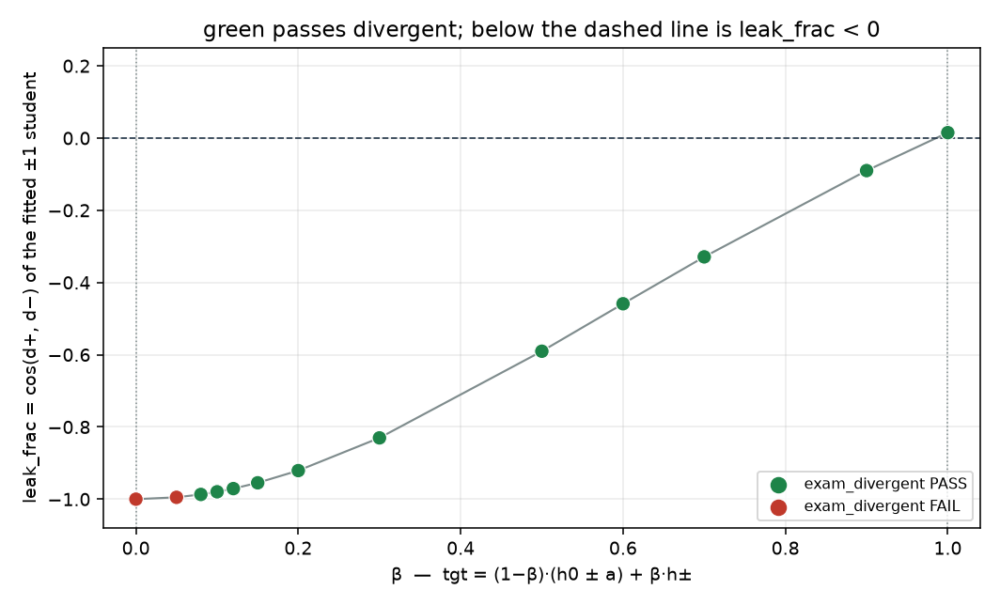

# Partial keep of c: --common_beta on the pair exam

Generated by `analysis/slider2d/run_lm_common_beta.py`. CPU only, no Hub,
no GPU, no Music 3 weights. Does not change the live trainer default.

The interpolation already exists live as `--lm_target symmetric
--common_beta β`. Default remains `v9` / `hidden`
with `--common_beta 0.0`. `--lm_target v9` ignores the
flag (κ=0, full pair-odd).

    tgt(±1) = (1 − β)·(h0 ± a) + β·h±
            = h0 ± a + β·c

β=0 is pair-odd (`t± = h0 ± a`). Energy sings a blend. Banned.
β=1 is the raw caption poles. Those pass `exam_divergent` and sit at
`leak_frac ≥ 0` on energy-v4 (the two tracks share a small even piece).

The exam: smallest β (most odd) that still **PASSES** `exam_divergent`,
and that row's `leak_frac = cos(d+, d−)` of the fitted ±1 student
(`leftover_bipolar`). More negative is better only if divergent still
passes. A recipe at `leak_frac ≈ −1` that fails divergent is the known
Goodhart, not a win. Passing `exam_close` is desired; divergent +
negative `leak_frac` is the gate. Leftover leak is unused ê on the
`unused_e` cell — `c` is not that axis, so this dial does not eat it.

## Sweep

| β | exam_divergent | exam_close | leak_frac | leftover leak | same-words | swing |
|---:|:---:|:---:|---:|---:|---:|---:|
| 0.00 | **FAIL** | **PASS** | -1.000 | +0.227 | 0.72 | +0.99 |
| 0.05 | **FAIL** | **PASS** | -0.995 | +0.228 | 0.73 | +0.99 |
| 0.08 | **PASS** | **PASS** | -0.987 | +0.228 | 0.76 | +0.99 |
| 0.10 | **PASS** | **PASS** | -0.980 | +0.228 | 0.76 | +0.99 |
| 0.12 | **PASS** | **PASS** | -0.971 | +0.228 | 0.79 | +0.99 |
| 0.15 | **PASS** | **PASS** | -0.955 | +0.228 | 0.81 | +1.00 |
| 0.20 | **PASS** | **PASS** | -0.921 | +0.228 | 0.82 | +1.00 |
| 0.30 | **PASS** | **PASS** | -0.830 | +0.228 | 0.93 | +1.00 |
| 0.50 | **PASS** | **PASS** | -0.590 | +0.228 | 1.04 | +1.00 |
| 0.60 | **PASS** | **PASS** | -0.459 | +0.228 | 1.12 | +1.00 |
| 0.70 | **PASS** | **PASS** | -0.329 | +0.228 | 1.15 | +1.00 |
| 0.90 | **PASS** | **PASS** | -0.090 | +0.228 | 1.22 | +1.00 |
| 1.00 | **PASS** | **PASS** | +0.015 | +0.228 | 1.32 | +1.00 |



## Verdict

Hit: **β = 0.08** is the smallest β that
PASSES `exam_divergent` with `leak_frac` = -0.987 < 0.
That is a train recipe, not a data pin: `--lm_target symmetric
--common_beta 0.08 --pole_mode hidden`.
The live default is unchanged.

- exam_close: **PASS**
- leftover leak (unused ê): +0.228
- same-words: 0.76
- swing kept: +0.99
- near-gate: same_words

That first pass sits near a gate. The first **clear** seed-0 pass
(no near-gate column) is **β = 0.15**,
`leak_frac` = -0.955, exam_close
**PASS**.

## Train card

`--lm_target common_beta --pole_mode hidden` freezes
**β = 0.60** (`leak_frac` = -0.459 on seed 0). That is the first β
that PASSES `exam_divergent` on seeds 0/1/2 without a
near-gate column. Equivalent: `--lm_target symmetric
--common_beta 0.6 --pole_mode hidden`.
Live default stays `--lm_target v9` / `--pole_mode hidden`.
Not a live listen.

## Seed check (divergent / close)

| seed | β | exam_divergent | exam_close | leak_frac | same-words |
|---:|---:|:---:|:---:|---:|---:|
| 0 | 0.08 | **PASS** | **PASS** | -0.987 | 0.76 |
| 0 | 0.15 | **PASS** | **PASS** | -0.955 | 0.81 |
| 0 | 0.60 | **PASS** | **PASS** | -0.459 | 1.12 |
| 1 | 0.08 | **PASS** | **PASS** | -0.987 | 0.82 |
| 1 | 0.15 | **PASS** | **PASS** | -0.955 | 0.85 |
| 1 | 0.60 | **PASS** | **PASS** | -0.459 | 1.07 |
| 2 | 0.08 | **FAIL** | **PASS** | -0.987 | 0.47 |
| 2 | 0.15 | **FAIL** | **PASS** | -0.955 | 0.49 |
| 2 | 0.60 | **PASS** | **PASS** | -0.459 | 0.82 |

Every β in the grid that passes divergent with negative leak_frac:

| β | leak_frac | exam_close | leftover leak |
|---:|---:|:---:|---:|
| 0.08 | -0.987 | **PASS** | +0.228 |
| 0.10 | -0.980 | **PASS** | +0.228 |
| 0.12 | -0.971 | **PASS** | +0.228 |
| 0.15 | -0.955 | **PASS** | +0.228 |
| 0.20 | -0.921 | **PASS** | +0.228 |
| 0.30 | -0.830 | **PASS** | +0.228 |
| 0.50 | -0.590 | **PASS** | +0.228 |
| 0.60 | -0.459 | **PASS** | +0.228 |
| 0.70 | -0.329 | **PASS** | +0.228 |
| 0.90 | -0.090 | **PASS** | +0.228 |

Leftover unused ê lives in `a`, not `c`. Interpolating the common
component cannot clear the unused-ê sheet; leftover leak stays in
the faithful / pair-odd band (~0.23) across the whole ladder.

## What this is not

- Not `faithful_attrs`. That is unused gender written into captions.
- Not pair-odd / `_sub_e` / midpoint / hold-ê / hub / project.
  Those delete `c` (`t± = h0 ± a`) and fail divergent or have
  `leak_frac ≈ −1`.
- Not a live listen. These numbers are the CPU pair-exam fixture.

## How to run

```bash
PYTHONPATH=. python analysis/slider2d/run_lm_common_beta.py --out docs/lm-common-beta-exam
PYTHONPATH=. pytest tests/test_lm_pair_exam.py -q -k common_beta
```

CPU only. No Hub, no GPU, no Music 3 weights.

Seed `0`, `400` Adam steps, grid `0, 0.05, 0.08, 0.1, 0.12, 0.15, 0.2, 0.3, 0.5, 0.6, 0.7, 0.9, 1`.

