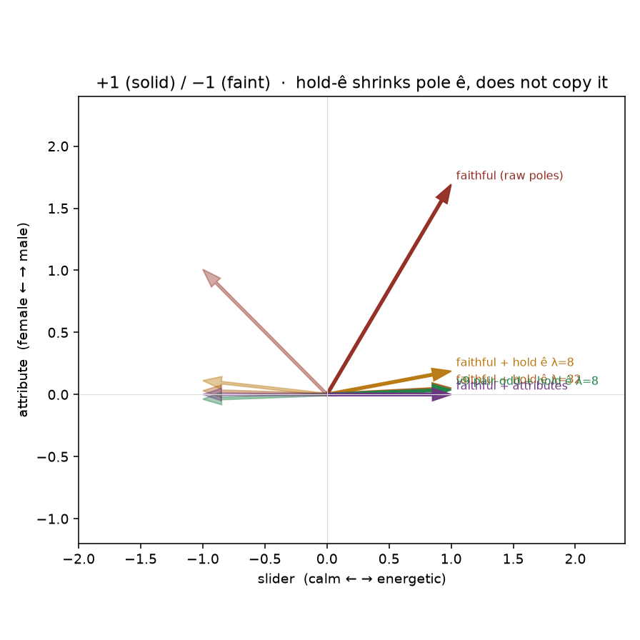
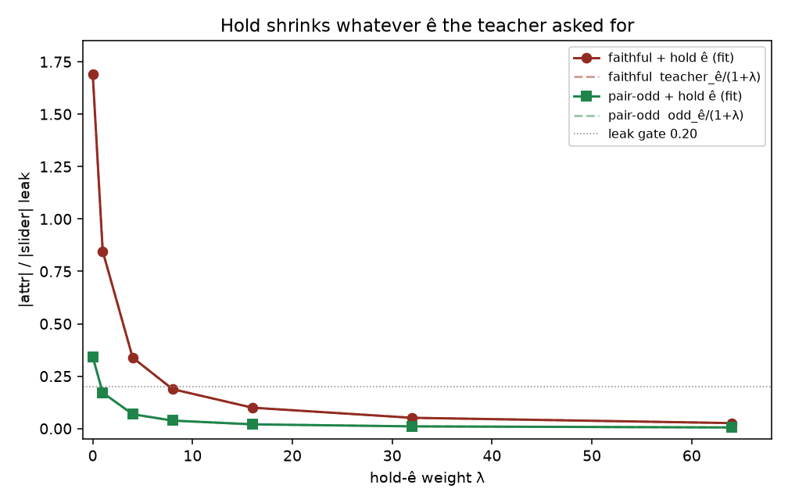

# Can faithful / v6 be fixed on the 2-D field?

Same energetic×gender geometry as [2d-analysis.md](2d-analysis.md)
and [lm-v9-2d.md](lm-v9-2d.md). Richer structured poles (slider
synonyms vs unused junk) are [lm-rich-2d.md](lm-rich-2d.md).
Teacher for `faithful` is the raw
poles: MSE to `h+` / `h−` (`--lm_target faithful` / v6). This scores
every honest knob that keeps that teacher, then the non-faithful
comparables. CPU only. No Hub, no GPU, no Music 3 weights.

Endreg / planreg are AR-only and are not on this field.
`--common_beta` is ignored in faithful mode (the function returns
`pos, neg`) and by `--lm_target v9`; on the symmetric teacher β = 1
*is* the faithful teacher, which is the point of
[lm-sheet-goodhart.md](lm-sheet-goodhart.md). `--target_scale` is
symmetric-only. `pole_mode: semantic_kl` is a v6 note, not a live
flag; its CPU form is scored on the sheet cell.

## Verdict

**Yes, but only by cleaning the captions** — `lm_faithful_attrs` (leak +0.000). On the leaky ungated pair, no knob that keeps raw-pole MSE as the teacher also copies those poles *and* gets leak ≤ 0.20: hold-ê at the live λ=8 leaves leak +0.188 (pole cos 0.659); higher λ can pass the leak gate only by refusing to copy ê. Pair-odd + hold-ê (`lm_v9`, leak +0.038) is the nearest recipe that works on leaky captions without rewriting them. Do not wire faithful+hold as the live default.

Ungated teacher leak **1.692** (even ê 1.350,
odd ê 0.342; even ∥ ê, `cos=1.000`).
Closed form: `student_ê = teacher_ê / (1+λ)`.

## Leaky energetic×gender

| method | teacher | slider | leak | ±1 | faithful fit | slider cos | leak | ±1 cos | pole cos | ê copied |
|---|---|---|---|---|---|---:|---:|---:|---:|---:|
| `lm_faithful_raw` | raw poles | **needs_help** | **needs_help** | **needs_help** | yes | 0.509 | +1.692 | +0.253 | 1.000 | 1.00 |
| `lm_faithful_hold_l1` | raw poles | **needs_help** | **needs_help** | **needs_help** | no | 0.763 | +0.846 | -0.391 | 0.944 | 0.50 |
| `lm_faithful_hold_l8` | raw poles | **right** | **right** | **right** | no | 0.983 | +0.188 | -0.956 | 0.659 | 0.11 |
| `lm_faithful_hold_l32` | raw poles | **right** | **right** | **right** | no | 0.999 | +0.051 | -0.997 | 0.552 | 0.03 |
| `lm_faithful_hold_l64` | raw poles | **right** | **right** | **right** | no | 1.000 | +0.026 | -0.999 | 0.531 | 0.02 |
| `lm_faithful_hub` | raw poles | **needs_help** | **needs_help** | **needs_help** | yes | 0.572 | +1.436 | +0.036 | 0.997 | 0.85 |
| `lm_faithful_attrs` | raw poles | **right** | **right** | **right** | yes | 1.000 | +0.000 | -1.000 | 1.000 | 1.00 |
| `lm_symmetric` | not faithful | **right** | **needs_help** | **right** | no | 0.946 | +0.342 | -1.000 | 0.760 | 0.20 |
| `lm_v9_hub` | not faithful | **right** | **needs_help** | **right** | no | 0.929 | +0.397 | -0.995 | 0.791 | 0.23 |
| `lm_v9_project` | not faithful | **right** | **right** | **right** | no | 1.000 | +0.000 | -1.000 | 0.509 | 0.00 |
| `lm_v9` | not faithful | **right** | **right** | **right** | no | 0.999 | +0.038 | -1.000 | 0.541 | 0.02 |





## What each knob does

- `lm_faithful_raw` / v6: MSE to `h+`/`h−`. Leak +1.692,
  ±1 cos +0.253, pole cos 1.000.
  Copies the poles, including unused gender and the shared even mode.
- `lm_faithful_hold_l*` : same teacher + hold-ê. Closed form
  leftover leak = 1.692/(1+λ).
  λ=8 (live v9 weight): leak +0.188, pole cos 0.659,
  ê copied 0.11 — gates can look close, but the fit
  is no longer the poles. λ=32: leak +0.051, pole cos
  0.552. Passing the leak gate means abandoning the poles.
- `lm_faithful_hub`: raw-pole MSE + published floor/anchor (κ blend).
  Leak +1.436. Anchor only sizes even blend-back; it
  does not take ê out of the odd teacher, and it does not beat raw leak.
- `lm_faithful_attrs`: `--attributes male,female` pins gender on every
  caption. Teacher is still raw poles, but those poles are clean.
  Leak +0.000, ±1 -1.000,
  pole cos 1.000. This is the data fix.
- `lm_symmetric` / pair-odd: `t± = h0 ± (h+−h−)/2`. Collapse fixed
  (-1.000); leak +0.342 stays in `a`.
- `lm_v9_hub`: published Hub leash. Same leaked odd axis as pair-odd.
- `lm_v9_project`: short-û project+hold. Leak-0 here because û *is*
  the pole names — the old cheat, not energy, not the default.
- `lm_v9`: current default, pair-odd + hold-ê λ=8. Leak +0.038,
  ±1 -1.000. Nearest thing that works on *leaky*
  captions without rewriting them.

## Energy-like and mismatch (already-odd poles)

On the energy-like cell the structured poles are already odd around
neutral (`h+ = −h−`). Faithful and pair-odd are the same teacher.
Hold-ê is then exactly current v9 — not a new faithful fix.
Mismatch is a clean pair: faithful already has leak 0 because ê is
not in the poles.

| cell | method | leak | ±1 cos | pass |
|---|---|---:|---:|---|
| energy-like | faithful λ=0 | +1.388 | -1.000 | False |
| energy-like | pair-odd λ=0 | +1.388 | -1.000 | False |
| energy-like | faithful + hold λ=8 | +0.154 | -1.000 | True |
| energy-like | pair-odd + hold λ=8 | +0.154 | -1.000 | True |
| mismatch (clean) | faithful | +0.000 | -1.000 | True |

## Why hold-ê cannot keep the name and kill leak

```
faithful teacher:   t± = h±                         # ê is inside
pair-odd teacher:   t± = h0 ± (h+ − h−)/2           # even ê dropped
hold:               L += λ · ((h(±1)−h0) · ê)²
equilibrium:        student_ê = teacher_ê / (1+λ)
```

Teacher +1 is already leak 1.692. Any residual with
leak ≤ 0.20 has cosine ≲ 0.67 to that pole — below the 0.90 copy gate.
The only way to stay faithful *and* leak-0 is to change the captions
so the poles no longer contain ê.

## What this field cannot see

- AR endreg / planreg / semantic-KL (v6 had those; not expressed here).
- Real Music 3 hidden geometry, Hub weights, multi-row yaml averaging.
- A third unused axis that is not the even mode. Here even is parallel
  to ê, so hold-ê also fixes collapse. That coincidence is this field,
  not a general promise.

## How to run

```bash
PYTHONPATH=. python analysis/slider2d/run_lm_faithful.py --out docs/lm-faithful-2d
PYTHONPATH=. python analysis/slider2d/run_lm_rich.py --out docs/lm-rich-2d
PYTHONPATH=. pytest tests/test_lm_faithful_2d.py tests/test_lm_v9_2d.py tests/test_lm_rich_2d.py -q
```

CPU only. No Hub, no GPU, no Music 3 weights.

Seed `0`, `250` Adam steps.

