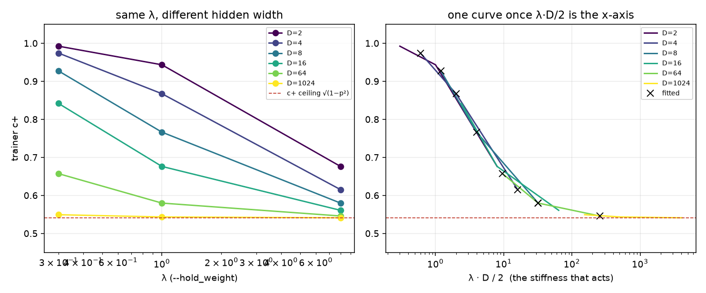
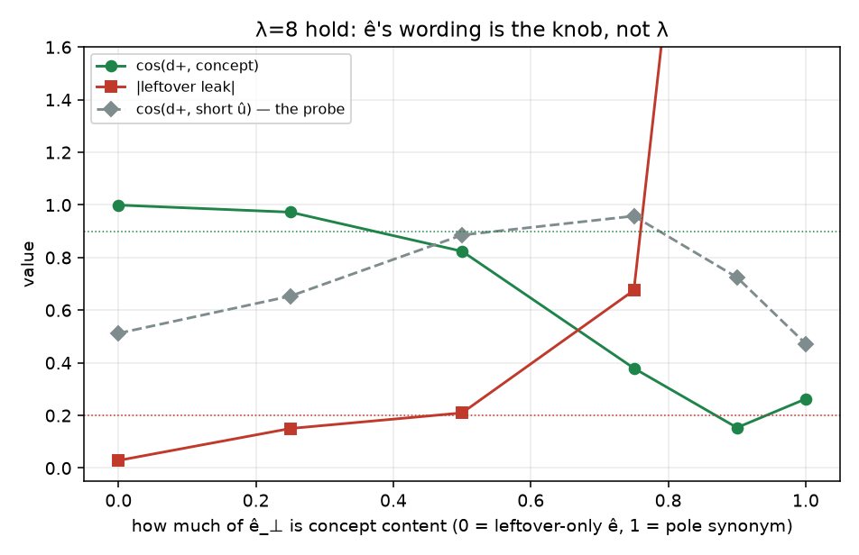
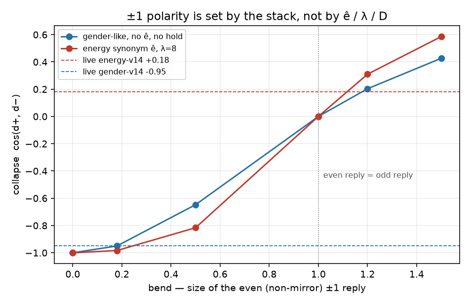

# High-D hold-ê: stiffness, ê wording, and the ±1 break

The overlap / rich / faithful cells are orthonormal 2-D: the short
declared û *is* the whole concept, and the student is a free
per-coordinate residual. This cell keeps the live loss
(`lm_hidden_targets` + `lm_axis_hold` on `ê_⊥ = ê − (ê·û)û`) and
adds the three things live energy-v14 has and 2-D does not: a
hidden width, concept content off the short caption axis, and a
±1 pair that is not a perfect mirror (two forward passes with the
LoRA multiplier flipped are not odd in the multiplier).

CPU only. No Hub, no GPU, no Music 3 weights. `--lm_target v9`
default is untouched.

## Verdict

**λ=8 is not a portable number, and it was never the knob.** `F.mse_loss` averages over the hidden width, `lm_axis_hold` does not, so the fit keeps `a_ê/(1 + λ·D/2)`. λ=8 on a 2-D cell is a stiffness of 8; on a D=1024 hidden state it is 4096. At that width λ ∈ {0.3, 1, 8} all land on the same residual (c+ 0.549 / 0.543 / 0.541, ceiling 0.541). Dropping to `--hold_weight 1` buys stiffness, not less leak.

**Trainer c+ cannot stay at 0.97 if the hold works.** With `p = |â·ê̂_⊥|` the ceiling is `√(1−p²)`. Gender-like keeps no ê, so p=0 and c+ +0.987 — that is "I copied pair-odd", not "the slider locked". The energy synonym ê has p=0.84, so a working hold must print c+ +0.580. Live energy-v14 logged c+ 0.31 against a caption-axis gate of 0.37: that is the hold doing its job on a synonym ê, not the hold failing.

**What actually failed live is ê's wording.** The hold eats one direction. On the synonym ê that direction is 92% concept content, so cos to the short probe *rises* to +0.684 while cos to the concept falls to +0.144 and 54% of the leak survives. A 2-D field cannot show that split — there û and the concept are one axis (same cell in 2-D: cos û +0.988, cos concept +0.988, leak +0.155, **PASS**).

**The ±1 break is not geometry.** With a symmetric pair-odd teacher and any residual linear in the slider scale, the pole MSE splits into `|w_odd − a|² + |w_even|²` and the hold splits the same way, so `w_even` never leaves 0 and `cos(d+, d−) = −1`. 45 cells with a *free* even parameter — D up to 64, λ up to 1024, tiny and messy ê_⊥ — all print collapse -1.000000. Live ±1 is two forward passes with the LoRA multiplier flipped, through attention softmax and SwiGLU MLPs; none of that is odd in the multiplier, so the replies are only approximate mirrors. `bend` is the size of the non-mirror part, and collapse -0.95 → bend 0.16, collapse +0.18 → bend 1.20. Live energy-v14's `+0.18` says the even reply was *larger* than the odd one (bend > 1) at whatever scale that run drove the LoRA to. That is a fact about the stack, not about ê: no ê and no λ in this fixture moves collapse at all.

**Recommendation.** Leftover-only ê is right on direction and is the canary for *that*: at λ=1 it is bipolar (-1.000), trainable (loss 0.099), keeps the concept (+0.884) and still leaves leak +0.529 — λ=8 barely moves it (+0.504), because the leftover a single caption pair does not name survives any λ. It is *not* a canary for the stiffness that broke ±1. `pair_odd_sub_e` on the same ê lands on the same residual (c+ +0.809 vs +0.822, leak +0.503 vs +0.504) with loss 0.000 and no stiffness at all: it is the hold's λ→∞ limit reached in one step. Ship leftover-only ê with `--hold_weight 1` to test the wording; then move the axis into the teacher (`pair_odd_sub_e`, subtracting **ê_⊥**, not raw ê) as the PR.

## The live signature, side by side

Two rows are calibrated, not predicted: gender-like takes the ±1
asymmetry implied by its own collapse log (bend 0.16), and
the energy analogue searches the asymmetry — size and gain / rotation
split — nearest the live `(c+, ±1)` pair. Everything else in both rows
is the geometry.

| number | live gender-v14 | fixture | live energy-v14 | fixture analogue |
|---|---:|---:|---:|---:|
| caption-axis gate `\|odd·û\|/\|\|odd\|\|` | 1.00 (clean pair) | 1.00 | 0.37 | 0.37 |
| trainer c+ | 0.97 | +0.987 | 0.31 | +0.350 |
| collapse | -0.95 | -0.950 | +0.18 | +0.180 |
| loss | 0.009 | 0.009 | not in the 0.02 band | 0.314 |
| hold λ | 0 (no ê) | 0 | 8 | 8 |
| ±1 asymmetry | — | 0.16 | — | 1.2 (0 gain / 1 rotation) |
| ‖d+‖ / ‖d−‖ | — | 1.00 | — | 1.00 |

The gender row lands all three of its live numbers. The energy search lands the collapse at bend 1.2 and gets c+ +0.350 against a logged 0.31, with the whole rest of the row — gate, λ, ê, D — untouched. Both live energy numbers are therefore consistent with one thing: an even reply 1.2× the odd reply, on top of a hold that is otherwise doing exactly what the closed form says.

The search prefers a pure rotation (0 gain), which predicts the two poles move by the *same* amount: ‖d+‖/‖d−‖ = 1.00. That is checkable without a new run — the trainer already writes `pperc` and `nperc` per step in `<name>_train.jsonl`. A gain share raises c+ at the same collapse and splits the two poles (at bend 1.2, 0.6 gain: c+ +0.491, ‖d+‖/‖d−‖ 1.97), so if energy-v14's two poles moved by very different amounts the asymmetry is bigger than 1.2 and part of it is gain. Read those two columns before spending a run on ê.

## Field

```
dim 0      short û          the declared slider_positive / negative pair
dim 1      concept off û    loudness the short pair misses (dense, slammed, 168)
dim 2..    leftover         unused mix / BPM wording / genre / syntax

a = 1.20 · unit(0.37 û + 0.62 concept + 0.69 leftover)
|a·û|/||a|| = 0.37      (live energy-v14 gate log 0.37)

ê = on_u · û + on_content · concept + on_leftover · leftover
ê_⊥ = ê − (ê·û)û            what lm_axis_hold renormalizes and holds
p  = |â · ê̂_⊥|              the share of the teacher the hold removes

δ(s) = s·w + bend·(par·w + √(1−par²)·G w)      ±1 replies of a stack
                            bend = size of the even reply, par = the
                            gain share of it, G fixed orthogonal
```

## Live bullets, one row each

| cell | ê | D | λ | λ·D/2 | bend | p | c+ | c+ pred | c+ ceil | cos û | cos concept | leak | leak kept | ±1 | perc% | loss | verdict |
|---|---|---:|---:|---:|---:|---:|---:|---:|---:|---:|---:|---:|---:|---:|---:|---:|---|
| `gender_like_no_e` | none (clean pair) | 8 | 0 | 0 | 0.16 | 0.00 | +0.987 | +1.000 | 1.00 | +0.987 | +0.987 | +0.160 | 0.00 | -0.950 | 16 | 0.009 | **PASS** |
| `energy_2d_synonym_l8` | synonym ê on the 2-D field | 2 | 8 | 8 | 0 | 0.81 | +0.700 | +0.700 | 0.58 | +0.988 | +0.988 | +0.155 | 0.11 | -1.000 | 72 | 0.846 | **PASS** |
| `energy_highd_pair_odd` | none (v9 with no leak pair) | 8 | 0 | 0 | 0 | 0.00 | +1.000 | +1.000 | 1.00 | +0.370 | +0.723 | +0.956 | 1.00 | -1.000 | 0 | 0.000 | **FAIL** |
| `energy_highd_synonym_l8` | synonym ê | 8 | 8 | 32 | 0 | 0.84 | +0.580 | +0.580 | 0.54 | +0.684 | +0.144 | +4.774 | 0.54 | -1.000 | 82 | 0.247 | **FAIL** |
| `energy_highd_tiny_l8` | synonym ê, tiny ê_⊥ | 8 | 8 | 32 | 0 | 0.84 | +0.580 | +0.580 | 0.54 | +0.684 | +0.144 | +4.774 | 0.54 | -1.000 | 82 | 0.247 | **FAIL** |
| `energy_highd_tiny_messy_l8` | synonym ê, tiny + messy ê_⊥ | 8 | 8 | 32 | 0 | 0.29 | +0.959 | +0.959 | 0.96 | +0.387 | +0.638 | +1.203 | 1.06 | -1.000 | 28 | 0.030 | **FAIL** |
| `energy_highd_medium_pin_l8` | same-loudness pin, density still ∥ poles | 8 | 8 | 32 | 0 | 0.84 | +0.581 | +0.581 | 0.54 | +0.682 | +0.144 | +4.803 | 0.54 | -1.000 | 81 | 0.246 | **FAIL** |
| `energy_highd_leftover_l0.3` | leftover-only ê (genre + BPM) | 8 | 0.3 | 1 | 0 | 0.59 | +0.953 | +0.953 | 0.81 | +0.435 | +0.848 | +0.624 | 0.65 | -1.000 | 32 | 0.068 | **FAIL** |
| `energy_highd_leftover_l1` | leftover-only ê (genre + BPM) | 8 | 1 | 4 | 0 | 0.59 | +0.885 | +0.885 | 0.81 | +0.453 | +0.884 | +0.529 | 0.55 | -1.000 | 47 | 0.099 | **FAIL** |
| `energy_highd_leftover_l8` | leftover-only ê (genre + BPM) | 8 | 8 | 32 | 0 | 0.59 | +0.822 | +0.822 | 0.81 | +0.458 | +0.893 | +0.504 | 0.53 | -1.000 | 57 | 0.120 | **FAIL** |
| `energy_highd_sub_e_synonym` | synonym ê_⊥ subtracted from a | 8 | 0 | 0 | 0 | 0.84 | +0.541 | +0.541 | 0.54 | +0.685 | +0.107 | +6.265 | 0.52 | -1.000 | 84 | 0.000 | **FAIL** |
| `energy_highd_sub_e_leftover` | leftover-only ê_⊥ subtracted from a | 8 | 0 | 0 | 0 | 0.59 | +0.809 | +0.809 | 0.81 | +0.458 | +0.893 | +0.503 | 0.53 | -1.000 | 59 | 0.000 | **FAIL** |
| `energy_highd_sub_raw_e_leftover` | leftover-only raw ê subtracted from a | 8 | 0 | 0 | 0 | 0.59 | +0.796 | +0.809 | 0.81 | +0.427 | +0.889 | +0.515 | 0.53 | -1.000 | 61 | 0.000 | **FAIL** |
| `energy_bend_synonym_l8` | synonym ê, bend 1.2 | 8 | 8 | 32 | 1.2 | 0.84 | +0.348 | +0.580 | 0.54 | +0.297 | +0.073 | +19.400 | 0.44 | +0.180 | 94 | 0.315 | **FAIL** |
| `energy_bend_leftover_l1` | leftover-only ê, bend 1.2 | 8 | 1 | 4 | 1.2 | 0.59 | +0.664 | +0.885 | 0.81 | +0.315 | +0.568 | +1.449 | 0.60 | +0.180 | 77 | 0.254 | **FAIL** |

`p`, `c+ pred` and `perc` are closed form:

```
k    = 1 / (1 + λ·D/2)                     # hold_shrink
c+   = (1 − (1−k)p²) / √(1 − p² + k²p²)
perc = (1 − k)·p
ceil = √(1 − p²)                           # k → 0, hold has done its job
```

Every linear row above matches it to three decimals, so the table is
a geometry statement, not a training artifact.

Trajectory columns are the mean over the last 50 steps, which is what the trainer's own summary reports. On the linear rows that equals the last step exactly — they converge and sit still. A non-mirror reply makes the loss non-convex, so the bend rows orbit: `energy_bend_synonym_l8` holds collapse at +0.180 and loss at 0.315 while its last-step c+ wanders ±0.05 around the window mean +0.348. Read the window, as live does.

Two flags separate the confusions this table exists for:

- `looks_like_v12` — c+ ≥ 0.90, i.e. the residual copied the pair-odd whole. True on `gender_like_no_e` (+0.987) and on `energy_highd_pair_odd` (+1.000, leak kept 1.00 — v12 / Hub are not leak-free). False on every working hold, including the 2-D **PASS** row (+0.700, perc 72%). A hold that leaves c+ at gender's 0.97 has not held anything.
- `hold_explains_c_plus` — measured c+ is within 0.06 of the closed form. True for every linear row, false for both bend rows (`energy_bend_synonym_l8` +0.348 vs predicted +0.580). That is the discriminator: a low c+ inside the closed form is the hold working; a low c+ *below* it is the stack, not ê.

## λ is not portable across hidden width

Closed form at the synonym ê (`p = 0.841`, ceiling `0.541`):

| D | λ=0.3 | λ=1 | λ=8 | λ·D/2 at λ=8 |
|---:|---:|---:|---:|---:|
| 2 | 0.992 | 0.943 | 0.676 | 8 |
| 4 | 0.974 | 0.867 | 0.615 | 16 |
| 8 | 0.927 | 0.766 | 0.580 | 32 |
| 16 | 0.842 | 0.676 | 0.561 | 64 |
| 64 | 0.657 | 0.580 | 0.546 | 256 |
| 1024 | 0.549 | 0.543 | 0.541 | 4096 |



Fitted rows (same ê, Adam, seed 0):

| cell | λ·D/2 | c+ | c+ pred | cos û | cos concept | leak kept | loss |
|---|---:|---:|---:|---:|---:|---:|---:|
| `d4_l0` | 0 | +1.000 | +1.000 | +0.370 | +0.723 | 1.00 | 0.000 |
| `d4_l0.3` | 1 | +0.974 | +0.974 | +0.491 | +0.628 | 0.82 | 0.191 |
| `d4_l1` | 2 | +0.867 | +0.867 | +0.608 | +0.459 | 0.68 | 0.340 |
| `d4_l8` | 16 | +0.615 | +0.615 | +0.682 | +0.179 | 0.55 | 0.480 |
| `d8_l0` | 0 | +1.000 | +1.000 | +0.370 | +0.723 | 1.00 | 0.000 |
| `d8_l0.3` | 1 | +0.927 | +0.927 | +0.559 | +0.544 | 0.74 | 0.139 |
| `d8_l1` | 4 | +0.766 | +0.766 | +0.654 | +0.337 | 0.62 | 0.204 |
| `d8_l8` | 32 | +0.580 | +0.580 | +0.684 | +0.144 | 0.54 | 0.247 |
| `d64_l0` | 0 | +1.000 | +1.000 | +0.370 | +0.723 | 1.00 | 0.000 |
| `d64_l0.3` | 10 | +0.657 | +0.657 | +0.678 | +0.221 | 0.57 | 0.029 |
| `d64_l1` | 32 | +0.580 | +0.580 | +0.684 | +0.144 | 0.54 | 0.031 |
| `d64_l8` | 256 | +0.546 | +0.546 | +0.685 | +0.112 | 0.53 | 0.032 |

The un-normalized half is also where a live `loss 278` comes from: while the fit still carries the teacher's ê component the hold term is `λ·(a·ê̂)²`, so λ=8 needs only `a·ê̂ ≈ 5.9` in hidden units to print 278. On this field the same term is 8.15. Nothing semantic exploded; the hold is a sum where the pole MSE is a mean.

## ê's wording is the knob

λ=8 throughout; only what the leak captions *say* moves.

| ê_⊥ content share | p | hold on content | hold on leftover | c+ | cos û | cos concept | leak | leak kept |
|---:|---:|---:|---:|---:|---:|---:|---:|---:|
| 0.00 | 0.69 | 0.00 | 1.00 | +0.743 | +0.512 | +1.000 | +0.029 | 0.03 |
| 0.25 | 0.82 | 0.25 | 0.97 | +0.602 | +0.654 | +0.973 | +0.150 | 0.12 |
| 0.50 | 0.91 | 0.50 | 0.87 | +0.476 | +0.886 | +0.824 | +0.210 | 0.10 |
| 0.75 | 0.92 | 0.75 | 0.66 | +0.451 | +0.958 | +0.379 | +0.676 | 0.14 |
| 0.90 | 0.86 | 0.90 | 0.44 | +0.554 | +0.725 | +0.154 | +4.169 | 0.47 |
| 1.00 | 0.62 | 1.00 | 0.00 | +0.799 | +0.472 | +0.263 | +3.354 | 1.00 |



The probe cosine and the concept cosine move in *opposite*
directions as ê becomes a synonym. Reading `cos(d+, û)` — or a
2-D cell — says the slider locked while the concept is being eaten.

## How completely does ê name the leak?

One declared caption pair is one direction. Leftover the poles
carry off that direction survives every λ.

| ê names | p | λ=1 leak | λ=1 kept | λ=8 leak | λ=8 kept | λ=1 cos concept |
|---:|---:|---:|---:|---:|---:|---:|
| 0.50 | 0.35 | +0.833 | 0.87 | +0.828 | 0.87 | +0.768 |
| 0.70 | 0.48 | +0.695 | 0.73 | +0.683 | 0.71 | +0.821 |
| 0.85 | 0.59 | +0.529 | 0.55 | +0.504 | 0.53 | +0.884 |
| 0.95 | 0.66 | +0.349 | 0.37 | +0.300 | 0.31 | +0.944 |
| 1.00 | 0.69 | +0.191 | 0.20 | +0.029 | 0.03 | +0.982 |

## ±1 polarity

| bend | energy synonym ê λ=8: c+ / ±1 / cos concept | gender-like: c+ / ±1 / loss | implied bend from ±1 |
|---:|---|---|---:|
| 0 | +0.580 / -1.000 / +0.144 | +1.000 / -1.000 / 0.000 | 0.00 |
| 0.16 | +0.533 / -0.950 / +0.147 | +0.987 / -0.950 / 0.009 | 0.16 |
| 0.5 | +0.467 / -0.600 / +0.126 | +0.894 / -0.600 / 0.072 | 0.50 |
| 1 | +0.375 / +0.000 / +0.088 | +0.707 / +0.000 / 0.180 | 1.00 |
| 1.2 | +0.348 / +0.180 / +0.073 | +0.640 / +0.180 / 0.212 | 1.20 |
| 1.5 | +0.298 / +0.385 / +0.043 | +0.555 / +0.385 / 0.249 | 1.50 |



`bend = 0.16` reproduces live gender-v14 on the clean pair: c+ +0.987 (live 0.97), ±1 -0.950 (live -0.95), loss 0.009 (live 0.009). `bend = 1.2` is what live energy-v14's ±1 +0.18 implies, and it costs the whole slider on this field (c+ +0.348, cos concept +0.073) regardless of ê. Polarity crosses zero exactly when the even reply matches the odd reply (bend = 1).

Free-even geometry grid: 45 cells, max collapse -1.000000, max even norm 0.00e+00. Geometry cannot break ±1.

## Row notes

- `energy_highd_pair_odd` (no ê, no hold) copies the leak: leak +0.956, leak kept 1.00, c+ +1.000. v12 / Hub are not leak-free on these poles.
- `energy_highd_tiny_l8` (‖ê_⊥‖ 0.20) is row-for-row `energy_highd_synonym_l8` (‖ê_⊥‖ 0.60): `lm_axis_hold` renormalizes, so a tiny leftover is not a weak hold.
- `energy_highd_tiny_messy_l8` rotates that tiny leftover into junk. p drops to 0.29 and the hold becomes a near no-op — concept back to +0.638, leak still +1.203.
- `energy_highd_medium_pin_l8` is the live rewrite: ê·û falls from +0.80 to +0.30 and every other number is unchanged (c+ +0.581 vs +0.580). Pinning "medium energy" on both leak captions does not move ê_⊥ while density and genre still read as the poles.
- `energy_highd_sub_raw_e_leftover` subtracts raw ê instead of ê_⊥ and takes û with it (cos û +0.427 vs +0.458). `pair_odd_sub_e` has to subtract ê_⊥, the same axis the hold uses.
- `energy_highd_sub_e_synonym` shows the teacher change is not a wording fix: on a synonym ê it lands where the λ=8 hold lands (cos concept +0.107 vs +0.144), only without the stiffness.
- `gender_like_no_e` leak +0.160 is bend junk, not caption leak: those poles carry no leftover at all (leak kept 0.00). It is what a ±1 -0.950 reply costs off-axis.

## What is now a cell, and what still is not

Now a cell:

- trainer c+ (cos with `a`) and slider-cos (cos with û) as separate
  columns, plus the closed-form ceiling, so "looks like v12" and
  "hold is working" are different verdicts.
- a concept axis the short caption pair only partly names, so the
  probe cosine and the concept cosine can disagree.
- tiny ê_⊥ (norm 0.20 vs 0.60) — identical rows, because
  `lm_axis_hold` renormalizes. Only the direction matters.
- messy ê_⊥: rotating a tiny leftover into junk drops p and turns the
  hold into a no-op in *both* directions.
- the same-loudness pin: dropping the loud/quiet words moves ê·û from
  +0.80 to +0.30 and leaves ê_⊥
  where it was, so the row is unchanged (c+ +0.581 vs
  +0.580).
- λ·D/2 as the stiffness that acts, and λ's irrelevance at live width.
- leftover-only ê × λ ∈ {0.3, 1, 8} against `pair_odd_sub_e`.

The lyric-garble / off-sheet next-token sheet is a different
cell: [lm-lyric-garble.md](lm-lyric-garble.md). High pair-odd cos
is not lock-healthy there.

Still not a cell:

- **the ±1 break as a consequence of ê / λ / D.** It is not one. It
  needs a non-mirror ±1 reply, which is a property of the stack.
  `bend` is a knob here, not a prediction.
- **the live 278 transient.** The scale is explained (`λ·(a·ê̂)²` with
  a sum-vs-mean mismatch), but a fixed 2-D/high-D vector fit with
  Adam descends monotonically; reproducing the overshoot needs the
  LoRA parametrization and the live clip / AdamW schedule.
- **whether Qwen actually hears "genre + BPM, no density" as unused.**
  `leftover_match` is the assumption that decides the residual leak,
  and only a live probe can measure it.

## How to run

```bash
PYTHONPATH=. python analysis/slider2d/run_lm_highd.py --out docs/lm-highd-leftover
PYTHONPATH=. pytest tests/test_lm_highd_leftover.py -q
```

Seed `0`, `400` Adam steps, lr 0.08.

2-D cross-check: this harness on the flat field prints slider +0.988 / leak +0.155 / c+ +0.700 / perc 72%, against +0.988 / +0.154 / +0.696 / 72% for `pole_synonym_slider_l8` in [lm-hold-overlap.md](lm-hold-overlap.md). Same physics, new columns.

