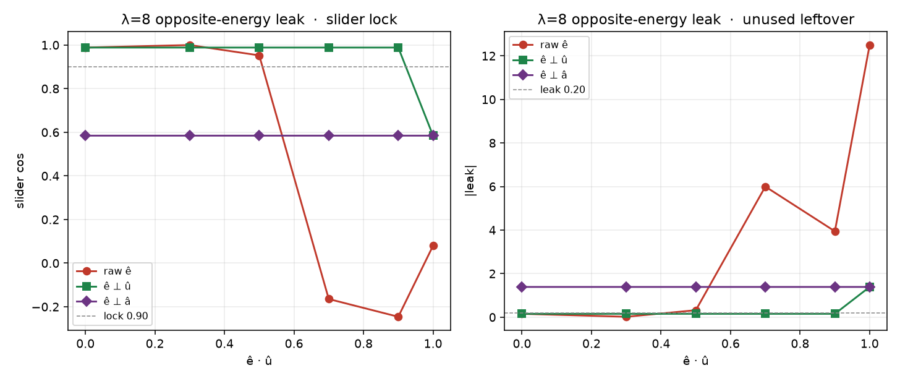
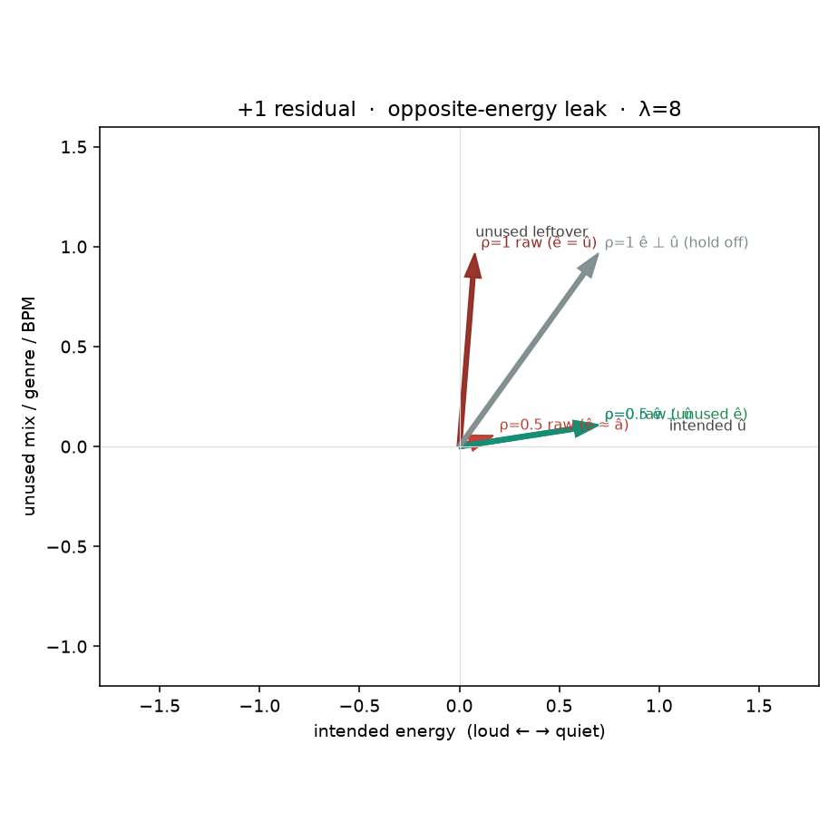

# Hold-ê when ê overlaps the slider (live energy)

Existing hold-ê cells PASS because they set ê = unused gender,
orthogonal to energetic. Live energy-v4 already declares
`slider_positive` = loud energy and `leak_positive` =
"Dense slammed mix, BPM 168, pop-punk." — that ê *is* energy.
This cell makes `ê·û` a knob on the same energy-like poles
(aligns `[0.48, 0.48, 0.68, 0.68]`).

CPU only. No Hub, no GPU, no Music 3 weights.

## Verdict

Raw hold at λ=8 **reproduces the live miss** when ê is a pole synonym or the slider: at `ê·û=1` slider cos +0.080, leak +12.495, c+ +0.849, perc 52%, loss 0.452. At `ê·û=0.5` (ê·â=+0.995 ≈ 1) c+ +0.798, perc 89%, loss 1.270 — the 2-D shrink-in-place of `student = teacher/(1+λ)`, not a locked ~0.01 loss. Unused-only ê still locks (slider +0.988, leak +0.154).

**Allowed ê is leftover unused, not a synonym of the poles or of `slider_positive`.** Energy-v4 leak captions are the wrong ê (opposite-energy restates the structured poles; mean |odd·û|/||odd|| = 0.58, so `ê·û≈0.5` is ê≈â). Hold in the trainer should use `ê_⊥ = ê − (ê·û)û`, not `ê − (ê·â)â`. At the live-like ρ=0.5 cell, ê⊥û locks (slider +0.988, leak +0.154); ê⊥â turns hold off (slider +0.584, leak +1.388). Same-energy different-mix captions are already unused-ê (slider +0.988, leak +0.154). Do not revert to Hub or short-û project.

## Geometry

Opposite-energy leak (current yaml):

```
ê(ρ) = ρ û + √(1−ρ²) unused
```

Mean pair-odd on this field has |â·û| = 0.584, so ρ=0.5
makes ê a synonym of the poles. Same-energy different-mix leak
is ê = unused (both captions loud; difference is mix).

## Baselines (same energy poles)

| policy | ê·û | ê·â | λ | ortho | slider cos | leak | c+ | perc% | loss | ±1 | verdict |
|---|---:|---:|---:|---|---:|---:|---:|---:|---:|---:|---|
| `pair_odd_no_hold` | 0.0 | +0.811 | 0 | raw | +0.584 | +1.388 | +0.992 | 12 | 0.022 | -1.000 | **FAIL** |
| `hub` | 0.0 | +0.811 | 0 | raw | +0.584 | +1.388 | +0.992 | 12 | 0.022 | -1.000 | **FAIL** |
| `gated_project_0.50` | 0.0 | +0.811 | 1 | raw | +1.000 | +0.000 | +0.580 | 81 | 0.956 | -1.000 | **PASS** |
| `v9_unused_e` | 0.0 | +0.811 | 8 | raw | +0.988 | +0.154 | +0.696 | 72 | 0.852 | -1.000 | **PASS** |
| `same_energy_hold_l8` | 0.0 | +0.811 | 8 | raw | +0.988 | +0.154 | +0.696 | 72 | 0.852 | -1.000 | **PASS** |
| `energy_slider_e_raw_l8` | 1.0 | +0.584 | 8 | raw | +0.080 | +12.495 | +0.849 | 52 | 0.452 | -1.000 | **FAIL** |
| `energy_slider_e_slider_l8` | 1.0 | +0.584 | 8 | slider | +0.584 | +1.388 | +0.992 | 12 | 0.022 | -1.000 | **FAIL** |
| `pole_synonym_raw_l8` | 0.5 | +0.995 | 8 | raw | +0.952 | +0.320 | +0.798 | 89 | 1.270 | -1.000 | **FAIL** |
| `pole_synonym_slider_l8` | 0.5 | +0.995 | 8 | slider | +0.988 | +0.154 | +0.696 | 72 | 0.852 | -1.000 | **PASS** |
| `pole_synonym_odd_l8` | 0.5 | +0.995 | 8 | odd | +0.584 | +1.388 | +0.992 | 12 | 0.022 | -1.000 | **FAIL** |

## Opposite-energy overlap × λ × ortho

| cell | ê·û | ê·â | λ | ortho | slider cos | leak | c+ | perc% | loss | ±1 | verdict |
|---|---:|---:|---:|---|---:|---:|---:|---:|---:|---:|---|
| `opposite_o0.0_l0_raw` | 0.0 | +0.811 | 0 | raw | +0.584 | +1.388 | +0.992 | 12 | 0.022 | -1.000 | **FAIL** |
| `opposite_o0.0_l1_raw` | 0.0 | +0.811 | 1 | raw | +0.821 | +0.694 | +0.936 | 42 | 0.489 | -1.000 | **FAIL** |
| `opposite_o0.0_l1_slider` | 0.0 | +0.811 | 1 | slider | +0.821 | +0.694 | +0.936 | 42 | 0.489 | -1.000 | **FAIL** |
| `opposite_o0.0_l1_odd` | 0.0 | +0.811 | 1 | odd | +0.584 | +1.388 | +0.992 | 12 | 0.022 | -1.000 | **FAIL** |
| `opposite_o0.0_l8_raw` | 0.0 | +0.811 | 8 | raw | +0.988 | +0.154 | +0.696 | 72 | 0.852 | -1.000 | **PASS** |
| `opposite_o0.0_l8_slider` | 0.0 | +0.811 | 8 | slider | +0.988 | +0.154 | +0.696 | 72 | 0.852 | -1.000 | **PASS** |
| `opposite_o0.0_l8_odd` | 0.0 | +0.811 | 8 | odd | +0.584 | +1.388 | +0.992 | 12 | 0.022 | -1.000 | **FAIL** |
| `opposite_o0.0_l32_raw` | 0.0 | +0.811 | 32 | raw | +0.999 | +0.042 | +0.613 | 79 | 0.927 | -1.000 | **PASS** |
| `opposite_o0.0_l32_slider` | 0.0 | +0.811 | 32 | slider | +0.999 | +0.042 | +0.613 | 79 | 0.927 | -1.000 | **PASS** |
| `opposite_o0.0_l32_odd` | 0.0 | +0.811 | 32 | odd | +0.584 | +1.388 | +0.992 | 12 | 0.022 | -1.000 | **FAIL** |
| `opposite_o0.3_l0_raw` | 0.3 | +0.949 | 0 | raw | +0.584 | +1.388 | +0.992 | 12 | 0.022 | -1.000 | **FAIL** |
| `opposite_o0.3_l1_raw` | 0.3 | +0.949 | 1 | raw | +0.777 | +0.811 | +0.958 | 49 | 0.661 | -1.000 | **FAIL** |
| `opposite_o0.3_l1_slider` | 0.3 | +0.949 | 1 | slider | +0.821 | +0.694 | +0.936 | 42 | 0.489 | -1.000 | **FAIL** |
| `opposite_o0.3_l1_odd` | 0.3 | +0.949 | 1 | odd | +0.584 | +1.388 | +0.992 | 12 | 0.022 | -1.000 | **FAIL** |
| `opposite_o0.3_l8_raw` | 0.3 | +0.949 | 8 | raw | +1.000 | +0.019 | +0.595 | 85 | 1.158 | -1.000 | **PASS** |
| `opposite_o0.3_l8_slider` | 0.3 | +0.949 | 8 | slider | +0.988 | +0.154 | +0.696 | 72 | 0.852 | -1.000 | **PASS** |
| `opposite_o0.3_l8_odd` | 0.3 | +0.949 | 8 | odd | +0.584 | +1.388 | +0.992 | 12 | 0.022 | -1.000 | **FAIL** |
| `opposite_o0.3_l32_raw` | 0.3 | +0.949 | 32 | raw | +0.977 | -0.217 | +0.396 | 92 | 1.261 | -1.000 | **FAIL** |
| `opposite_o0.3_l32_slider` | 0.3 | +0.949 | 32 | slider | +0.999 | +0.042 | +0.613 | 79 | 0.927 | -1.000 | **PASS** |
| `opposite_o0.3_l32_odd` | 0.3 | +0.949 | 32 | odd | +0.584 | +1.388 | +0.992 | 12 | 0.022 | -1.000 | **FAIL** |
| `opposite_o0.5_l0_raw` | 0.5 | +0.995 | 0 | raw | +0.584 | +1.388 | +0.992 | 12 | 0.022 | -1.000 | **FAIL** |
| `opposite_o0.5_l1_raw` | 0.5 | +0.995 | 1 | raw | +0.662 | +1.134 | +0.988 | 51 | 0.724 | -1.000 | **FAIL** |
| `opposite_o0.5_l1_slider` | 0.5 | +0.995 | 1 | slider | +0.821 | +0.694 | +0.936 | 42 | 0.489 | -1.000 | **FAIL** |
| `opposite_o0.5_l1_odd` | 0.5 | +0.995 | 1 | odd | +0.584 | +1.388 | +0.992 | 12 | 0.022 | -1.000 | **FAIL** |
| `opposite_o0.5_l8_raw` | 0.5 | +0.995 | 8 | raw | +0.952 | +0.320 | +0.798 | 89 | 1.270 | -1.000 | **FAIL** |
| `opposite_o0.5_l8_slider` | 0.5 | +0.995 | 8 | slider | +0.988 | +0.154 | +0.696 | 72 | 0.852 | -1.000 | **PASS** |
| `opposite_o0.5_l8_odd` | 0.5 | +0.995 | 8 | odd | +0.584 | +1.388 | +0.992 | 12 | 0.022 | -1.000 | **FAIL** |
| `opposite_o0.5_l32_raw` | 0.5 | +0.995 | 32 | raw | +0.973 | -0.236 | +0.379 | 97 | 1.383 | -1.000 | **FAIL** |
| `opposite_o0.5_l32_slider` | 0.5 | +0.995 | 32 | slider | +0.999 | +0.042 | +0.613 | 79 | 0.927 | -1.000 | **PASS** |
| `opposite_o0.5_l32_odd` | 0.5 | +0.995 | 32 | odd | +0.584 | +1.388 | +0.992 | 12 | 0.022 | -1.000 | **FAIL** |
| `opposite_o0.7_l0_raw` | 0.7 | +0.989 | 0 | raw | +0.584 | +1.388 | +0.992 | 12 | 0.022 | -1.000 | **FAIL** |
| `opposite_o0.7_l1_raw` | 0.7 | +0.989 | 1 | raw | +0.461 | +1.922 | +0.982 | 51 | 0.715 | -1.000 | **FAIL** |
| `opposite_o0.7_l1_slider` | 0.7 | +0.989 | 1 | slider | +0.821 | +0.694 | +0.936 | 42 | 0.489 | -1.000 | **FAIL** |
| `opposite_o0.7_l1_odd` | 0.7 | +0.989 | 1 | odd | +0.584 | +1.388 | +0.992 | 12 | 0.022 | -1.000 | **FAIL** |
| `opposite_o0.7_l8_raw` | 0.7 | +0.989 | 8 | raw | -0.165 | +5.996 | +0.699 | 88 | 1.254 | -1.000 | **FAIL** |
| `opposite_o0.7_l8_slider` | 0.7 | +0.989 | 8 | slider | +0.988 | +0.154 | +0.696 | 72 | 0.852 | -1.000 | **PASS** |
| `opposite_o0.7_l8_odd` | 0.7 | +0.989 | 8 | odd | +0.584 | +1.388 | +0.992 | 12 | 0.022 | -1.000 | **FAIL** |
| `opposite_o0.7_l32_raw` | 0.7 | +0.989 | 32 | raw | -0.564 | +1.465 | +0.338 | 96 | 1.366 | -1.000 | **FAIL** |
| `opposite_o0.7_l32_slider` | 0.7 | +0.989 | 32 | slider | +0.999 | +0.042 | +0.613 | 79 | 0.927 | -1.000 | **PASS** |
| `opposite_o0.7_l32_odd` | 0.7 | +0.989 | 32 | odd | +0.584 | +1.388 | +0.992 | 12 | 0.022 | -1.000 | **FAIL** |
| `opposite_o0.9_l0_raw` | 0.9 | +0.880 | 0 | raw | +0.584 | +1.388 | +0.992 | 12 | 0.022 | -1.000 | **FAIL** |
| `opposite_o0.9_l1_raw` | 0.9 | +0.880 | 1 | raw | +0.291 | +3.286 | +0.939 | 45 | 0.571 | -1.000 | **FAIL** |
| `opposite_o0.9_l1_slider` | 0.9 | +0.880 | 1 | slider | +0.821 | +0.694 | +0.936 | 42 | 0.489 | -1.000 | **FAIL** |
| `opposite_o0.9_l1_odd` | 0.9 | +0.880 | 1 | odd | +0.584 | +1.388 | +0.992 | 12 | 0.022 | -1.000 | **FAIL** |
| `opposite_o0.9_l8_raw` | 0.9 | +0.880 | 8 | raw | -0.246 | +3.944 | +0.638 | 78 | 0.997 | -1.000 | **FAIL** |
| `opposite_o0.9_l8_slider` | 0.9 | +0.880 | 8 | slider | +0.988 | +0.154 | +0.696 | 72 | 0.852 | -1.000 | **PASS** |
| `opposite_o0.9_l8_odd` | 0.9 | +0.880 | 8 | odd | +0.584 | +1.388 | +0.992 | 12 | 0.022 | -1.000 | **FAIL** |
| `opposite_o0.9_l32_raw` | 0.9 | +0.880 | 32 | raw | -0.385 | +2.398 | +0.520 | 85 | 1.086 | -1.000 | **FAIL** |
| `opposite_o0.9_l32_slider` | 0.9 | +0.880 | 32 | slider | +0.999 | +0.042 | +0.613 | 79 | 0.927 | -1.000 | **PASS** |
| `opposite_o0.9_l32_odd` | 0.9 | +0.880 | 32 | odd | +0.584 | +1.388 | +0.992 | 12 | 0.022 | -1.000 | **FAIL** |
| `opposite_o1.0_l0_raw` | 1.0 | +0.584 | 0 | raw | +0.584 | +1.388 | +0.992 | 12 | 0.022 | -1.000 | **FAIL** |
| `opposite_o1.0_l1_raw` | 1.0 | +0.584 | 1 | raw | +0.339 | +2.777 | +0.954 | 30 | 0.264 | -1.000 | **FAIL** |
| `opposite_o1.0_l1_slider` | 1.0 | +0.584 | 1 | slider | +0.584 | +1.388 | +0.992 | 12 | 0.022 | -1.000 | **FAIL** |
| `opposite_o1.0_l1_odd` | 1.0 | +0.584 | 1 | odd | +0.584 | +1.388 | +0.992 | 12 | 0.022 | -1.000 | **FAIL** |
| `opposite_o1.0_l8_raw` | 1.0 | +0.584 | 8 | raw | +0.080 | +12.495 | +0.849 | 52 | 0.452 | -1.000 | **FAIL** |
| `opposite_o1.0_l8_slider` | 1.0 | +0.584 | 8 | slider | +0.584 | +1.388 | +0.992 | 12 | 0.022 | -1.000 | **FAIL** |
| `opposite_o1.0_l8_odd` | 1.0 | +0.584 | 8 | odd | +0.584 | +1.388 | +0.992 | 12 | 0.022 | -1.000 | **FAIL** |
| `opposite_o1.0_l32_raw` | 1.0 | +0.584 | 32 | raw | +0.022 | +45.815 | +0.818 | 57 | 0.492 | -1.000 | **FAIL** |
| `opposite_o1.0_l32_slider` | 1.0 | +0.584 | 32 | slider | +0.584 | +1.388 | +0.992 | 12 | 0.022 | -1.000 | **FAIL** |
| `opposite_o1.0_l32_odd` | 1.0 | +0.584 | 32 | odd | +0.584 | +1.388 | +0.992 | 12 | 0.022 | -1.000 | **FAIL** |





## Same-energy different-mix leak

| cell | ê·û | ê·â | λ | ortho | slider cos | leak | c+ | perc% | loss | ±1 | verdict |
|---|---:|---:|---:|---|---:|---:|---:|---:|---:|---:|---|
| `same_energy_o0.0_l0_raw` | 0.0 | +0.811 | 0 | raw | +0.584 | +1.388 | +0.992 | 12 | 0.022 | -1.000 | **FAIL** |
| `same_energy_o0.0_l1_raw` | 0.0 | +0.811 | 1 | raw | +0.821 | +0.694 | +0.936 | 42 | 0.489 | -1.000 | **FAIL** |
| `same_energy_o0.0_l1_slider` | 0.0 | +0.811 | 1 | slider | +0.821 | +0.694 | +0.936 | 42 | 0.489 | -1.000 | **FAIL** |
| `same_energy_o0.0_l1_odd` | 0.0 | +0.811 | 1 | odd | +0.584 | +1.388 | +0.992 | 12 | 0.022 | -1.000 | **FAIL** |
| `same_energy_o0.0_l8_raw` | 0.0 | +0.811 | 8 | raw | +0.988 | +0.154 | +0.696 | 72 | 0.852 | -1.000 | **PASS** |
| `same_energy_o0.0_l8_slider` | 0.0 | +0.811 | 8 | slider | +0.988 | +0.154 | +0.696 | 72 | 0.852 | -1.000 | **PASS** |
| `same_energy_o0.0_l8_odd` | 0.0 | +0.811 | 8 | odd | +0.584 | +1.388 | +0.992 | 12 | 0.022 | -1.000 | **FAIL** |
| `same_energy_o0.0_l32_raw` | 0.0 | +0.811 | 32 | raw | +0.999 | +0.042 | +0.613 | 79 | 0.927 | -1.000 | **PASS** |
| `same_energy_o0.0_l32_slider` | 0.0 | +0.811 | 32 | slider | +0.999 | +0.042 | +0.613 | 79 | 0.927 | -1.000 | **PASS** |
| `same_energy_o0.0_l32_odd` | 0.0 | +0.811 | 32 | odd | +0.584 | +1.388 | +0.992 | 12 | 0.022 | -1.000 | **FAIL** |

## Live-log analogue

Mikkel ~step 515/800: loss 0.16–0.30 (not ~0.01), c+ ~0 / −0.10,
col −0.21, perc 132%. That is high-D hold punching a teacher-aligned
ê until the residual is numerically ~0 (cosine undefined / noisy).
2-D MSE / hold share a ½ factor, so `student_ê = teacher_ê / (1+λ)`
stays parallel to the teacher when ê ∥ â — c+ stays high, perc
→ λ/(1+λ). The slider-lock failure still shows up as leftover unused
when ê ≈ û.

The ½ factor is a width effect: `F.mse_loss` averages over the hidden
state and `lm_axis_hold` does not, so at width D the fit keeps
`teacher_ê/(1 + λ·D/2)`. λ=8 here is a stiffness of 8; live it is
`4·D`. That, the concept living partly off short û, and the ±1 break
are cells in [lm-highd-leftover.md](lm-highd-leftover.md).

ê = û, λ=8 raw: step 0 loss 1.44 c+ +0.00 col +0.00 p% 100 step 50 loss 0.46 c+ +0.85 col -1.00 p% 53 step 100 loss 0.45 c+ +0.85 col -1.00 p% 52 step 150 loss 0.45 c+ +0.85 col -1.00 p% 52 step 200 loss 0.45 c+ +0.85 col -1.00 p% 52

ê ≈ â, λ=8 raw: step 0 loss 1.44 c+ +0.00 col +0.00 p% 100 step 50 loss 1.27 c+ +0.79 col -1.00 p% 88 step 100 loss 1.27 c+ +0.80 col -1.00 p% 89 step 150 loss 1.27 c+ +0.80 col -1.00 p% 89 step 200 loss 1.27 c+ +0.80 col -1.00 p% 89

## What each recipe does

- `pair_odd_no_hold` / Hub: copies leftover mix. Slider component
  of the pair is present, unused leak is not held.
- `gated_project_0.50` (v12): teacher = `(a·û)û`. Locks this cell
  and is leak-0, but it is the live-fragile path that kills gender
  at |odd·û|/||odd|| = 0.20. Not the default.
- `v9_unused_e`: current 2-D hold-ê. PASS. The wrong ê for live energy.
- raw hold at high overlap: punches the slider / the teacher.
- `ê_⊥û = ê − (ê·û)û`: hold cannot punch the slider name. At ρ<1 the
  leftover unused is held and the slider locks. At ρ=1 hold is off
  (slider +0.584, leak +1.388) — ê had no unused left.
- `ê_⊥â = ê − (ê·â)â`: at the live-like pole synonym, leftover is 0
  and hold turns off. Leak stays. Per-row â is also not one vector
  on Music 3; û is encoded once.
- Same-energy different-mix leak captions: ê is already unused.
  Current hold-ê locks without a trainer change. Opposite-energy
  energy-v4 captions are the wrong ê.

## How to run

```bash
PYTHONPATH=. python analysis/slider2d/run_lm_overlap.py --out docs/lm-hold-overlap
PYTHONPATH=. pytest tests/test_lm_hold_overlap.py tests/test_lm_live_cells.py -q
```

Seed `0`, `200` Adam steps.

