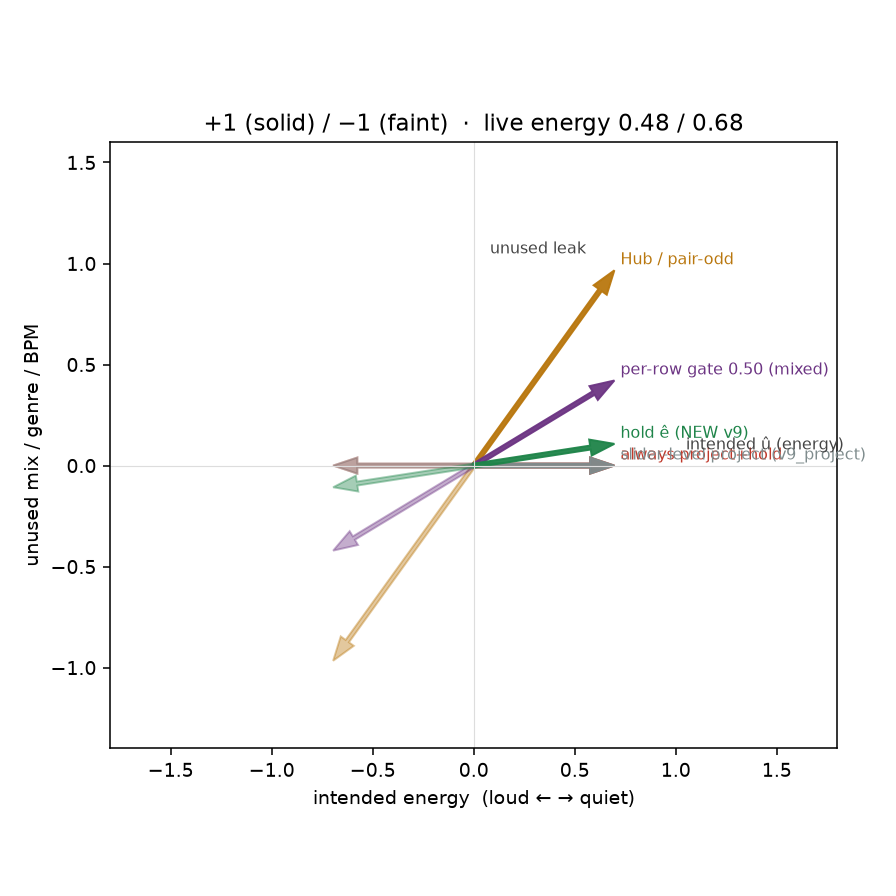

# Live 2-D cells: gender-like and energy-like

The old energetic×gender leak cell set û from the pole names, so
`|odd·û|/||odd|| ≈ 0.95` and project+hold looked leak-0. That hid
live energy the same way the first fixture hid gender.

Two CPU cells match the live Music 3 logs. One default loss has to
be right on both. Hub flags are not required.

CPU only. No Hub weights, no GPU, no Music 3 downloads.

## Cells

- **Gender-like:** clean pair, short û at `|odd·û|/||odd|| = 0.20`.
  Always-project+hold must FAIL (tiny `||d+||`, hold eats the singer).
  Pair-symmetric / Hub-odd must PASS. NEW: teacher = full odd,
  **no hold on û⊥**. Hold only if a real leak ê is declared.
- **Energy-like:** leaky pair (unused attr in `pos−neg`), short û **is**
  the intended axis, alignments `[0.48, 0.48, 0.68, 0.68]` on four rows.
  Per-row 0.50 splits the rows (mixed teacher) and must FAIL.
  Hub / symmetric-on-pair must still leak. Short-û project+hold may
  look leak-0 but is the live-fragile path. NEW: teacher = full odd,
  hold along the unused-attr direction ê.
- **Old leak-0 cell** (û = energetic/calm pole names) is not energy.
  Project+hold is still leak-0 there; that is the cheat.
- **+/− leftover** (leak_frac / same-dir) must stay in the live-good
  band (≲ 6% same-dir). It is not the thing we optimize.

## Verdict

**`--lm_target v9` is now full pair-odd + hold-on-ê** (λ=8.0).
Teacher stays `a = ½(h+−h−)`, `t± = h0 ± a`, κ = 0. Do not replace
`a` with `(a·û)û`. Short `slider_positive` is a name / probe.
Declare unused mix / BPM / genre as YAML `leak_positive` /
`leak_negative` (or `leak: [pos, neg]`). If `attributes` already
pin the unused axis, `a` is clean and hold can be 0.

Gender-like NEW: leak +0.000, `||d+||/||odd||` 1.000, cos 1.000, mixed False, same-dir 0.0000.
Energy-like NEW: leak +0.154, `||d+||/||odd||` 0.587, cos to û 0.988, mixed False, same-dir 0.0000.
Per-row 0.50 on energy: mixed=True, leak +0.605, cos 0.856.

Discarded: always-project / short-û project (kills gender at 0.20),
Hub leash (still leaks unused attr), slider-level 0.50 gate (û is
still the teacher on energy), per-row 0.50 (mixed energy teacher),
soft per-row blend of pair-odd and `(a·û)û`. λ=1 hold-on-ê leaves
energy leak ~0.69 — too weak when ê fights the full-odd teacher.
û = pole-odd on the energy cell is identity project and still leaks —
cheat leak +1.828, align 1.000.

## Table (Hub / project-short-û / NEW)

### Gender-like (intended axis = clean pair-odd)

| policy | leak | ||d+||/||odd|| | cos intended | mixed-row | verdict |
|---|---:|---:|---:|---|---|
| `hub` | +0.000 | 1.000 | 1.000 | no | **PASS** |
| `always_project_hold` | +4.899 | 0.200 | 0.200 | no | **FAIL** |
| `hold_e` | +0.000 | 1.000 | 1.000 | no | **PASS** |

### Energy-like (intended axis = energy, unused attr = ê)

| policy | leak | ||d+||/||odd|| | cos intended | mixed-row | verdict |
|---|---:|---:|---:|---|---|
| `hub` | +1.388 | 0.992 | 0.584 | no | **FAIL** |
| `always_project_hold` | +0.000 | 0.580 | 1.000 | no | **PASS** |
| `hold_e` | +0.154 | 0.587 | 0.988 | no | **PASS** |



## What each policy does

- `hub`: pair-odd + published floor/anchor. **PASS** gender (clean pair),
  **FAIL** energy (unused attr stays in `(pos−neg)/2`).
- `always_project_hold` / `--lm_target v9_always` (and `v9_project`
  on energy): **FAIL** gender (strength 0.20, hold eats the singer),
  **PASS** energy (û is the axis). Live-fragile: û is a name, not the
  teacher.
- `hold_e` / default `--lm_target v9`: **PASS** both. Teacher = full
  odd on every row. Gender declares no ê (hold 0). Energy holds the
  unused-attr direction ê at λ=8.
- `gated_row_0.50` / `slider_align_0.50`: old project path, kept as
  `--lm_target v9_project`. Not the default.

## Bare Music 3 LM train

Gender stays `--lm_target v9` (default): omit leak_*, hold 0. Leaky
axes use `--lm_target pair_odd_sub_e` (pair-odd minus `ê_⊥`, hold 0)
with leftover-only `leak_positive` / `leak_negative` (genre + mix /
BPM, not the slider). CLI `--leak_positive` / `--leak_negative` wins.
`attributes` prefixes captions (makes `a` clean) and is not ê.

Old short-û project is `--lm_target v9_project` (slider-level gate)
or `--lm_target v9_always`.

```bash
python conceptmod/textsliders/train_lm_slider_music3.py --prompts_file conceptmod/textsliders/data/prompts-gender-v4.yaml
python conceptmod/textsliders/train_lm_slider_music3.py --lm_target pair_odd_sub_e --prompts_file conceptmod/textsliders/data/prompts-energy-v4.yaml
```

## How to run

```bash
PYTHONPATH=. python analysis/slider2d/run_lm_live.py --out docs/lm-live-cells
PYTHONPATH=. pytest tests/test_lm_live_cells.py tests/test_lm_v9_mismatch.py tests/test_lm_v9_2d.py tests/test_lm_trainer_v9.py -q
```

Seed `0`, `200` Adam steps.

Unused-ê is the wrong ê for live energy-v4 leak captions (they
*are* energy). That cell is [lm-hold-overlap.md](lm-hold-overlap.md).

Both cells here are orthonormal 2-D, so λ=8 is a stiffness of 8 and
the short û *is* the concept. At live width λ=8 is `4·D`, the concept
sits partly off û, and trainer c+ has a ceiling below gender's 0.97:
[lm-highd-leftover.md](lm-highd-leftover.md).

Both cells also score a high `cos_intended` as success, and neither
can ask whether the teacher point is a caption the LM would ever
produce. The pair-odd midpoint is not, and that is what garbles the
lyric: [lm-sheet-goodhart.md](lm-sheet-goodhart.md).

