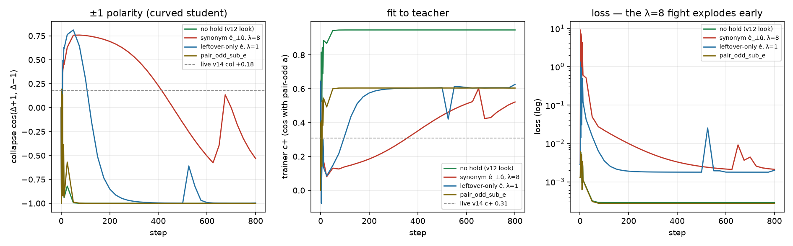

# Live energy-v14 signature: c+ vs slider-cos, live-D ê_⊥, ±1 polarity

The overlap cells ([lm-hold-overlap.md](lm-hold-overlap.md)) are
orthonormal 2-D: they show ê·û overlap and that holding ê_⊥û locks
the slider at ρ=0.5. Live energy-v14 logged three things those cells
cannot say: trainer c+ vs slider-cos as different columns, a hold
that is λ·D/2 stiff against a tiny messy ê_⊥, and a ±1 polarity
break (collapse **+0.18**, loss 278 by step 13 on the rewrite).
This cell set is D=1024, live steps (800), same teacher
and hold code paths (`lm_hidden_targets` / `lm_hold_dir` /
`lm_axis_hold` / `lm_slider_loss`).

CPU only. No Hub, no GPU, no Music 3 weights. The live default
(`--lm_target v9`, λ=8 hold on declared ê_⊥û) is unchanged.

## Verdict

**c+ is fit-to-pair-odd, not slider lock.** Gender-like prints c+ +1.00 / collapse -1.00 / perc 0% and leaky-energy-no-hold prints c+ +0.95 / collapse -1.00 / perc 32% — the same v12 look, but energy carries leak +1.29. The 2-D working hold (ρ=0.5, ê_⊥û, λ=8) locks the slider at +0.99 with leftover +0.15 while printing c+ +0.70, perc 72%, loss 0.85. A working hold on energy will never look like v12; expecting gender's 0.97 there reads success as failure.

**λ is not portable across D.** The held component of a linear fit is `s_e = t_e/(1+λ·D/2)`: λ=8 keeps 0.111 in 2-D and 0.000244 at D=1024 (~4000× annihilation); even λ=0.3 keeps 0.0065. And ê_⊥û is one direction out of a (D−2)-dim leftover, so the same recipe that locked 2-D leftover at +0.15 leaves +1.40 at live D with loss stuck 6× off the band — violent *and* barely curative.

**The ±1 break needs curvature; then λ=8 reproduces it.** A linear residual provably cannot break polarity (the loss separates over odd/even weights; under the identical fight collapse is -1.000 with ‖w_even‖ = 0.0e+00). The curved student (adapter through a saturating layer) under synonym-ê_⊥û λ=8 lands on the live shape: c+ +0.52 (live 0.31), collapse late-max +0.23 (live +0.18), perc 86% (live 132%), loss spiking 3234× in the first steps (live: 278 by step 13). The medium-energy pin does not save it (c+ +0.56, still broken): ê_⊥ is still a pole synonym.

**Canary vs teacher change.** Leftover-only ê + λ=1 trains (collapse -1.00, loss 0.0022) but leak stays +0.30 — per-row wording that one declared ê cannot name. λ=8 breaks ±1 **even with a genuinely unused ê** (collapse -0.13, spike 3735×): at live D the fight itself is the failure, not just the wrong ê. `pair_odd_sub_e` (subtract ê_⊥û from the teacher) removes the same component with no fight at all: collapse -1.00, loss 0.0018, max 0.006, leak +0.29. Use leftover-only ê + λ=1 as the live canary; if leak stays big, `pair_odd_sub_e` is the next PR — with ê_⊥û orthogonalization kept, because subtracting a synonym ê punches the heard slider (intended cos +0.40). Do not wire either as the default from this fixture alone.

## Geometry

D = 1024. The declared probe û spans only part of the heard
loudness (`heard = cos40°·û + sin40°·dense-wording`); rows are the
live aligns 0.48/0.48/0.68/0.68 against `heard`, with the leftover
split into a shared genre/BPM/mix direction and per-row wording.
Declared ê variants:

- `opposite` — energy-v4 leak captions: 0.85·heard + wording
  (ê·û +0.65, ê_⊥·â +0.77: a synonym in disguise)
- `pinned` — the "medium energy" rewrite: 0.62·heard + wording
  (ê·û +0.47, ê_⊥·â +0.66: still a synonym)
- `leftover_only` — genre+BPM wording only, no density/loudness
  words (ê·û +0.00, ê_⊥·â +0.77:
  it *is* the heard leak inside a, which is the point)

Students: `linear` = the odd+even residual every other cell uses;
`curved` = the same adapter applied through a fixed tanh layer
around a non-zero operating point (a LoRA at −1 is −ΔW in weight
space, not −Δh in hidden space).


## Signature table

slider-cos is vs the declared probe û; intended-cos is vs the heard
loudness (gender: the concept); leak is leftover-norm / |intended|;
colL is the max collapse over the last half of training.

| cell | student | ê | λ | c+ | slider | intended | col | colL | perc% | loss | loss_max | leak | v12 look | ±1 broken |
|---|---|---|---:|---:|---:|---:|---:|---:|---:|---:|---:|---:|---|---|
| `gender_like_linear` | linear | none | 0 | +1.000 | +0.200 | +1.000 | -1.000 | -1.000 | 0 | 0.0000 | 0.00 | +0.00 | yes | no |
| `gender_like_curved` | curved | none | 0 | +1.000 | +0.200 | +1.000 | -0.999 | -0.999 | 1 | 0.0000 | 0.01 | +0.01 | yes | no |
| `energy_no_hold_linear` | linear | none | 0 | +0.948 | +0.469 | +0.612 | -1.000 | -1.000 | 32 | 0.0003 | 0.00 | +1.29 | yes | no |
| `energy_no_hold_curved` | curved | none | 0 | +0.948 | +0.468 | +0.612 | -1.000 | -1.000 | 32 | 0.0003 | 0.01 | +1.29 | yes | no |
| `synonym_perp_l8_linear` | linear | opposite | 8 | +0.599 | +0.760 | +0.437 | -1.000 | -1.000 | 80 | 0.0018 | 0.17 | +1.40 | no | no |
| `synonym_perp_l8_curved` | curved | opposite | 8 | +0.522 | +0.646 | +0.342 | -0.532 | +0.229 | 86 | 0.0021 | 9.10 | +2.12 | no | **BROKEN** |
| `pinned_perp_l8_curved` | curved | pinned | 8 | +0.555 | +0.581 | +0.469 | -0.780 | -0.027 | 84 | 0.1686 | 8.22 | +1.73 | no | **BROKEN** |
| `leftover_only_l0.3_curved` | curved | leftover_only | 0.3 | +0.610 | +0.735 | +0.959 | -1.000 | -0.794 | 79 | 0.0018 | 0.40 | +0.29 | no | no |
| `leftover_only_l1_curved` | curved | leftover_only | 1 | +0.626 | +0.735 | +0.958 | -0.997 | -0.610 | 78 | 0.0022 | 1.32 | +0.30 | no | no |
| `leftover_only_l8_curved` | curved | leftover_only | 8 | +0.342 | +0.519 | +0.713 | -0.127 | +0.274 | 102 | 0.1365 | 10.51 | +0.98 | no | **BROKEN** |
| `sub_e_leftover_linear` | linear | leftover_only | sub | +0.605 | +0.735 | +0.959 | -1.000 | -1.000 | 79 | 0.0018 | 0.00 | +0.29 | no | no |
| `sub_e_leftover_curved` | curved | leftover_only | sub | +0.604 | +0.735 | +0.959 | -1.000 | -1.000 | 79 | 0.0018 | 0.01 | +0.29 | no | no |
| `sub_e_synonym_curved` | curved | opposite | sub | +0.600 | +0.741 | +0.401 | -1.000 | -1.000 | 80 | 0.0018 | 0.01 | +1.54 | no | no |

2-D reference (existing overlap cell, steps 200): `pole_synonym_slider_l8` slider +0.988, leftover +0.154, c+ +0.696, perc 72%, loss 0.852 — PASS leftover, FAIL "looks like v12".



## What each cell says

- `gender_like_*`: hold 0 (no ê declared — the field refuses an
  invented one). The "copied pair-odd" look is *correct* here.
- `energy_no_hold_*`: the same look with the heard leak on board —
  v12 / Hub. c+ cannot tell these two apart; leak can.
- `synonym_perp_l8_linear`: geometry alone at live D — leak barely
  cured, c+ down, loss stuck, but collapse exactly −1 (separability).
- `synonym_perp_l8_curved`: the live v14 signature, including the
  early explosion and the ±1 break.
- `pinned_perp_l8_curved`: the same-loudness caption pin does not
  cancel dense/sparse↔loud/quiet; λ=8 still fights and still breaks.
- `leftover_only_l*`: the proposed canary. λ≤1 trains and stays
  bipolar; λ=8 breaks even with the right ê — the λ, not only the ê,
  is wrong at live D.
- `sub_e_*`: `pair_odd_sub_e` = subtract declared ê_⊥û from `a`.
  Same leak cut, trainable loss, exact bipolarity, no spike. With a
  synonym ê it punches the heard slider — the ⊥û step and the
  leftover-only caption rule stay mandatory.

## What still cannot be seen

- The exact live magnitudes (loss 278, c+ 0.31 at step 515 of a
  real Qwen run) — the fixture matches shape, not scale.
- Whether Qwen's encodings make the *live* leftover-only captions
  actually ⊥ heard loudness — that is a probe on the real encoder
  (`probe_lm_axis_signal.py`-style), not a fixture question.
- Render/listen quality. Fixture PASS is necessary, never sufficient.

## How to run

```bash
PYTHONPATH=. python analysis/slider2d/run_lm_signature.py --out docs/lm-live-signature
PYTHONPATH=. pytest tests/test_lm_signature.py -q
```

Seed `0`, `800` Adam steps, D=1024.

