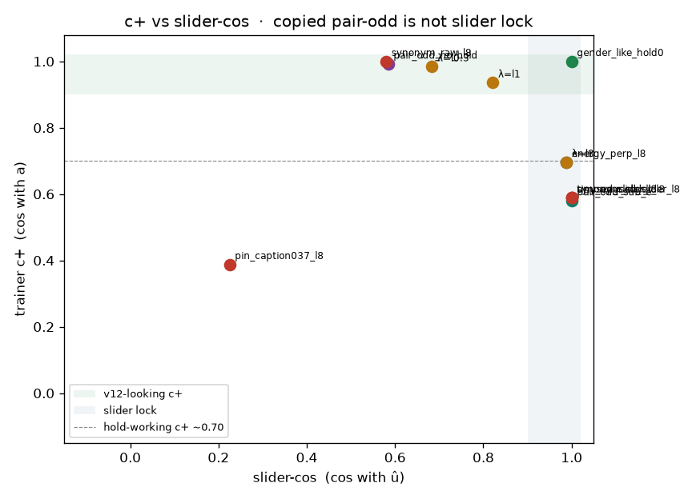
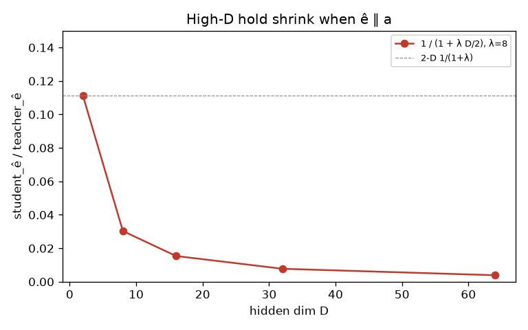

# Live Music 3 hold failure on the CPU fixture

Existing overlap / rich / faithful cells on main are orthonormal 2-D.
They show ê·û overlap and ê_⊥û locking slider-cos. They do **not**
make trainer c+ (cos with a) vs slider-cos (cos with û) a test, and
they never break ±1 polarity. This page is those missing live bullets
with real fixture numbers.

CPU only. No Hub, no GPU, no Music 3 weights.
Live `--lm_target v9` default is unchanged (True).

## Verdict

Gender-like hold 0 copies pair-odd: c+ +1.000, slider-cos +1.000, collapse -1.000, loss 0.000 — the v12-looking / gender-v14 look. No junk ê on that cell.

Energy ê synonym + ê_⊥û λ=8 on orthonormal 2-D: slider-cos +0.988, leftover +0.154, c+ +0.696, perc 72%, loss 0.852. PASS leftover lock, FAIL looks-like-v12 (pair-odd no-hold on the same poles is c+ +0.992, loss 0.022, perc 12%). Hold is *supposed* to make fit-to-pair-odd worse. Slider lock is alignment with û, not c+.

High-D (D=32) ê≈a raw λ=8: student / teacher 0.0077 vs closed form 0.0078. c+ +1.000 stays parallel; raw collapse -1.000 is still −1 because a linear odd residual of εa and −εa is antipodal. ||d+|| / ||a|| < 0.05 so the live-log cosine is undefined (reported collapse_live +0.000) — the closest analogue this field can make to energy-v14 collapse +0.18. Loss 0.089 is not in the 0.02 band; perc 99%.

Synonym pin (medium energy on both leak captions, density/genre still = poles, short û at caption-axis 0.37): ê·û +0.370, hold·â +0.929, c+ +0.388, slider-cos +0.225, perc 92%, collapse -1.000. ê_⊥ after dropping the 0.37 short û is still ≈ a, so λ=8 still fights the teacher. Tiny unused leftover after ortho is **not** this miss: unit-normalize turns it into leftover-only hold (high-D unused slider-cos +1.000, tiny-unused +1.000).

**leftover-only ê + λ=1 is the canary, not the next live wire.** It trains (c+ +0.936, loss 0.489, collapse -1.000) but leftover stays +0.694. λ=8 leftover-only locks leak (+0.154) and is hold-working, not v12-looking (c+ +0.696, perc 72%). `pair_odd_sub_e` zeros leak (+0.000) and locks slider-cos +1.000, but c+ vs full pair-odd is +0.580 — the teacher changed. Compare only. Do not wire it. Do not change `--lm_target v9`.

v12 / Hub is not leak-free on energy. Gender’s 0.97 c+ is “I copied
pair-odd.” Energy will never look like that if hold is working.

## Table

† = residual so small the live-log ±1 cosine is undefined (closest
analogue to energy-v14 collapse +0.18). Linear odd residual of εa
and −εa still prints raw collapse −1.

| cell | D | λ | ê·û | ê·â | slider-cos | c+ | leak | perc% | loss | ±1 | v12-looking | hold-working |
|---|---:|---:|---:|---:|---:|---:|---:|---:|---:|---|---|---|
| `gender_like_hold0` | 2 | 0 | — | — | +1.000 | +1.000 | +0.000 | 0 | 0.000 | -1.000 | yes | no |
| `pair_odd_no_hold` | 2 | 0 | +0.000 | — | +0.584 | +0.992 | +1.388 | 12 | 0.022 | -1.000 | yes | no |
| `energy_perp_l8` | 2 | 8 | +0.500 | +0.995 | +0.988 | +0.696 | +0.154 | 72 | 0.852 | -1.000 | no | yes |
| `leftover_only_l0.3` | 2 | 0.3 | +0.000 | +0.811 | +0.684 | +0.984 | +1.068 | 21 | 0.237 | -1.000 | no | no |
| `leftover_only_l1` | 2 | 1 | +0.000 | +0.811 | +0.821 | +0.936 | +0.694 | 42 | 0.489 | -1.000 | no | no |
| `leftover_only_l8` | 2 | 8 | +0.000 | +0.811 | +0.988 | +0.696 | +0.154 | 72 | 0.852 | -1.000 | no | yes |
| `pair_odd_sub_e` | 2 | 0 | — | — | +1.000 | +0.580 | +0.000 | 81 | 0.956 | -1.000 | no | no |
| `highd_synonym_raw_l8` | 32 | 8 | +0.580 | +1.000 | +0.580 | +1.000 | +1.405 | 99 | 0.089 | -1.000† | no | no |
| `highd_synonym_slider_l8` | 32 | 8 | +0.580 | +1.000 | +1.000 | +0.589 | +0.011 | 81 | 0.059 | -1.000 | no | yes |
| `highd_tiny_unused_slider_l8` | 32 | 8 | +0.999 | +0.620 | +1.000 | +0.589 | +0.011 | 81 | 0.059 | -1.000 | no | yes |
| `highd_pin_caption037_l8` | 32 | 8 | +0.370 | +1.000 | +0.225 | +0.388 | +1.405 | 92 | 0.077 | -1.000 | no | no |
| `highd_unused_slider_l8` | 32 | 8 | +0.000 | +0.815 | +1.000 | +0.589 | +0.011 | 81 | 0.059 | -1.000 | no | yes |





## What is now a 2-D / high-D cell

- Gender-like copied pair-odd (hold 0, no junk ê): c+ / collapse /
  slider-cos as first-class columns. This *is* the v12-looking look.
- Energy ê synonym + ê_⊥û λ=8 on orthonormal 2-D: leftover PASS,
  looks-like-v12 FAIL (c+ ~0.70, perc ~72%).
- leftover-only ê × λ ∈ {0.3, 1, 8} vs `pair_odd_sub_e` on the same
  leaky energy poles.
- High-D ê≈a raw λ=8: closed-form shrink `1/(1+λD/2)`, residual → 0,
  perc stuck, polarity cosine undefined.
- Synonym pin: short û at live caption-axis 0.37, ê≈a, ê_⊥û still
  fights a. λ=8 still bad.

## What this field still cannot see

- Live collapse **+0.18** as a converged linear-odd number. A
  multiplier residual of εa and −εa is antipodal even when ε→0.
  Live Qwen LoRA is nonlinear in hidden space; +1 and −1 need not
  stay opposite once the residual is numerically gone. The fixture
  reports that as undefined / 0, not +0.18.
- Loss 278 by step 13. High-D MSE is a mean over D, so the same
  fight prints a *small* loss (~0.09 at D=32) and a huge perc.
  The explosion is an AR / optimizer event this field does not have.
- A tiny unused leftover that is *weaker* than leftover-only hold.
  `lm_axis_hold` unit-normalizes ê_⊥. Tiny unused = unused.

## Geometry

```
MSE  = mean_D ||student − teacher||²     # 1/D factor
hold = ½ ((d+·ê)² + (d−·ê)²)            # not divided by D
w_ê  = a_ê / (1 + λ D/2)
```

At D=2, λ=8 this is `1/9`. At D=32 it is `0.0078`.
2-D stays parallel to the teacher (c+ high) whenever ê ∥ a.
High-D zeros that component. If ê≈a, the whole residual → 0.

Synonym pin: leak captions both say medium energy (even cancels).
Density / slammed vs airy still encodes the poles, so ê≈a.
Short `slider_positive` is loud/calm at ê·û = 0.37.
ê_⊥ = ê − (ê·û)û still ≈ a. λ=8 still fights.

## How to run

```bash
PYTHONPATH=. python analysis/slider2d/run_lm_signature.py --out docs/lm-live-signature
PYTHONPATH=. pytest tests/test_lm_signature.py tests/test_lm_hold_overlap.py tests/test_lm_live_cells.py -q
```

Seed `0`, `200` Adam steps.

See [lm-hold-overlap.md](lm-hold-overlap.md) for the orthonormal
ê·û sweep and [lm-live-cells.md](lm-live-cells.md) for the default
v9 gender/energy cells. Do not change `--lm_target v9`.

