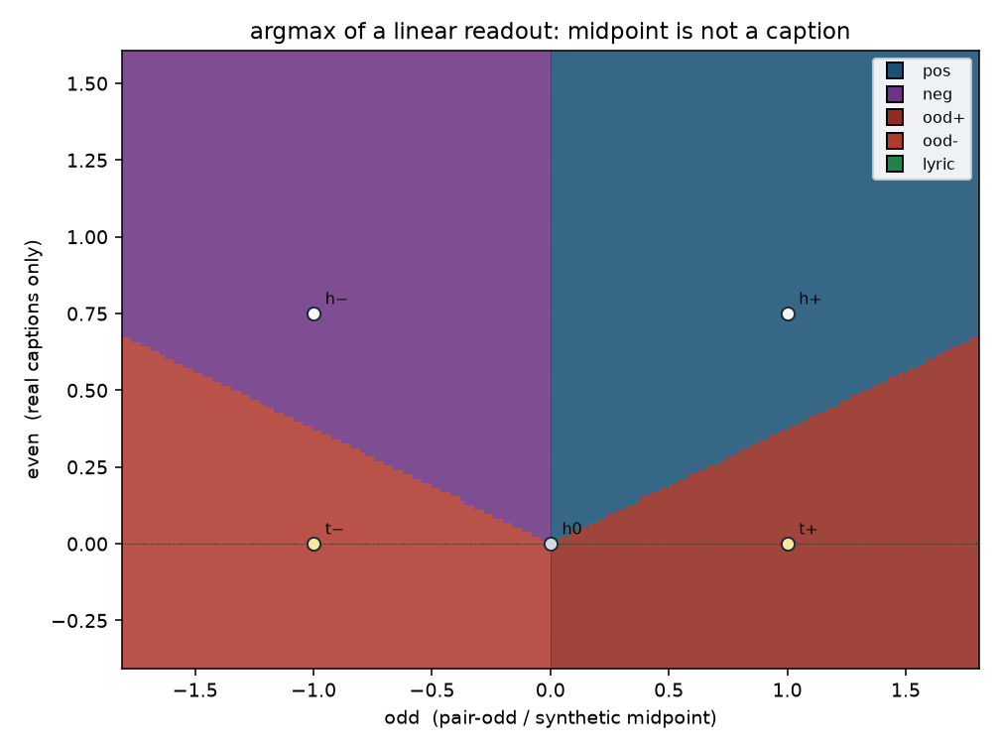
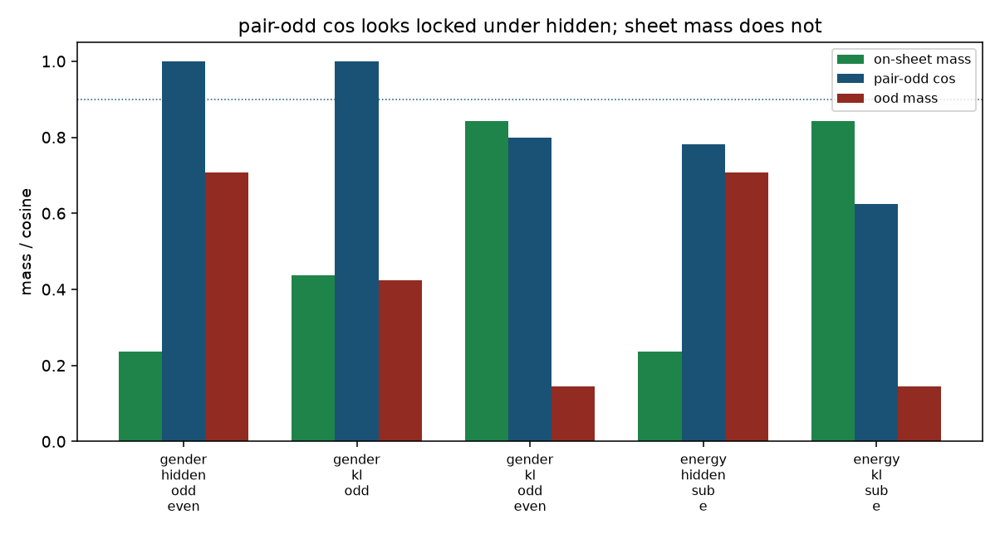

# Lyric-garble Goodhart: hidden midpoint vs semantic KL

v15 pole term is hidden MSE onto the pair-odd midpoint
`t± = h0 ± ½(h+ − h−)`. That point is **not a real caption**. Hitting
it is what made gender-v15 start singing words that are not on the
sheet, while pair-odd cos / collapse printed the locked look
(~0.96 / −0.95). Existing 2-D cells treat high pair-odd cos as
success. That is the Goodhart.

v16 `--pole_mode semantic_kl` fits the next-token policy of a real
caption hidden. Gender: `KL(encode(pos) || LoRA@+1)` and the minus
pole; no leak_*, hold_ê=0. Leaky axes (`pair_odd_sub_e`): same KL,
ê-cleaned real poles, still hold_ê=0. Pair-odd cos / collapse are
logged only and look worse. That is expected.

This field invents the smallest extra structure that can see
off-sheet singing: a tiny vocab and a linear readout. CPU only. No
Hub, no GPU, no Music 3 weights. `--lm_target v9` / hold math is
untouched. The committed trainer still applies hidden MSE — this
cell scores the two pole terms without changing the live default.

## Verdict

**Hidden MSE onto the midpoint goes off-sheet while looking locked.
Semantic KL stays on-sheet if the student can hold the shared even.**

Gender hidden (`odd_even`): pair-odd cos +1.000,
collapse -1.000, argmax `ood+` /
`ood-`, on-sheet mass 0.24.
Gender KL (`odd_even`): pair-odd cos +0.800,
collapse -0.280, on-sheet mass
0.84, argmax `pos` /
`neg`. Worse-looking lock, on the sheet.

A linear readout is enough to *create* the third token. Softmax of
the hidden-space blend is not a blend of the two caption policies:
midpoint argmax `ood+`, caption argmax
`pos` (sheet mass 0.84
vs midpoint 0.24). A linear *student* that
is odd in the slider scale cannot *stay* on-sheet under KL — no
bias, argmax is constant along a ray, and the whole pair-odd ray is
off-sheet (`gender_kl_odd` still sings `ood+` /
`ood-`). The `odd_even` residual
(`s·w_odd + |s|·w_even`) is the curved student that can hold the
shared even. Hypothesis: linear readout enough to leave the sheet
under MSE — **kept**. Linear odd student enough to stay on-sheet
under KL — **discarded**.

Do not call v15 leak-free or lock-healthy because pair-odd cos is
1.00. Do not revert a later live default to
hidden because this cell exists.

## Field

```
dim 0      pair-odd           a = ½(h+ − h−); t± = h0 ± a live here
dim 1      shared even        real captions only; midpoint drops it
dim 2      leftover ê         unused mix / BPM (energy cells)

h+ = (odd, even, leftover)     encode(pos) — on-sheet argmax pos
h− = (−odd, even, −leftover)   encode(neg) — on-sheet argmax neg
t+ = (odd, 0, leftover)        synthetic midpoint — off-sheet
â  = (odd, 0, 0)               ê-cleaned midpoint — still off-sheet
h+_clean = (odd, even, 0)      ê-cleaned real pole — on-sheet

vocab  pos, neg, ood+, ood−, lyric, leak
sheet  pos / neg / lyric
off    ood± (midpoint garble) and leak (unused-attr singing)
```

Linear readout (no bias). Midpoint vs caption is an argmax flip, not
a large hidden cosine:
cos(h+, t+) = 0.800 on gender,
0.863 on energy. The live 0.96 lock is
the student-to-teacher cosine after hidden MSE, not this number.

## Table

### Gender-like (no ê, hold 0)

| cell | pole | teacher | student | teacher cos | pair-odd cos | ±1 | on-sheet | ood mass | ood rate | argmax ± | locked look | Goodhart | verdict |
|---|---|---|---|---:|---:|---:|---:|---:|---:|---|---|---|---|
| `gender_hidden_odd` | hidden | `pair_odd` | `odd` | +1.000 | +1.000 | -1.000 | 0.24 | 0.71 | 1.00 | ood+ / ood- | yes | yes | **FAIL** |
| `gender_hidden_odd_even` | hidden | `pair_odd` | `odd_even` | +1.000 | +1.000 | -1.000 | 0.24 | 0.71 | 1.00 | ood+ / ood- | yes | yes | **FAIL** |
| `gender_hidden_faithful_odd_even` | hidden | `faithful` | `odd_even` | +0.800 | +0.800 | -0.280 | 0.84 | 0.14 | 0.00 | pos / neg | no | no | **PASS** |
| `gender_kl_odd` | semantic_kl | `pair_odd` | `odd` | +1.000 | +1.000 | -1.000 | 0.44 | 0.42 | 1.00 | ood+ / ood- | yes | yes | **FAIL** |
| `gender_kl_odd_even` | semantic_kl | `pair_odd` | `odd_even` | +0.800 | +0.800 | -0.280 | 0.84 | 0.14 | 0.00 | pos / neg | no | no | **PASS** |

### Energy-like leftover + `pair_odd_sub_e` (hold 0)

| cell | pole | teacher | student | teacher cos | pair-odd cos | ±1 | on-sheet | ood mass | ood rate | argmax ± | locked look | Goodhart | verdict |
|---|---|---|---|---:|---:|---:|---:|---:|---:|---|---|---|---|
| `energy_hidden_pair_odd` | hidden | `pair_odd` | `odd_even` | +1.000 | +1.000 | -1.000 | 0.19 | 0.56 | 1.00 | leak / ood- | yes | yes | **FAIL** |
| `energy_hidden_sub_e` | hidden | `pair_odd_sub_e` | `odd_even` | +1.000 | +0.781 | -1.000 | 0.24 | 0.71 | 1.00 | ood+ / ood- | yes | yes | **FAIL** |
| `energy_kl_pair_odd` | semantic_kl | `pair_odd` | `odd_even` | +0.863 | +0.863 | -0.490 | 0.78 | 0.13 | 0.00 | pos / neg | no | no | **PASS** |
| `energy_kl_sub_e` | semantic_kl | `pair_odd_sub_e` | `odd_even` | +0.800 | +0.625 | -0.280 | 0.84 | 0.14 | 0.00 | pos / neg | no | no | **PASS** |





## What each row does

- `gender_hidden_odd` / `gender_hidden_odd_even`: v15. Student hits
  `t+`. Even capacity does not help — the teacher has no even, so
  `w_even → 0`. Pair-odd cos +1.000 /
  +1.000, collapse -1.000,
  argmax `ood+` / `ood-`. The
  early-stop look (`c+ ≥ 0.90`, collapse `≤ −0.85`) fires. Off-sheet.
- `gender_hidden_faithful_odd_even`: control. Hidden MSE onto the
  *real* captions stays on-sheet (argmax `pos` /
  `neg`). The garble is the midpoint, not
  hidden MSE in general.
- `gender_kl_odd`: v16 loss, live-like odd LoRA. Shrinks along the
  pair-odd ray (temperature down, argmax unchanged). Still
  `ood+` / `ood-`.
  Semantic KL does not save a student that cannot leave the ray.
- `gender_kl_odd_even`: v16. Lands on encode(pos)/encode(neg).
  Pair-odd cos +0.800, collapse
  -0.280 — worse than v15, on-sheet.
- `energy_hidden_pair_odd`: raw pair-odd midpoint keeps leftover.
  Argmax `leak` / `ood-`,
  leftover leak +0.800. Off-sheet. v12 / Hub
  / v15 with no ê are not leak-free on these poles.
- `energy_hidden_sub_e`: ê-cleaned midpoint. Leftover gone
  (0.000), still argmax `ood+` /
  `ood-`. Cleaning ê does not put the midpoint
  back on the sheet.
- `energy_kl_pair_odd`: KL onto raw encode(pos). On-sheet
  (`pos` / `neg`) and
  still carries leftover 0.800 — the unused
  attr is in the real captions.
- `energy_kl_sub_e`: v16 leaky path. KL onto ê-cleaned real poles,
  hold 0. On-sheet (`pos` / `neg`),
  leftover 0.000, pair-odd cos
  +0.625.

## Hypothesis, proved or discarded

| claim | result |
|---|---|
| Tiny vocab + linear readout is enough to make the midpoint prefer a third token | **proved** (mid `ood+` ≠ caption `pos`) |
| Hidden MSE onto `t±` moves the student off the sheet while pair-odd cos looks locked | **proved** (`goodhart` on both gender hidden rows) |
| Semantic KL onto encode(pos)/encode(neg) stays on-sheet | **proved** for `odd_even`; **discarded** for odd-linear |
| A linear odd student can leave the sheet under MSE | **proved** (it goes to the midpoint) |
| A linear odd student can stay on-sheet under KL | **discarded** (ray-invariant argmax) |
| `pair_odd_sub_e` hidden is on-sheet because ê is gone | **discarded** (cleaned midpoint still `ood+`) |

## Live trainer

`train_lm_slider_music3.py` on `main` @ 38aeeed still applies
`lm_slider_loss` (hidden MSE) inside `lm_train_loss`. There is no
`--pole_mode` flag. `lm_semantic_kl` / `lm_e_cleaned_captions` live
in `slider_targets.py` as the CPU extract this fixture scores. This
PR does not wire the flag and does not change the live default.
Wire it only when a later change *is* the trainer change; do not
revert a later `semantic_kl` default to hidden because pair-odd cos
looks worse.

`--early_cos 0.97 --early_collapse -0.95` would stop the hidden
gender rows as done. That gate is blind to the sheet.

## What this field cannot see

- **Real Qwen lyrics.** The vocab is six tokens. Off-sheet here is
  `ood±` / `leak`, not a sung line from the written lyric sheet.
- **AR sampling.** Policy is one next-token softmax of a linear
  head. No teacher-forced composition, no `<|audio_end|>`, no
  endreg / planreg interaction.
- **Whether live LoRA's even reply is large enough.** Gender-v14
  collapse −0.95 implies bend ≈ 0.16. This readout flips argmax at
  even = 0.75, so 0.16 would still be off-sheet. A real Qwen head
  might flip with a smaller even — only a live probe can measure
  that.
- **Hidden width / λ·D/2 / ê wording.** That is
  [lm-highd-leftover.md](lm-highd-leftover.md).

## How to run

```bash
PYTHONPATH=. python analysis/slider2d/run_lm_sheet.py --out docs/lm-lyric-garble
PYTHONPATH=. pytest tests/test_lm_lyric_garble.py -q
```

CPU only. No Hub, no GPU, no Music 3 weights.

Seed `0`, `300` Adam steps, lr 0.08.
