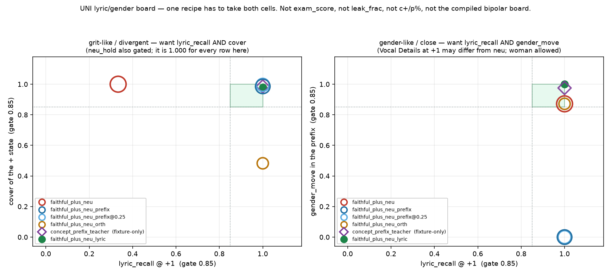
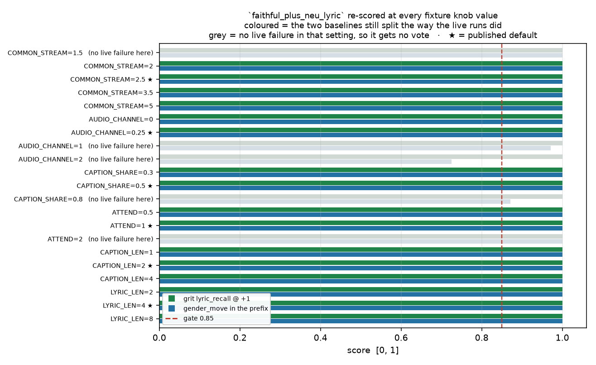

# UNI lyric/gender board: one recipe, both failures

Generated by `analysis/slider2d/run_lm_lyric_gender.py`. CPU only, no
Hub, no GPU, no Music 3 weights, no Music 3 train. Does not change the
live trainer default (`--lm_target v9` / `--pole_mode hidden`). This is
a **separate scale**. It is not folded into the compiled bipolar board,
and nothing here ranks on `exam_score`, `leak_frac`, `c+` or `p%`.

**Does one opt-in recipe take both pair types? `yes` — `--lm_target faithful_plus_neu_lyric`.**

## 1. Diagnosis: two failures, one cause, opposite clamps

Music 3 LM sliders, UNI (`faithful_plus_neu`): the student is
`encode(neu tokens) + LoRA`, the teacher is `encode(pos tokens)` at the
last real token, and the last real token is `<|audio_start|>`. The loss
is a single point. The LoRA is not.

A LoRA on attention fires at **every** position, and the continue token
reads the prefix, so the last-token gradient arrives at every prefix
token too. Two consequences, and they pull opposite ways:

1. **Grit / distortion / joy (divergent).** `h+` is far from `h0`, so
   the rewrite the LoRA has to produce is large, and the share of it
   that lands on the lyric positions is large in absolute terms. The
   written line stops being the written line: +1 sings the caption's
   concept words. `+ REF` (pos caption, slider off) still sings the
   line, so this is the LoRA's prefix rewrite, not the caption.
2. **Gender (close).** `h+ − h0` is small and on-manifold, so nothing
   shreds — but the concept *is* a prefix span. The + caption says
   `One female lead singer. A woman is singing…`; the neutral says
   `One lead singer`. Listen is neutral caption + LoRA, so the woman
   can only exist if the LoRA rewrites that ungendered caption span.

`faithful_plus_neu_prefix` holds the whole `encode(neu)` prefix. That
fixes (1) by forbidding prefix rewrites — which is exactly what (2)
needs. It is not a weight that is too high; it is a hold whose support
covers the concept. Lowering the weight slides between the two failures
instead of splitting them, and the board below shows that directly.

The support is the variable, not the strength. The lyric span and the
caption span are different token ranges of the same prompt, and only
one of them is the thing we are protecting.

## 2. The recipe

`--lm_target faithful_plus_neu_lyric` (opt-in; default stays `v9`).

- last hidden @ +1 → raw `h+`. Unchanged from `faithful_plus_neu`.
- last hidden @ scale 0 → `h0`. Unchanged.
- **hidden at every position in `<|lyrics_start|> … <|lyrics_end|>`
  @ +1 → the same positions of `encode(neu)`.** New, and the only
  new term.
- the caption span, including Vocal Details, is **not** held.
- no minus teacher, no leftover-gate, no pair-odd, no `h0 ± a`.

The span is resolved from the tokenizer (`lm_lyric_span_mask`), the
written lyric tokens plus the closing marker whose hidden summarizes
them, and it **fails closed**: a tokenizer that cannot name the markers,
or a row without a well-formed span, raises rather than quietly
degrading into `faithful_plus_neu` under a different flag name.

The term is `lm_masked_hidden_mse`, a per-element mean, so weight 1.0
puts it on the same scale as the last-token MSE. Worth stating plainly:
the older whole-prefix hold uses `_masked_hidden_mse`, which sums over
hidden width per position, so its effective weight is about
`hidden_size` times the last-token MSE. That is a second, independent
reason live prefix-hold froze the prefix hard — and it is left alone
here, because it is the published #48 baseline and this board is
supposed to compare against what actually ran. The 2D board normalizes
both holds the same way, so the win below is not a weight artifact.

```bash
CUDA_VISIBLE_DEVICES=N python conceptmod/textsliders/train_lm_slider_music3.py \
  --name gender-lm-uni-lyric \
  --prompts_file conceptmod/textsliders/data/prompts-gender-v4.yaml \
  --lm_target faithful_plus_neu_lyric --pole_mode hidden \
  --rank 8 --alpha 8 --lr 5e-4 --steps 800 --seed 7 \
  --no-early_stop --endreg_weight 1.0 --device 0
```

No v4 rewrite. Infer and listen with the yaml **neutral** caption +
LoRA, not the + caption.

## 3. Why the others lose

| candidate | grit | gender | why it loses |
|---|---|---|---|
| `faithful_plus_neu` | lyric_recall 0.333 MISS | gender_move 0.872 **HIT** | the failure itself: no hold anywhere, so the prefix rewrite is free |
| `faithful_plus_neu_prefix` | lyric_recall 1.000 **HIT** | gender_move 0.000 MISS | hold covers the caption span, so it pins the concept away |
| `faithful_plus_neu_prefix@0.25` | lyric_recall 1.000 **HIT** | gender_move 0.000 MISS | the same clamp, softer — a slide along one axis, not a split |
| `faithful_plus_neu_orth` | cover 0.483 vs gate 0.85 | gender_move 0.872 **HIT** | projects the *target*, not the LoRA: the prefix rewrite is untouched and the + state is no longer `h+`, so cover collapses |
| `concept_prefix_teacher` | lyric_recall 1.000 **HIT** | gender_move 0.975 **HIT** | wins on the fixture and cannot be built live — see below |

**`lm_project_last_delta_off_lyric`.** It moves where the last-token
teacher points, orthogonal to the lyric-hidden span. But the shred does
not come from the *direction* of the last-token delta; it comes from
the LoRA firing on lyric activations on its way to producing that
delta. So the lyrics are saved for the wrong reason — the target is no
longer `h+`, and grit cover falls to 0.483 against a 0.85 gate. This is the hypothesis this pass discards.

**Concept-prefix teacher + lyric hold.** Teach the caption span toward
`encode(pos)`'s caption span and hold the lyric span to `encode(neu)`.
On this fixture it does take both cells (gender_move 0.975), and it is still
not the pick, for one concrete reason: it needs a position-by-position
correspondence between the two caption spans. The fixture has one
because both spans are the same length by construction. The live yaml
does not — `One female lead singer. A woman is singing…` and `One lead
singer` are different token counts, so there is no position *i* to MSE
against position *i*. A pooled variant is buildable, but it costs a
second sequence teacher and a pooling choice, and this board says the
extra teacher buys nothing: freeing the caption span already gets
gender_move 1.000, above the 0.975 the explicit
teacher reaches. It is on the board, marked fixture-only, rather than
left unmentioned.

## 4. The board

400 Adam steps, seed 0. The fit starts from a zero init and
the cell geometry is seed-free, so these numbers are deterministic;
the seed is recorded for form, not because it moves anything.

Scored on **grit-like / divergent**: `lyric_recall` @ +1, `cover`,
`neu_hold` (gates 0.85 / 0.85 / 0.85).
Scored on **gender-like / close**: `lyric_recall` @ +1 and
`gender_move` (gates 0.85 / 0.85).
`cover` and `neu_hold` are logged on the close cell — the caption span
is *supposed* to move there.

`gender_move` is the share of the + caption's readable Vocal Details
gender margin (`logit(female) − logit(male)` under the frozen readout)
that the student put back into the **neutral** prefix at +1. 1.0 means
the neutral prefix at +1 reads as female as the + caption does; 0.0
means it still reads ungendered.

### `divergent` — energy-v4 shape: two tracks, concept in caption words, ‖h+ − h0‖ large — this is where UNI shreds lyrics

| recipe | live flag | lyric_recall @ +1 | gender_move | cover | neu_hold | off-caption | hit |
|---|---|---:|---:|---:|---:|---:|---|
| `faithful_plus_neu_prefix` | yes | 1.000 | n/a | 0.986 | 1.000 | 0.000 | **HIT** |
| `faithful_plus_neu_prefix@0.25` | yes | 1.000 | n/a | 0.996 | 1.000 | 0.000 | **HIT** |
| `concept_prefix_teacher` | fixture-only | 1.000 | n/a | 0.986 | 1.000 | 0.000 | **HIT** |
| `faithful_plus_neu_lyric` | yes | 1.000 | n/a | 0.980 | 1.000 | 0.000 | **HIT** |
| `faithful_plus_neu_orth` | yes | 1.000 | n/a | 0.483 | 1.000 | 0.031 | MISS |
| `faithful_plus_neu` | yes | 0.333 | n/a | 1.000 | 1.000 | 0.000 | MISS |

### `close` — gender-v4 shape: one song, the moved attribute is a prefix Vocal Details span — this is where prefix-hold kills the woman

| recipe | live flag | lyric_recall @ +1 | gender_move | cover | neu_hold | off-caption | hit |
|---|---|---:|---:|---:|---:|---:|---|
| `faithful_plus_neu` | yes | 1.000 | 0.872 | 1.000 | 1.000 | 0.000 | **HIT** |
| `faithful_plus_neu_orth` | yes | 1.000 | 0.872 | 0.596 | 1.000 | 0.000 | **HIT** |
| `concept_prefix_teacher` | fixture-only | 1.000 | 0.975 | 0.986 | 1.000 | 0.000 | **HIT** |
| `faithful_plus_neu_lyric` | yes | 1.000 | 1.000 | 0.981 | 1.000 | 0.000 | **HIT** |
| `faithful_plus_neu_prefix` | yes | 1.000 | 0.000 | 0.986 | 1.000 | 0.000 | MISS |
| `faithful_plus_neu_prefix@0.25` | yes | 1.000 | 0.000 | 0.996 | 1.000 | 0.000 | MISS |



### Combined rank — both cells or nothing

| rank | recipe | takes both | grit lyric_recall | grit cover | gender lyric_recall | gender_move | what it is |
|---:|---|---|---:|---:|---:|---:|---|
| 1 | `faithful_plus_neu_lyric` | **yes** | 1.000 | 0.980 | 1.000 | 1.000 | hold the lyric span only; caption span free |
| 2 | `concept_prefix_teacher` | **yes** | 1.000 | 0.986 | 1.000 | 0.975 | caption span → encode(pos) caption span, lyric span → encode(neu) |
| 3 | `faithful_plus_neu_orth` | — | 1.000 | 0.483 | 1.000 | 0.872 | last-delta projected off the lyric span; no prefix term |
| 4 | `faithful_plus_neu_prefix` | — | 1.000 | 0.986 | 1.000 | 0.000 | baseline: hold the whole encode(neu) prefix (#48) |
| 5 | `faithful_plus_neu_prefix@0.25` | — | 1.000 | 0.996 | 1.000 | 0.000 | the same clamp, softer — a slide, not a split |
| 6 | `faithful_plus_neu` | — | 0.333 | 1.000 | 1.000 | 0.872 | baseline: last-hidden MSE only (#46) |

### What the prefix actually sings

The sung line is the greedy next token at each **lyric** position, read
against the yaml lyric sheet — the one existing column #48 found that
flags grit shred and keeps gender. Vocal Details is the gender word the
caption position reads, `—` when it reads neither.

| cell | recipe | sung line @ +1 | Vocal Details @ +1 | Vocal Details, + REF |
|---|---|---|---|---|
| `divergent` | `faithful_plus_neu` | `punk punk punk punk / lyric1 lyric1 lyric1 lyric1 / punk punk punk punk` | — | — |
| `divergent` | `faithful_plus_neu_prefix` | `lyric0 lyric0 lyric0 lyric0 / lyric1 lyric1 lyric1 lyric1 / lyric2 lyric2 lyric2 lyric2` | — | — |
| `divergent` | `faithful_plus_neu_prefix@0.25` | `lyric0 lyric0 lyric0 lyric0 / lyric1 lyric1 lyric1 lyric1 / lyric2 lyric2 lyric2 lyric2` | — | — |
| `divergent` | `faithful_plus_neu_orth` | `lyric0 lyric0 lyric0 lyric0 / lyric1 lyric1 lyric1 lyric1 / lyric2 lyric2 lyric2 lyric2` | — | — |
| `divergent` | `concept_prefix_teacher` | `lyric0 lyric0 lyric0 lyric0 / lyric1 lyric1 lyric1 lyric1 / lyric2 lyric2 lyric2 lyric2` | — | — |
| `divergent` | `faithful_plus_neu_lyric` | `lyric0 lyric0 lyric0 lyric0 / lyric1 lyric1 lyric1 lyric1 / lyric2 lyric2 lyric2 lyric2` | — | — |
| `close` | `faithful_plus_neu` | `lyric0 lyric0 lyric0 lyric0 / lyric1 lyric1 lyric1 lyric1 / lyric2 lyric2 lyric2 lyric2` | female | female |
| `close` | `faithful_plus_neu_prefix` | `lyric0 lyric0 lyric0 lyric0 / lyric1 lyric1 lyric1 lyric1 / lyric2 lyric2 lyric2 lyric2` | — | female |
| `close` | `faithful_plus_neu_prefix@0.25` | `lyric0 lyric0 lyric0 lyric0 / lyric1 lyric1 lyric1 lyric1 / lyric2 lyric2 lyric2 lyric2` | — | female |
| `close` | `faithful_plus_neu_orth` | `lyric0 lyric0 lyric0 lyric0 / lyric1 lyric1 lyric1 lyric1 / lyric2 lyric2 lyric2 lyric2` | female | female |
| `close` | `concept_prefix_teacher` | `lyric0 lyric0 lyric0 lyric0 / lyric1 lyric1 lyric1 lyric1 / lyric2 lyric2 lyric2 lyric2` | female | female |
| `close` | `faithful_plus_neu_lyric` | `lyric0 lyric0 lyric0 lyric0 / lyric1 lyric1 lyric1 lyric1 / lyric2 lyric2 lyric2 lyric2` | female | female |

The `+ REF` column is the pos caption with the slider off. It sings the
line (`lyric_recall 1.000` on grit)
and it reads female on the close cell, which is the point: the caption
is not what breaks the lyrics, and the gender is genuinely in the
prefix rather than at the continue token.

## 5. Is this a knife-edge?

The fixture has knobs, so the board is re-run at every value of every
one of them, and the sweep is published rather than tuned against.
A setting where the two baselines stop splitting the way the live runs
did is a setting with no live failure in it, so it gets no vote.

- settings swept: **21**
- settings that still reproduce the live split (`faithful_plus_neu` shreds grit and moves gender, `faithful_plus_neu_prefix` the reverse): **16**
- of those, `faithful_plus_neu_lyric` takes both cells in **16**
- counterexamples: **none**

| knob | value | live split reproduces | pick takes both | pick grit lyric_recall | pick gender_move |
|---|---:|---|---|---:|---:|
| `COMMON_STREAM` | 1.5 | no live failure here | **yes** | 1.000 | 1.000 |
| `COMMON_STREAM` | 2 | yes | **yes** | 1.000 | 1.000 |
| `COMMON_STREAM` (default) | 2.5 | yes | **yes** | 1.000 | 1.000 |
| `COMMON_STREAM` | 3.5 | yes | **yes** | 1.000 | 1.000 |
| `COMMON_STREAM` | 5 | yes | **yes** | 1.000 | 1.000 |
| `AUDIO_CHANNEL` | 0 | yes | **yes** | 1.000 | 1.000 |
| `AUDIO_CHANNEL` (default) | 0.25 | yes | **yes** | 1.000 | 1.000 |
| `AUDIO_CHANNEL` | 1 | no live failure here | **yes** | 1.000 | 0.972 |
| `AUDIO_CHANNEL` | 2 | no live failure here | no | 1.000 | 0.725 |
| `CAPTION_SHARE` | 0.3 | yes | **yes** | 1.000 | 1.000 |
| `CAPTION_SHARE` (default) | 0.5 | yes | **yes** | 1.000 | 1.000 |
| `CAPTION_SHARE` | 0.8 | no live failure here | **yes** | 1.000 | 0.872 |
| `ATTEND` | 0.5 | yes | **yes** | 1.000 | 1.000 |
| `ATTEND` (default) | 1 | yes | **yes** | 1.000 | 1.000 |
| `ATTEND` | 2 | no live failure here | **yes** | 1.000 | 1.000 |
| `CAPTION_LEN` | 1 | yes | **yes** | 1.000 | 1.000 |
| `CAPTION_LEN` (default) | 2 | yes | **yes** | 1.000 | 1.000 |
| `CAPTION_LEN` | 4 | yes | **yes** | 1.000 | 1.000 |
| `LYRIC_LEN` | 2 | yes | **yes** | 1.000 | 1.000 |
| `LYRIC_LEN` (default) | 4 | yes | **yes** | 1.000 | 1.000 |
| `LYRIC_LEN` | 8 | yes | **yes** | 1.000 | 1.000 |



The settings that drop out of the split are the ones that give
`<|audio_start|>` a large private channel or a weak read of the prefix.
In that regime the continue token can be moved without touching the
prompt at all — so nothing shreds, nothing needs a hold, and there is
no problem to solve. The live evidence says we are not in that regime:
UNI shreds, and holding the prefix costs last-token accuracy.

## 6. The fixture

Each row is a sequence, assembled the way `_assemble` assembles one:

```
[ caption span (Vocal Details) x2 ][ lyric span x4 ][ <|audio_start|> ]
```

The `<|audio_start|>` base hidden is `h0` itself, so `cover`,
`neu_hold` and off-caption read exactly the vectors the plus+neu exam
reads. The student is a **shared linear map** on each position's own
activation — `δ(σ, x) = (σ·W_odd + |σ|·W_even + W_zero) x` — not a free
vector per position. That matters: whether a hold on one span is cheap
has to *fall out* of whether that span's activations are separable, not
be assumed.

Three modelling choices carry the result, all of them named constants:

- `COMMON_STREAM = 2.5` — the residual-stream component
  every position shares. Real LM hiddens at different positions are far
  from orthogonal, and that shared channel is what lets one LoRA weight
  rewrite every position at once. Without it the map could specialize
  per span for free, no last-token loss would ever touch the lyrics,
  and the fixture could not reproduce the shred that started this.
- `AUDIO_CHANNEL = 0.25` — the continue token's own input
  channel. Small, because the `<|audio_start|>` hidden is mostly a read
  of the prompt. This is the knob the sweep is most sensitive to, and
  it is sensitive in the honest direction: make it big and the live
  failure disappears along with the need for a fix.
- `CAPTION_SHARE = 0.5` — how much of `h+ − h0` the +
  caption states in its Vocal Details span rather than at the continue
  token. This is what makes `gender_move` well-defined at all.

`ATTEND = 1` is how much of the prefix rewrite the continue
token re-reads; that coupling is why a last-token-only loss puts mass
on the lyric span in the first place.

The close cell is `close_field(unused=-0.55)`: gender-v4 with the moved
Vocal Details attribute placed on the axis `male` / `female` actually
read, negative because `female` reads `−ĝ`. `close_field` alone puts
all of a close pair's motion in `delivery`, a zero column, so nothing
could score whether the woman arrived. `shared` is still solved from
the logged gender-v4 pair cos.

## 7. Limits

- There is still no 2D metric for slight +1 lyric *smear*. This board
  scores whether the written line survives as the argmax, not whether
  it is delivered cleanly. Listen and `scripts/blindspot_whisper.py`
  `lyric_recall` remain the real exam.
- `gender_move` is a readout margin in a fixture, not an F0 estimate.
  It says the neutral prefix reads female at +1; it does not promise a
  live median F0.
- No Music 3 train, no GPU, no Hub, no weights on this branch. The live
  flag is wired and unit-tested; it has not been run on real audio.

## Related cells (not this scale)

- [lm-lyric-recall.md](lm-lyric-recall.md) — which existing metric flags grit shred and keeps gender (#48).
- [lm-plus-neu-exam.md](lm-plus-neu-exam.md) — last-hidden cover / neu_hold / off-caption.
- [lm-plus-exam.md](lm-plus-exam.md) — plus-only cover / off-caption.
- [lm-pair-exam.md](lm-pair-exam.md) — bipolar continuation gates.
- [lm-2d-scoreboard.md](lm-2d-scoreboard.md) — compiled bipolar board, not updated and not folded into.

## How to run

```bash
PYTHONPATH=. python analysis/slider2d/run_lm_lyric_gender.py --out docs/lm-lyric-gender
PYTHONPATH=. pytest tests/test_lm_lyric_gender.py tests/test_lm_lyric_recall.py \
  tests/test_lm_plus_neu_exam.py tests/test_lm_trainer_v9.py -q
```

CPU only. No Hub, no GPU, no Music 3 weights. Seed `0`, `400` Adam steps.

