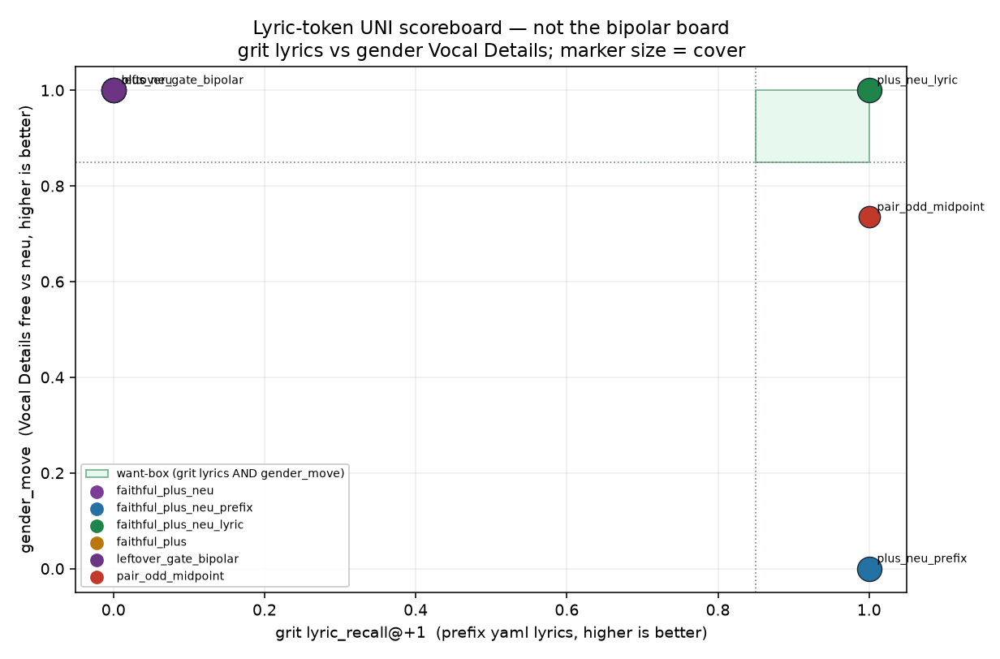

# Lyric-token UNI scoreboard

Generated by `analysis/slider2d/run_lm_lyric_hold.py`. CPU only, no Hub,
no GPU, no Music 3 weights. Does not change the live trainer default
(`--lm_target v9` / `--pole_mode hidden`). This is **not** the
compiled bipolar `exam_score` board and is not ranked on
`leak_frac` or last-50 `c+` / `p%`.

Three UNI recipes, do not mix:

- `faithful_plus_neu` — last-token UNI (gender / tempo).
- `faithful_plus_neu_prefix` — whole-prefix hold (grit / distortion / joy).
- `faithful_plus_neu_lyric` — lyric-token hold (one-recipe candidate).

Both pair types sit on the **same** board:

1. **Grit-like / divergent** — concept words in the caption, yaml
   lyrics in the prefix. Failure sings `punk punk punk`.
2. **Gender-like / close** — same room, only Vocal Details flips
   woman vs ungendered. Failure pins the prefix to neu so woman
   never appears.

Want-box: grit `lyric_recall` HIT **and** gender_move HIT **and**
cover / neu_hold stay high. Gate is the existing pair-exam
continuation floor `0.85`.

Lyric-hold hits both: **yes**.
Last-token UNI hits gender and misses grit lyrics: **yes**.
Whole-prefix hold hits grit lyrics and misses gender_move: **yes**.

## Combined rank

Want-box first, then grit lyric_recall, then gender_move, then
cover. Averages are over the two required cells. `+ REF`
`lyric_recall` is encode(pos), no student — the yaml line must
still be there when the + caption is used without LoRA.

| rank | recipe | want-box | grit lyrics | gender_move | cover | neu_hold | + REF lyrics |
|---:|---|---|---|---:|---:|---:|---:|
| 1 | `faithful_plus_neu_lyric` | **HIT** | **HIT** | **HIT** | 0.933 | 1.000 | 1.000 |
| 2 | `pair_odd_midpoint` | MISS | **HIT** | MISS | 0.590 | 1.000 | 1.000 |
| 3 | `faithful_plus_neu_prefix` | MISS | **HIT** | MISS | 0.933 | 1.000 | 1.000 |
| 4 | `faithful_plus` | MISS | MISS | **HIT** | 0.933 | 0.610 | 1.000 |
| 5 | `faithful_plus_neu` | MISS | MISS | **HIT** | 0.933 | 1.000 | 1.000 |
| 6 | `leftover_gate_bipolar` | MISS | MISS | **HIT** | 0.933 | 0.498 | 1.000 |

Winner: `faithful_plus_neu_lyric` want-box yes (grit lyrics 1.000, gender_move 1.000).



## Per-cell numbers

| recipe | cell | lyric_recall@+1 | gender_move | cover | neu_hold | + REF lyrics | sings lyrics | sings Vocal Details |
|---|---|---:|---:|---:|---:|---:|---|---|
| `faithful_plus_neu` | `divergent` | 0.000 | 1.000 | 0.932 | 1.000 | 1.000 | `punk punk punk punk | punk punk punk punk | punk punk punk punk` | `punk punk | punk punk | punk punk` |
| `faithful_plus` | `divergent` | 0.000 | 1.000 | 0.932 | 0.613 | 1.000 | `punk punk punk punk | punk punk punk punk | punk punk punk punk` | `punk punk | punk punk | punk punk` |
| `faithful_plus_neu_prefix` | `divergent` | 1.000 | 0.000 | 0.932 | 1.000 | 1.000 | `lyric0 lyric0 lyric0 lyric0 | lyric1 lyric1 lyric1 lyric1 | lyric2 lyric2 lyric2 lyric2` | `lead lead | lead lead | lead lead` |
| `faithful_plus_neu_lyric` | `divergent` | 1.000 | 1.000 | 0.932 | 1.000 | 1.000 | `lyric0 lyric0 lyric0 lyric0 | lyric1 lyric1 lyric1 lyric1 | lyric2 lyric2 lyric2 lyric2` | `punk punk | punk punk | punk punk` |
| `leftover_gate_bipolar` | `divergent` | 0.000 | 1.000 | 0.932 | 0.498 | 1.000 | `punk punk punk punk | punk punk punk punk | punk punk punk punk` | `punk punk | punk punk | punk punk` |
| `pair_odd_midpoint` | `divergent` | 1.000 | 0.702 | 0.584 | 1.000 | 1.000 | `lyric0 lyric0 lyric0 lyric0 | lyric1 lyric1 lyric1 lyric1 | lyric2 lyric2 lyric2 lyric2` | `punk punk | punk punk | punk punk` |
| `faithful_plus_neu` | `close` | 1.000 | 1.000 | 0.935 | 1.000 | 1.000 | `lyric0 lyric0 lyric0 lyric0 | lyric1 lyric1 lyric1 lyric1 | lyric2 lyric2 lyric2 lyric2` | `woman woman | woman woman | woman woman` |
| `faithful_plus` | `close` | 1.000 | 1.000 | 0.935 | 0.606 | 1.000 | `lyric0 lyric0 lyric0 lyric0 | lyric1 lyric1 lyric1 lyric1 | lyric2 lyric2 lyric2 lyric2` | `woman woman | woman woman | woman woman` |
| `faithful_plus_neu_prefix` | `close` | 1.000 | 0.000 | 0.935 | 1.000 | 1.000 | `lyric0 lyric0 lyric0 lyric0 | lyric1 lyric1 lyric1 lyric1 | lyric2 lyric2 lyric2 lyric2` | `lead lead | lead lead | lead lead` |
| `faithful_plus_neu_lyric` | `close` | 1.000 | 1.000 | 0.935 | 1.000 | 1.000 | `lyric0 lyric0 lyric0 lyric0 | lyric1 lyric1 lyric1 lyric1 | lyric2 lyric2 lyric2 lyric2` | `woman woman | woman woman | woman woman` |
| `leftover_gate_bipolar` | `close` | 1.000 | 1.000 | 0.935 | 0.498 | 1.000 | `lyric0 lyric0 lyric0 lyric0 | lyric1 lyric1 lyric1 lyric1 | lyric2 lyric2 lyric2 lyric2` | `woman woman | woman woman | woman woman` |
| `pair_odd_midpoint` | `close` | 1.000 | 0.735 | 0.596 | 1.000 | 1.000 | `lyric0 lyric0 lyric0 lyric0 | lyric1 lyric1 lyric1 lyric1 | lyric2 lyric2 lyric2 lyric2` | `woman woman | woman woman | woman woman` |

## Train card (opt-in)

`--lm_target faithful_plus_neu_lyric --pole_mode hidden`. Teacher
is raw `h+` at +1 last token, `h0` at scale 0, and encode(neu)
on the yaml `lyrics` span only. Vocal Details / Global Metadata /
Arrangement are not held. No minus, no leftover-gate. Fail closed
if the lyric span cannot be found. Last real token must be
`<|audio_start|>`. Default stays `--lm_target v9` /
`--pole_mode hidden`.

```bash
CUDA_VISIBLE_DEVICES=N python conceptmod/textsliders/train_lm_slider_music3.py \
  --name energy-lm-uni-lyric \
  --prompts_file conceptmod/textsliders/data/prompts-energy-v4.yaml \
  --lm_target faithful_plus_neu_lyric --pole_mode hidden \
  --rank 8 --alpha 8 --lr 5e-4 --steps 800 --seed 7 \
  --no-early_stop --endreg_weight 1.0 --device 0
```

v4 / uni-v1 yamls are not rewritten. Infer plus+neu with the
**neutral** caption + LoRA, not the + caption.

## Related cells

- [lm-lyric-recall.md](lm-lyric-recall.md) — existing-metric OOD + last-token transplant.
- [lm-plus-neu-exam.md](lm-plus-neu-exam.md) — last-hidden cover / neu_hold / off-caption.
- [lm-plus-exam.md](lm-plus-exam.md) — plus-only cover / off-caption.
- [lm-2d-scoreboard.md](lm-2d-scoreboard.md) — compiled bipolar board (not updated).

## How to run

```bash
PYTHONPATH=. python analysis/slider2d/run_lm_lyric_hold.py --out docs/lm-lyric-hold
PYTHONPATH=. pytest tests/test_lm_lyric_hold.py tests/test_lm_lyric_recall.py tests/test_lm_trainer_v9.py -q
```

CPU only. No Hub, no GPU, no Music 3 weights. Seed `0`, `400` Adam steps.

