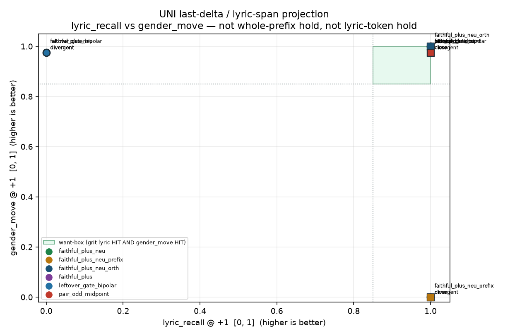

# UNI last-delta / lyric-span projection

Generated by `analysis/slider2d/run_lm_lyric_orth.py`. CPU only, no Hub,
no GPU, no Music 3 weights. Does not change the live trainer default
(`--lm_target v9` / `--pole_mode hidden`). This is a **separate
board** from the existing-metric OOD hunt, whole-prefix hold, and
lyric-token hold MSE. Those pages are not replaced here.

`faithful_plus_neu` (last-token UNI) keeps gender/tempo lyrics and
flips woman, but shreds grit/distortion/joy lyrics: last-token
transplant. `faithful_plus_neu_prefix` holds the entire +1 prefix
to encode(neu). That restores grit lyrics and pins Vocal Details
so woman cannot appear.

**Does last-delta / lyric-span projection beat that split? `yes`**
— grit lyric HIT and gender_move HIT on one board, from the
scored numbers, not from an essay.

## Scored numbers

1. **lyric_recall@+1** on the prefix sung line vs the yaml lyric
   sheet (existing pair-exam continuation floor).

   Gate: `≥ 0.85`. Higher is better.
2. **cover** of the + state (same as plus-only / plus+neu).

   Gate: `≥ 0.85`. Higher is better.
3. **neu_hold** at scale 0 (same as plus+neu).

   Gate: `≥ 0.85`. Higher is better.
4. **gender_move**: Vocal Details at +1 may differ from neu.
   Prefix-hold zeros the prefix residual (miss). Last-token UNI
   and last-delta-orth leave it free.

   Gate: `≥ 0.85`. Higher is better.

Want-box: grit lyric HIT **and** gender_move HIT. Rank is want-box
first, then lyric_recall, cover, neu_hold, gender_move.
Not ranked: `exam_score`, `leak_frac`, `c+`, `p%`.

## Train card (opt-in)

`--lm_target faithful_plus_neu_orth --pole_mode hidden`. Last-token
UNI stays: +1 last → raw `h+`, 0 → `h0`, no minus, no leftover-gate.
The last-token update must not lie in the lyric-token hidden span.
Lyric tokens keep only the in-span residual. Vocal Details are not
held. Fail closed if the lyric span cannot be found. Last token
must be `<|audio_start|>`. Infer with the yaml `neutral` caption +
LoRA. Default stays `--lm_target v9` / `--pole_mode hidden`.
`faithful_plus_neu` and `faithful_plus_neu_prefix` are unchanged.

```bash
CUDA_VISIBLE_DEVICES=N python conceptmod/textsliders/train_lm_slider_music3.py \
  --name energy-lm-uni-orth \
  --prompts_file conceptmod/textsliders/data/prompts-energy-v4.yaml \
  --lm_target faithful_plus_neu_orth --pole_mode hidden \
  --rank 8 --alpha 8 --lr 5e-4 --steps 800 --seed 7 \
  --no-early_stop --endreg_weight 1.0 --device 0
```

v4 yaml is the fixture rank. The yaml is not rewritten. No live
listen on this branch.

## Combined rank (divergent + close)

Want-box first (grit lyric HIT and gender_move HIT, plus cover /
neu_hold), then lyric_recall, cover, neu_hold, gender_move.
Averages over the two required cells.

| rank | recipe | want-box | lyric_recall | cover | neu_hold | gender_move | grit lyric | gender |
|---:|---|---|---:|---:|---:|---:|---|---|
| 1 | `faithful_plus_neu_orth` | **yes** | 1.000 | 0.933 | 1.000 | 1.000 | **HIT** | **HIT** |
| 2 | `faithful_plus_neu_prefix` | — | 1.000 | 0.933 | 1.000 | 0.000 | **HIT** | MISS |
| 3 | `pair_odd_midpoint` | — | 1.000 | 0.590 | 1.000 | 0.975 | **HIT** | **HIT** |
| 4 | `faithful_plus` | — | 0.500 | 0.933 | 0.610 | 0.975 | MISS | **HIT** |
| 5 | `leftover_gate_bipolar` | — | 0.500 | 0.933 | 0.498 | 0.975 | MISS | **HIT** |
| 6 | `faithful_plus_neu` | — | 0.500 | 0.933 | 1.000 | 0.975 | MISS | **HIT** |

## The board (400 Adam steps, seed 0)

Both pair types on one board:

1. **grit-like / divergent** — yaml lyrics in prefix, concept words
   in the + caption. Fail = sings `punk punk`.
2. **gender-like / close** — same room, only Vocal Details flips
   woman vs ungendered. Fail = woman pinned away / gender_move miss.

Baselines: `faithful_plus_neu` (gender HIT, grit MISS) and
`faithful_plus_neu_prefix` (grit HIT, gender MISS).

### `divergent`

| recipe | lyric_recall | cover | neu_hold | gender_move | sings lyric | want-box |
|---|---:|---:|---:|---:|---|---|
| `faithful_plus_neu` | 0.000 | 0.932 | 1.000 | 0.975 | punk punk punk punk | punk punk punk punk | punk punk punk punk | — |
| `faithful_plus` | 0.000 | 0.932 | 0.613 | 0.975 | punk punk punk punk | punk punk punk punk | punk punk punk punk | — |
| `faithful_plus_neu_prefix` | 1.000 | 0.932 | 1.000 | 0.000 | lyric0 lyric0 lyric0 lyric0 | lyric1 lyric1 lyric1 lyric1 | lyric2 lyric2 lyric2 lyric2 | — |
| `faithful_plus_neu_orth` | 1.000 | 0.932 | 1.000 | 1.000 | lyric0 lyric0 lyric0 lyric0 | lyric1 lyric1 lyric1 lyric1 | lyric2 lyric2 lyric2 lyric2 | **yes** |
| `leftover_gate_bipolar` | 0.000 | 0.932 | 0.498 | 0.975 | punk punk punk punk | punk punk punk punk | punk punk punk punk | — |
| `pair_odd_midpoint` | 1.000 | 0.584 | 1.000 | 0.975 | lyric0 lyric0 lyric0 lyric0 | lyric1 lyric1 lyric1 lyric1 | lyric2 lyric2 lyric2 lyric2 | — |

### `close`

| recipe | lyric_recall | cover | neu_hold | gender_move | sings lyric | want-box |
|---|---:|---:|---:|---:|---|---|
| `faithful_plus_neu` | 1.000 | 0.935 | 1.000 | 0.975 | lyric0 lyric0 lyric0 lyric0 | lyric1 lyric1 lyric1 lyric1 | lyric2 lyric2 lyric2 lyric2 | **yes** |
| `faithful_plus` | 1.000 | 0.935 | 0.606 | 0.975 | lyric0 lyric0 lyric0 lyric0 | lyric1 lyric1 lyric1 lyric1 | lyric2 lyric2 lyric2 lyric2 | — |
| `faithful_plus_neu_prefix` | 1.000 | 0.935 | 1.000 | 0.000 | lyric0 lyric0 lyric0 lyric0 | lyric1 lyric1 lyric1 lyric1 | lyric2 lyric2 lyric2 lyric2 | — |
| `faithful_plus_neu_orth` | 1.000 | 0.935 | 1.000 | 1.000 | lyric0 lyric0 lyric0 lyric0 | lyric1 lyric1 lyric1 lyric1 | lyric2 lyric2 lyric2 lyric2 | **yes** |
| `leftover_gate_bipolar` | 1.000 | 0.935 | 0.498 | 0.975 | lyric0 lyric0 lyric0 lyric0 | lyric1 lyric1 lyric1 lyric1 | lyric2 lyric2 lyric2 lyric2 | — |
| `pair_odd_midpoint` | 1.000 | 0.596 | 1.000 | 0.975 | lyric0 lyric0 lyric0 lyric0 | lyric1 lyric1 lyric1 lyric1 | lyric2 lyric2 lyric2 lyric2 | — |



Want-box is high lyric_recall AND high gender_move. Circles are
divergent / grit-like; squares are close / gender-like.

## Baselines vs last-delta-orth

- UNI grit lyric miss: **yes**
  (`0.000, 1.000`).
- UNI gender_move hit: **yes**
  (`0.975, 0.975`).
- Prefix grit lyric hit: **yes**
  (`1.000, 1.000`).
- Prefix gender_move miss: **yes**
  (`0.000, 0.000`).
- Orth beats the split: **yes**
  (lyric `1.000, 1.000`,
  gender_move `1.000, 1.000`,
  cover `0.932, 0.935`).

**Answer: want-box `yes`.** Last-token UNI plus a last-delta / lyric-span projection keeps grit lyrics without holding Vocal Details to neu.

## Related cells

- [lm-lyric-recall.md](lm-lyric-recall.md) — existing-metric OOD + last-token transplant.
- [lm-plus-neu-exam.md](lm-plus-neu-exam.md) — last-hidden cover / neu_hold / off-caption.
- [lm-plus-exam.md](lm-plus-exam.md) — plus-only cover / off-caption.
- [lm-2d-scoreboard.md](lm-2d-scoreboard.md) — compiled bipolar board (not updated).

## How to run

```bash
PYTHONPATH=. python analysis/slider2d/run_lm_lyric_orth.py --out docs/lm-lyric-orth
PYTHONPATH=. pytest tests/test_lm_lyric_recall.py tests/test_lm_trainer_v9.py -q
```

CPU only. No Hub, no GPU, no Music 3 weights. Seed `0`, `400` Adam steps.

