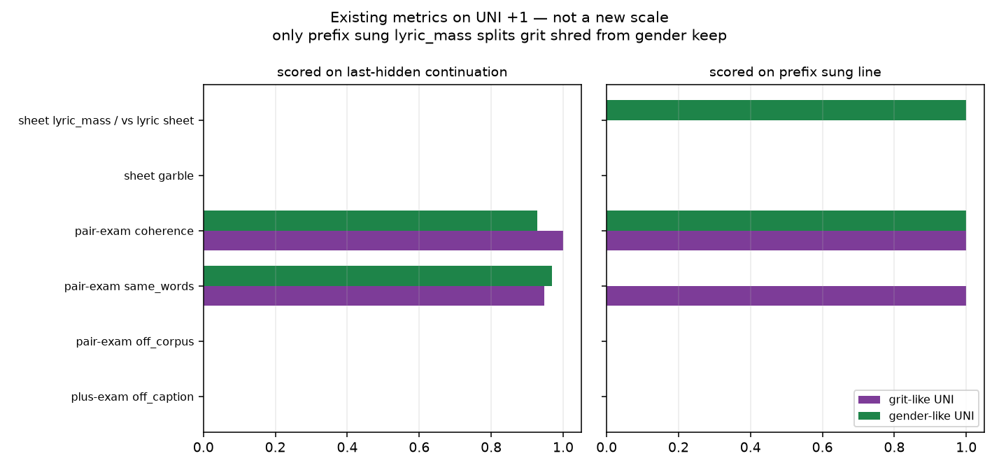

# OOD detection + `faithful_plus_neu` bug hunt

Generated by `analysis/slider2d/run_lm_lyric_recall.py`. CPU only, no Hub,
no GPU, no Music 3 weights. Does not change the live trainer default
(`--lm_target v9` / `--pole_mode hidden`). This is **not** a new
lyric-recall leaderboard. We already have cover / neu_hold /
off-caption / pair-exam / sheet. The job is: which of those would
have flagged grit-like +1 lyric shred vs gender/tempo keep, and
which `faithful_plus_neu` implementation mistakes would cause OOD
even if the math (MSE +1 last → raw h+, MSE 0 → h0, no minus) is
right.

Two failures, do not mix:

1. **Two-song yaml (v4):** `h+` is another track. High `c+` =
   arrived at the other song. Not this page.
2. **Last-token transplant (uni-v2, same-room yaml):** student =
   encode(neu tokens, LoRA @ +1), teacher last = encode(pos tokens).
   Loss is last-hidden MSE only. The last real token is
   `<|audio_start|>`. The LoRA still rewrites every prefix token,
   including lyrics. Matching last hidden to `h+` does not match
   the KV of the neu prefix. + REF (pos caption, no LoRA) still
   sings the yaml line. That is this page.

## 1. Existing metrics — which ones fire

Last-hidden scoring of **every** existing caption metric misses
the transplant: if last = `h+`, off-caption / garble /
`same_words` / coherence look like a + caption hit. Last-hidden
sheet `lyric_mass` is 0 on **both** cells (the + caption rollout
is concept words), so it flags grit *and* gender and cannot
split them.

On the **prefix sung line**, grit UNI sings on-caption concept
words (`punk punk punk punk | punk punk punk punk | punk punk punk punk`). Plus-exam off-caption,
pair-exam `off_corpus` / `same_words` / coherence, and sheet
garble stay green. Gender/tempo-like UNI keeps the yaml line
(`lyric0 lyric0 lyric0 lyric0 | lyric1 lyric1 lyric1 lyric1 | lyric2 lyric2 lyric2 lyric2`).

The only existing column that flags grit shred and keeps gender
is **sheet `lyric_mass` / continuation vs the yaml lyric sheet**,
scored on the prefix sung line — not a new scale. Gate is the
existing pair-exam continuation floor `0.85`.

| metric | last-hidden grit | last-hidden gender | prefix grit | prefix gender | flags grit-not-gender? |
|---|---:|---:|---:|---:|---|
| plus-exam off_caption | 0.000 — | 0.000 — | 0.000 — | 0.000 — | no |
| pair-exam off_corpus | 0.000 — | 0.000 — | 0.000 — | 0.000 — | no |
| pair-exam same_words | 0.948 — | 0.969 — | 1.000 — | 0.000 **FLAG** | no |
| pair-exam coherence | 1.000 — | 0.929 — | 1.000 — | 1.000 — | no |
| sheet garble | 0.000 — | 0.000 — | 0.000 — | 0.000 — | no |
| sheet lyric_mass / vs lyric sheet | 0.000 **FLAG** | 0.000 **FLAG** | 0.000 **FLAG** | 1.000 — | **yes** |

Useful (flags grit, not gender): `prefix_sung.sheet_lyric_mass`.
False alarm (flags gender keep): `prefix_sung.pair_same_words`.



Live implication: a last-hidden off-caption / garble / `c+` board
would have called grit UNI a hit. Whisper vs the yaml lyric sheet
is the existing listen analog of prefix `lyric_mass`.

## 2. `faithful_plus_neu` implementation bugs

Formulation stays: MSE +1 last → raw `h+`, MSE 0 → `h0`, no minus,
no leftover-gate, student = encode(neu)+LoRA. These are
implementation mistakes that would cause OOD even if that math is
right.

| check | status |
|---|---|
| Teacher encoded before LoRA exists (`_encode_static` / `@torch.no_grad`) | ok |
| Student tokens are `neu_ids`, not `pos_ids` | ok |
| Teacher is raw `h+` (not leftover-gated) | ok |
| Scale 0 sets LoRA multiplier 0 (identity) | ok |
| LoRA wraps `Qwen3Attention` only (not `embed_tokens`) | ok |
| `_assemble` ends with `{im_end}{audio_start}` | ok |
| Last-hidden gather used **shape-1**, not the mask | **fixed** — now `_gather_last_hidden` / last-real index |
| No assert last token is `<|audio_start|>` | **fixed** — fail closed when the tokenizer can say |
| Plus+neu still teacher-forced scale **−1** endreg / planreg | **fixed** — minus pole skipped |
| Default `early_stop` required `c-` / `nperc` / collapse | **fixed** — plus+neu uses `c+` / `p%` only |
| `infer_music3` default prompt was yaml `target` (often +) | **fixed** — prefers `neutral`; warns on plus+neu sidecars |
| `generate_listen` already uses yaml `neutral` + LoRA | ok; now prints the double-+ warning |

Endreg at +1 still regularizes prompt-last + ~250 frames. That
does not pin the lyric prefix KV, so it does not by itself cause
the transplant — but backpropping minus-side end-margin on a
no-minus card was a formulation leak.

Default stays `--lm_target v9` / `--pole_mode hidden`. No v4
rewrite. No GPU train on this branch.

## 3. Prefix-hold (secondary, already wired)

Opt-in `--lm_target faithful_plus_neu_prefix` holds the +1 prefix
hidden to encode(neu). Cheap leftover from the previous pass.
Not the point. UNI last-token MSE still sits in the old plus+neu
want-box (cover / neu_hold / off-caption) while prefix
`lyric_mass` is `0.000` on grit
and `1.000` on close.

Prefix-hold lifts grit lyric-sheet mass: **yes**
(1.000, 1.000).
Keeps cover: **yes**.

```bash
CUDA_VISIBLE_DEVICES=N python conceptmod/textsliders/train_lm_slider_music3.py \
  --name energy-lm-uni-prefix \
  --prompts_file conceptmod/textsliders/data/prompts-energy-v4.yaml \
  --lm_target faithful_plus_neu_prefix --pole_mode hidden \
  --rank 8 --alpha 8 --lr 5e-4 --steps 800 --seed 7 \
  --no-early_stop --endreg_weight 1.0 --device 0
```

v4 yaml is not rewritten. Infer plus+neu with the **neutral**
caption + LoRA, not the + caption.

## 4. Lyric-token hold (one-recipe candidate)

`--lm_target faithful_plus_neu` = last-token UNI (gender / tempo).
`--lm_target faithful_plus_neu_prefix` = whole-prefix hold (grit /
distortion / joy). `--lm_target faithful_plus_neu_lyric` holds only
the yaml `lyrics` span so Vocal Details can still flip woman. Ranked
on [lm-lyric-hold.md](lm-lyric-hold.md). Default stays
`--lm_target v9` / `--pole_mode hidden`.

## Related cells

- [lm-lyric-hold.md](lm-lyric-hold.md) — grit lyrics vs gender_move scoreboard.
- [lm-plus-neu-exam.md](lm-plus-neu-exam.md) — last-hidden cover / neu_hold / off-caption.
- [lm-plus-exam.md](lm-plus-exam.md) — plus-only cover / off-caption.
- [lm-pair-exam.md](lm-pair-exam.md) — bipolar continuation / same_words / off_corpus / coherence.
- [lm-sheet-goodhart.md](lm-sheet-goodhart.md) — sheet on-sheet / garble / lyric_mass.
- [lm-roles.md](lm-roles.md) — role-split UNI (lyrics → neu, Vocal Details → pos).
- [lm-2d-scoreboard.md](lm-2d-scoreboard.md) — compiled bipolar board (not updated).

## How to run

```bash
PYTHONPATH=. python analysis/slider2d/run_lm_lyric_recall.py --out docs/lm-lyric-recall
PYTHONPATH=. pytest tests/test_lm_lyric_recall.py tests/test_lm_plus_neu_exam.py tests/test_lm_trainer_v9.py -q
```

CPU only. No Hub, no GPU, no Music 3 weights. Seed `0`, `400` Adam steps.

