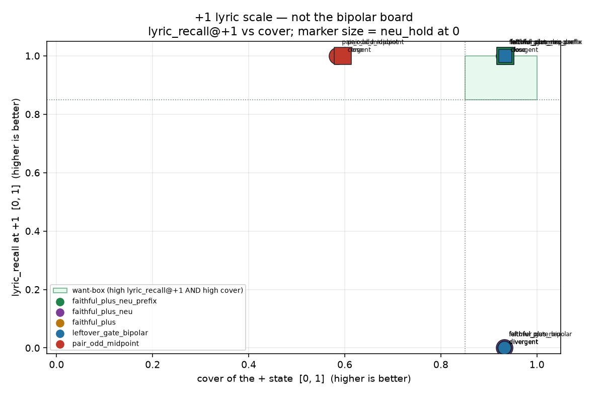

# +1 lyric_recall: yaml lyrics on a continuation

Generated by `analysis/slider2d/run_lm_lyric_recall.py`. CPU only, no Hub,
no GPU, no Music 3 weights. Does not change the live trainer default
(`--lm_target v9` / `--pole_mode hidden`). This is a **separate
scale** from the plus+neu exam, plus-only exam, pair-exam,
leftover-sheet `leak_frac`, and the compiled bipolar board. Those
pages are not updated here.

Cover ≠ lyrics. The plus+neu exam ranked `faithful_plus_neu` first
on caption-word cover and neu_hold at scale 0. It does not score
yaml-lyric survival at +1. Live UNI still shreds lyrics on several
plus LoRAs. Train `c+` / `p%` call those a hit. Whisper lyric
recall does not.

## Two failures, do not mix

1. **Two-song yaml (v4):** `h+` is another track. High `c+` =
   arrived at the other song. Not this page.
2. **Last-token transplant (uni-v2, same-room yaml):** student =
   encode(neu tokens, LoRA @ +1), teacher last = encode(pos tokens)
   (same lyrics, + words flipped). Loss is last-hidden MSE only.
   The last real token is the continue-from token. The LoRA still
   rewrites every prefix token, including lyrics. Matching last
   hidden to `h+` does not match the KV of the neu prefix.
   Generation then has a pos-like last hidden and a neu KV.
   + REF (pos caption, no LoRA) still sings the yaml line.
   That is this page.

**Replicated last-token transplant? `yes`** — UNI
+1 lyric_recall on divergent (grit-like) is `0.000` while
cover / neu_hold / off-caption stay in the old plus+neu want-box.
+ REF lyric_recall is `1.000`.

The last-hidden plus+neu fixture cannot see this. Decoding from a
last hidden that already equals `h+` reproduces the + caption
rollout (concept words). Lyrics live in the prefix KV. This cell
is the smallest sequence that can: prefix tokens = yaml lyrics,
last token = continue, LoRA on all positions, last hidden causal
in the prefix.

## The metric

1. **lyric_recall@+1** — share of the +1 student's sung-line
   continuation (greedy tokens read off the prefix KV) that is
   on the yaml `lyrics` field. Not + caption words (punk / loud
   / grit). Sortable in `[0, 1]`. Gate: `≥ 0.85` (same as
   `off-lyric ≤ 0.05` on this bag).
2. **cover** of the + last hidden (same as plus-only / plus+neu):
   `min(overlap_with_pos, 1 − blend_toward_mid)`. Gate: `≥ 0.85`.
3. **neu_hold** at scale 0 (same as plus+neu). Gate:
   `≥ 0.85`.
4. **off-caption** on the + last-hidden continuation. Logged.
   Gate suggestion `0.05`; not the rank key.

Also logged, not a rank key: scale-0 lyric_recall and + REF
(pos caption, no student). REF+ high + student +1 low = last-token
transplant (failure 2). A hit is high +1 lyric_recall AND high
cover AND high neu_hold at 0. Not scored: `leak_frac`, `c+`, `p%`,
pair-odd, `exam_score`.

## Train card (opt-in, only because prefix-hold lifts +1 lyrics)

`--lm_target faithful_plus_neu_prefix --pole_mode hidden`.
Student +1 last hidden fits raw `h+`. Student +1 prefix hidden
fits encode(neu) prefix (yaml lyrics), not encode(pos) prefix.
Student scale 0 fits `h0`. No minus teacher, no leftover-gate.
`faithful_plus_neu` and `faithful_plus` stay unchanged.
Default stays `--lm_target v9` / `--pole_mode hidden`.

```bash
CUDA_VISIBLE_DEVICES=N python conceptmod/textsliders/train_lm_slider_music3.py \
  --name energy-lm-uni-prefix \
  --prompts_file conceptmod/textsliders/data/prompts-energy-v4.yaml \
  --lm_target faithful_plus_neu_prefix --pole_mode hidden \
  --rank 8 --alpha 8 --lr 5e-4 --steps 800 --seed 7 \
  --no-early_stop --endreg_weight 1.0 --device 0
```

v4 yaml is not rewritten. Uni yamls can swap in later. No live
listen on this branch. No Hub, no GPU, no Music 3 weights here.

## Combined rank (divergent + close)

Rank by lyric_recall@+1, then cover. Averages over the two
required cells. Divergent is grit-like (same-room lyrics, last-
token transplant garbles). Close is gender-like (keeps lyrics).

| rank | recipe | train | lyric_recall@+1 | cover | neu_hold | off-caption | hit Δ | hit close |
|---:|---|---|---:|---:|---:|---:|---|---|
| 1 | `faithful_plus_neu_prefix` | plus+neu+prefix | 1.000 | 0.933 | 1.000 | 0.000 | **HIT** | **HIT** |
| 2 | `pair_odd_midpoint` | bipolar ± | 1.000 | 0.590 | 1.000 | 0.000 | — | — |
| 3 | `faithful_plus` | plus-only | 0.500 | 0.933 | 0.610 | 0.000 | — | — |
| 4 | `leftover_gate_bipolar` | bipolar ± | 0.500 | 0.933 | 0.498 | 0.000 | — | — |
| 5 | `faithful_plus_neu` | plus+neu | 0.500 | 0.933 | 1.000 | 0.000 | — | **HIT** |

## The board (400 Adam steps, seed 0)

This is the +1 lyric scale, not the bipolar board.
`faithful_plus_neu` is the live UNI last-token card.
`faithful_plus_neu_prefix` holds the lyric prefix.
`faithful_plus` is leftover-gated plus-only.
`leftover_gate_bipolar` is current `faithful` / leftover-gate ±.
`pair_odd_midpoint` is the known fail (keeps lyrics here, misses cover).

### `divergent`

| recipe | train | lyric_recall@+1 | lyric@0 | + REF | cover | neu_hold | off-caption | old box | hit |
|---|---|---:|---:|---:|---:|---:|---:|---|---|
| `faithful_plus_neu_prefix` | plus+neu+prefix | 1.000 | 1.000 | 1.000 | 0.932 | 1.000 | 0.000 | **yes** | **HIT** |
| `pair_odd_midpoint` | bipolar ± | 1.000 | 1.000 | 1.000 | 0.584 | 1.000 | 0.000 | — | — |
| `faithful_plus` | plus-only | 0.000 | 1.000 | 1.000 | 0.932 | 0.613 | 0.000 | — | — |
| `leftover_gate_bipolar` | bipolar ± | 0.000 | 1.000 | 1.000 | 0.932 | 0.498 | 0.000 | — | — |
| `faithful_plus_neu` | plus+neu | 0.000 | 1.000 | 1.000 | 0.932 | 1.000 | 0.000 | **yes** | — |

Sung line at +1 (prefix KV), then + REF:

- `faithful_plus_neu_prefix`: `lyric0 lyric0 lyric0 lyric0 | lyric1 lyric1 lyric1 lyric1 | lyric2 lyric2 lyric2 lyric2`
  REF+: `lyric0 lyric0 lyric0 lyric0 | lyric1 lyric1 lyric1 lyric1 | lyric2 lyric2 lyric2 lyric2`
- `pair_odd_midpoint`: `lyric0 lyric0 lyric0 lyric0 | lyric1 lyric1 lyric1 lyric1 | lyric2 lyric2 lyric2 lyric2`
  REF+: `lyric0 lyric0 lyric0 lyric0 | lyric1 lyric1 lyric1 lyric1 | lyric2 lyric2 lyric2 lyric2`
- `faithful_plus`: `punk punk punk punk | punk punk punk punk | punk punk punk punk`
  REF+: `lyric0 lyric0 lyric0 lyric0 | lyric1 lyric1 lyric1 lyric1 | lyric2 lyric2 lyric2 lyric2`
- `leftover_gate_bipolar`: `punk punk punk punk | punk punk punk punk | punk punk punk punk`
  REF+: `lyric0 lyric0 lyric0 lyric0 | lyric1 lyric1 lyric1 lyric1 | lyric2 lyric2 lyric2 lyric2`
- `faithful_plus_neu`: `punk punk punk punk | punk punk punk punk | punk punk punk punk`
  REF+: `lyric0 lyric0 lyric0 lyric0 | lyric1 lyric1 lyric1 lyric1 | lyric2 lyric2 lyric2 lyric2`

### `close`

| recipe | train | lyric_recall@+1 | lyric@0 | + REF | cover | neu_hold | off-caption | old box | hit |
|---|---|---:|---:|---:|---:|---:|---:|---|---|
| `faithful_plus` | plus-only | 1.000 | 1.000 | 1.000 | 0.935 | 0.606 | 0.000 | — | — |
| `leftover_gate_bipolar` | bipolar ± | 1.000 | 1.000 | 1.000 | 0.935 | 0.498 | 0.000 | — | — |
| `faithful_plus_neu` | plus+neu | 1.000 | 1.000 | 1.000 | 0.935 | 1.000 | 0.000 | **yes** | **HIT** |
| `faithful_plus_neu_prefix` | plus+neu+prefix | 1.000 | 1.000 | 1.000 | 0.935 | 1.000 | 0.000 | **yes** | **HIT** |
| `pair_odd_midpoint` | bipolar ± | 1.000 | 1.000 | 1.000 | 0.596 | 1.000 | 0.000 | — | — |

Sung line at +1 (prefix KV), then + REF:

- `faithful_plus`: `lyric0 lyric0 lyric0 lyric0 | lyric1 lyric1 lyric1 lyric1 | lyric2 lyric2 lyric2 lyric2`
  REF+: `lyric0 lyric0 lyric0 lyric0 | lyric1 lyric1 lyric1 lyric1 | lyric2 lyric2 lyric2 lyric2`
- `leftover_gate_bipolar`: `lyric0 lyric0 lyric0 lyric0 | lyric1 lyric1 lyric1 lyric1 | lyric2 lyric2 lyric2 lyric2`
  REF+: `lyric0 lyric0 lyric0 lyric0 | lyric1 lyric1 lyric1 lyric1 | lyric2 lyric2 lyric2 lyric2`
- `faithful_plus_neu`: `lyric0 lyric0 lyric0 lyric0 | lyric1 lyric1 lyric1 lyric1 | lyric2 lyric2 lyric2 lyric2`
  REF+: `lyric0 lyric0 lyric0 lyric0 | lyric1 lyric1 lyric1 lyric1 | lyric2 lyric2 lyric2 lyric2`
- `faithful_plus_neu_prefix`: `lyric0 lyric0 lyric0 lyric0 | lyric1 lyric1 lyric1 lyric1 | lyric2 lyric2 lyric2 lyric2`
  REF+: `lyric0 lyric0 lyric0 lyric0 | lyric1 lyric1 lyric1 lyric1 | lyric2 lyric2 lyric2 lyric2`
- `pair_odd_midpoint`: `lyric0 lyric0 lyric0 lyric0 | lyric1 lyric1 lyric1 lyric1 | lyric2 lyric2 lyric2 lyric2`
  REF+: `lyric0 lyric0 lyric0 lyric0 | lyric1 lyric1 lyric1 lyric1 | lyric2 lyric2 lyric2 lyric2`



Want-box is high lyric_recall@+1 AND high cover. Marker size is
neu_hold at scale 0. Title says this is the +1 lyric scale, not
the bipolar board.

## What the numbers say

- Last-token transplant replicated: **yes**.
- UNI (`faithful_plus_neu`) +1 lyric_recall: 0.000, 1.000 (divergent, close). + REF: 1.000, 1.000.
- UNI still in the old plus+neu want-box (cover / neu_hold / off-caption): **yes** (cover 0.932, 0.935, neu_hold 1.000, 1.000).
- Prefix-hold lifts +1 lyric_recall: **yes** (1.000, 1.000).
- Prefix-hold keeps + cover: **yes** (0.932, 0.935).
- Prefix-hold hits both required pairs: **yes**.

**Answer: last-token-only MSE is the bug on this fixture.** Prefix-hold restores the yaml line at +1 without killing cover or neu_hold. Close / gender-like already keeps lyrics under last-token UNI; divergent / grit-like does not. That split matches the live listen (gender/tempo keep lyrics; grit/distortion/energy do not).

## Related cells (not this scale)

- [lm-plus-neu-exam.md](lm-plus-neu-exam.md) — cover / neu_hold / off-caption.
- [lm-plus-exam.md](lm-plus-exam.md) — plus-only cover / off-caption.
- [lm-pair-exam.md](lm-pair-exam.md) — bipolar continuation gates.
- [lm-even-leftover.md](lm-even-leftover.md) — leftover-sheet `leak_frac`.
- [lm-2d-scoreboard.md](lm-2d-scoreboard.md) — compiled bipolar board.

## How to run

```bash
PYTHONPATH=. python analysis/slider2d/run_lm_lyric_recall.py --out docs/lm-lyric-recall
PYTHONPATH=. pytest tests/test_lm_lyric_recall.py tests/test_lm_plus_neu_exam.py tests/test_lm_trainer_v9.py -q
```

CPU only. No Hub, no GPU, no Music 3 weights. Seed `0`, `400` Adam steps.

