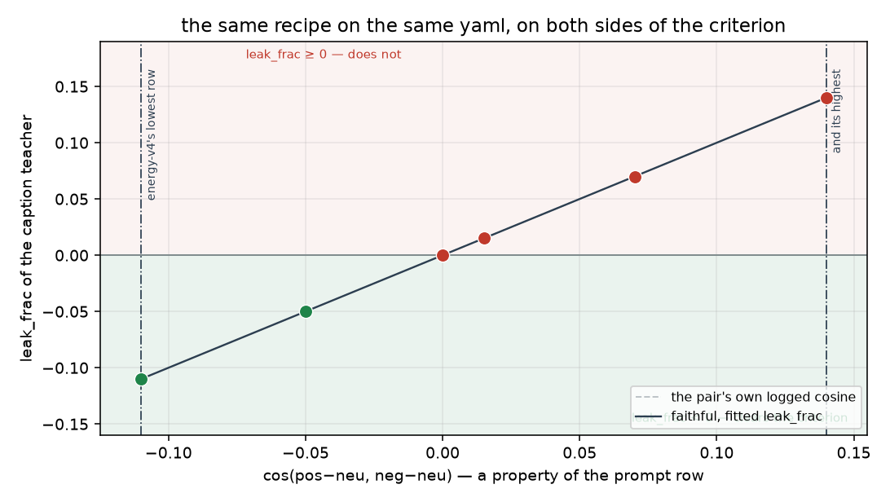
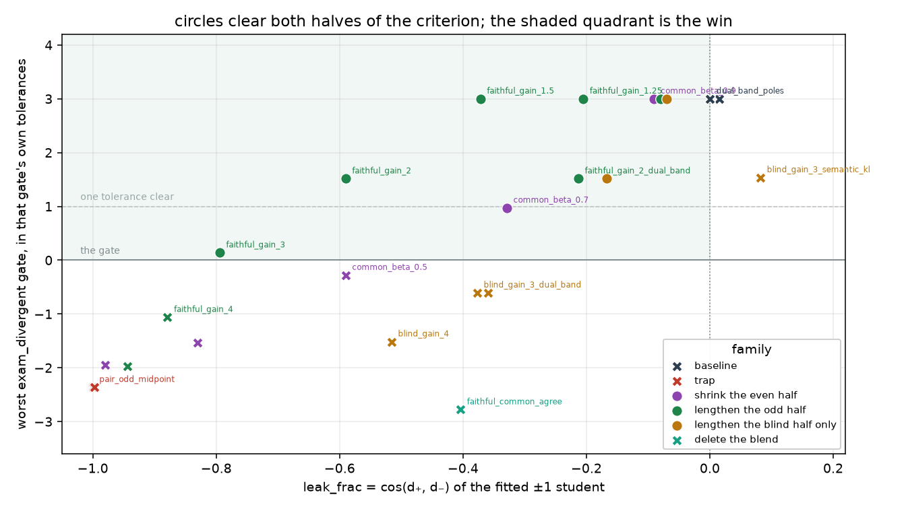
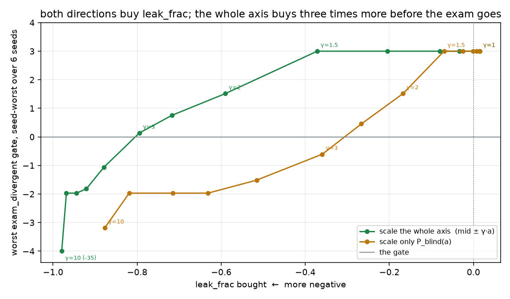

# Odd enough for `leak_frac < 0`, without becoming a midpoint

Generated by `analysis/slider2d/run_odd_search.py`. CPU only, no Hub,
no GPU, no Music 3 weights. **The live default is unchanged**
(`--lm_target v9` / `--pole_mode hidden`), no v4 yaml is rewritten, and
no live listen is claimed for anything on this page.

The criterion is a gate, not a vibe:

> `exam_divergent` is True **and** `leak_frac < 0`,
> where `leak_frac = cos(d₊, d₋)` of the fitted ±1 student
> (`leftover_bipolar` in `slider_targets.py`).

Before this cell the only row clearing both was `faithful_attrs`, which
is a caption rewrite rather than a loss. Every recipe that had pushed
`leak_frac` negative from the loss side — `pair_odd_midpoint`,
`pair_odd_sub_e`, `dual_band_midpoint`, hold-ê, `hub`, project — landed
at `leak_frac ≈ −1` and **failed** the divergent exam. Every recipe that
passed it sat between +0.03 and +0.12. Two clusters, and a wall between
them.

**Which fixture `leak_frac` is read off matters, so this page reports
both.** `leftover_bipolar` names a quantity, not a pair. The compiled
board's column (`bipolar_from`) prefers the #22 sheet leftover cell,
which is where +0.03 for `faithful_raw` comes from; the divergent exam
cell prints +0.015 for the same recipe, because it is a different pair.
The `HIT` column follows the criterion as written — the divergent cell —
and the board's fixture is printed beside it, so a result that only
works on one reading is visible as one.

## The answer, first

**The set is not empty: 10 recipes clear both halves.** The
widest-margin one is `faithful_gain_1.5` — `t± = mid ± 1.5·a` — at
`leak_frac -0.372` on the divergent cell and
`-0.359` on the board's sheet fixture,
passing every divergent gate at all 6 seeds with 3.0 tolerances of room on the tightest one, and
passing the close and `unused_e` cells as well.

**But there is no wall, and that is the more useful half of the
result.** `leak_frac` is not something a loss discovers. For a shared
±1 residual it is an exact function of the teacher's even and odd
halves, readable off four captions before a single step:

```
d± = β·c ± γ·a          c = ½(h₊+h₋) − h0,  a = ½(h₊−h₋)
leak_frac = (β²‖c‖² − γ²‖a‖²) / (β²‖c‖² + γ²‖a‖²)
```

(`teacher_leak_frac` in `slider_targets.py`.) So the honest question
was never *whether* something can be odd enough — anything with
`γ/β > 1.015` on this pair is — but what the
exam charges for it, and which direction of "more odd" is cheapest.

## Why the wall is 7% wide

On a divergent pair the two tracks are separate features:
`a = ½·track·(p̂−q̂) + o` and `c = ½·track·(p̂+q̂) + shared·ŝ`. Both halves
therefore carry the same `½·track² = 2.00`, and it
subtracts straight out of `leak_frac`. What is left deciding the sign is
the shared specificity against the part of the pole content that flips:

| | value |
|---|---:|
| `‖c‖²` | 3.4005 |
| `‖a‖²` | 3.3000 |
| the track, in **both** | 2.0000 |
| `shared²` (even, after the track cancels) | 1.4005 |
| `‖o‖²` (odd, after the track cancels) | 1.3000 |
| break-even gain `‖c‖/‖a‖` | 1.0151 |

That is the whole wall: 1.40 against 1.30. A caption-faithful teacher
lands at `+0.0150`, which is not a coincidence
— it is the pair's own `cos(pos−neu, neg−neu)`, the number the live
trainer already prints.

### So on a caption teacher, the sign belongs to the *row*

energy-v4 logs that cosine from -0.11 to +0.14 across its three
genre rows, and the divergent cell is calibrated to the midpoint
(+0.015). Sweeping the cell across that logged range,
with `faithful` and nothing else changed:

| row cosine | `shared` | fitted `leak_frac` | exam_divergent | clears both |
|---:|---:|---:|---|---|
| -0.110 | 0.804 | -0.110 | PASS | **yes** |
| -0.050 | 0.993 | -0.050 | PASS | **yes** |
| +0.000 | 1.140 | +0.000 | PASS | no |
| +0.015 | 1.183 | +0.015 | PASS | no |
| +0.070 | 1.340 | +0.070 | PASS | no |
| +0.140 | 1.541 | +0.140 | PASS | no |

Same recipe, same yaml, both sides of the criterion depending on which
prompt row you read. `leak_frac` is a pair coordinate first and a recipe
column second, and a board that sorts recipes by it is partly sorting
prompt rows.



## The three directions of "more odd", and their price

| teacher | what it does | on a close pair |
|---|---|---|
| `faithful_gain` | `t± = mid ± γ·a` — keep the caption pair's own midpoint, scale only the axis | a bigger slider, `c` intact |
| `faithful_gain` *(blind)* | the same gain restricted to `P_blind` — the half of the axis a next-token KL cannot read at all | the axis *is* mostly that band there |
| `faithful_common_agree` | `t± = h0 + agree(h₊,h₋) ± a` — delete the part of `c` no single caption occupies | **identical to `faithful`**: on one song `agree = c` |

`lm_blend_guard` admits `faithful_gain` at every γ, structurally:
`‖t₊ − pos‖ = (γ−1)‖a‖` is below `‖t₊ − mid‖ = γ‖a‖` for all of them. So
unlike every `sub_e` variant it cannot drift into a blend — it only ever
moves the two ends further apart around a midpoint it never touches.

## The board

Every candidate, on all three pair-exam cells, at 6 seeds. A
cell passes only if it passes at **every** seed. `worst gate` is the
tightest divergent gate in units of that gate's own near-gate tolerance,
seed-worst — `+1.0` is exactly one tolerance clear, which is the line
`near_gate` draws.

The two `leak_frac` columns are the same quantity on two different
pairs. `—` in the sheet columns is a candidate that fixture cannot
express (it has no blind projector and no `dual_band` over-drive),
reported missing rather than guessed.

| recipe | family | idea | leak_frac *(divergent)* | leak_frac *(board / #22 sheet)* | even ‖·‖ | odd ‖·‖ | exam_divergent | worst gate | exam_close | exam_unused_e | sheet leftover | verdict |
|---|---|---|---:|---:|---:|---:|---|---:|---|---|---|---|
| `faithful_raw` | baseline | the caption pair; leak_frac is then the pair's own logged cosine | +0.015 | +0.030 | 1.844 | 1.817 | PASS | +3.0 | PASS *(near coherence)* | PASS | FAIL | — |
| `semantic_kl_poles` | baseline | the live v18 recipe | +0.082 | +0.125 | 1.799 | 1.657 | PASS | +1.5 | FAIL | PASS | FAIL | — |
| `dual_band_poles` | baseline | #35's shipped loss on caption poles | +0.000 | +0.027 | 1.799 | 1.799 | PASS | +3.0 | PASS | PASS | FAIL | — |
| `pair_odd_midpoint` | trap | t± = h0 ± a; deletes c, leak_frac −1, the named trap | -1.000 | -1.000 | 0.000 | 1.817 | FAIL *(2/6 seeds)* | -2.4 | PASS | PASS | FAIL | — |
| `dual_band_midpoint` | trap | the same midpoint under #35's loss | -0.997 | -0.967 | 0.070 | 1.805 | FAIL *(2/6 seeds)* | -2.4 | PASS | PASS | FAIL | — |
| `common_beta_0.9` | shrink the even half | t± = h0 ± a + 0.9·c | -0.090 | -0.075 | 1.660 | 1.817 | PASS | +3.0 | PASS *(near coherence)* | PASS | FAIL | **HIT** |
| `common_beta_0.7` | shrink the even half | t± = h0 ± a + 0.7·c | -0.329 | -0.316 | 1.291 | 1.817 | PASS *(near same_words)* | +1.0 | PASS *(near coherence)* | PASS | FAIL | **HIT** |
| `common_beta_0.5` | shrink the even half | t± = h0 ± a + 0.5·c | -0.590 | -0.580 | 0.922 | 1.817 | FAIL *(5/6 seeds)* | -0.3 | PASS *(near coherence)* | PASS | FAIL | — |
| `common_beta_0.3` | shrink the even half | t± = h0 ± a + 0.3·c | -0.830 | -0.826 | 0.553 | 1.817 | FAIL *(5/6 seeds)* | -1.5 | PASS *(near coherence)* | PASS | FAIL | — |
| `common_beta_0.1` | shrink the even half | t± = h0 ± a + 0.1·c | -0.980 | -0.979 | 0.184 | 1.817 | FAIL *(4/6 seeds)* | -1.9 | PASS | PASS | FAIL | — |
| `faithful_gain_1.1` | lengthen the odd half | t± = mid ± 1.1·a | -0.080 | -0.065 | 1.844 | 1.998 | PASS | +3.0 | PASS *(near coherence)* | PASS | FAIL | **HIT** |
| `faithful_gain_1.25` | lengthen the odd half | t± = mid ± 1.25·a | -0.205 | -0.191 | 1.844 | 2.271 | PASS | +3.0 | PASS *(near coherence)* | PASS | PASS | **HIT** |
| `faithful_gain_1.5` | lengthen the odd half | t± = mid ± 1.5·a | -0.372 | -0.359 | 1.844 | 2.725 | PASS | +3.0 | PASS | PASS | PASS | **HIT** |
| `faithful_gain_2` | lengthen the odd half | t± = mid ± 2·a | -0.590 | -0.580 | 1.844 | 3.633 | PASS | +1.5 | PASS | PASS | PASS | **HIT** |
| `faithful_gain_3` | lengthen the odd half | t± = mid ± 3·a | -0.795 | -0.789 | 1.844 | 5.450 | PASS *(near same_words)* | +0.1 | PASS | PASS | PASS | **HIT** |
| `faithful_gain_4` | lengthen the odd half | t± = mid ± 4·a | -0.879 | -0.876 | 1.844 | 7.266 | FAIL *(4/6 seeds)* | -1.1 | PASS | PASS | PASS | — |
| `faithful_gain_6` | lengthen the odd half | t± = mid ± 6·a | -0.944 | -0.943 | 1.844 | 10.900 | FAIL *(2/6 seeds)* | -2.0 | PASS | PASS | PASS | — |
| `blind_gain_1.5` | lengthen the blind half only | t± = mid ± (a + 0.5·P_blind(a)) | -0.070 | — | 1.844 | 1.978 | PASS | +3.0 | PASS | PASS | — | **HIT** |
| `blind_gain_2` | lengthen the blind half only | t± = mid ± (a + 1·P_blind(a)) | -0.168 | — | 1.844 | 2.184 | PASS | +1.5 | PASS | PASS | — | **HIT** |
| `blind_gain_3` | lengthen the blind half only | t± = mid ± (a + 2·P_blind(a)) | -0.360 | — | 1.844 | 2.687 | FAIL *(4/6 seeds)* | -0.6 | PASS | PASS | — | — |
| `blind_gain_4` | lengthen the blind half only | t± = mid ± (a + 3·P_blind(a)) | -0.516 | — | 1.844 | 3.263 | FAIL *(2/6 seeds)* | -1.5 | PASS | PASS | — | — |
| `faithful_common_agree` | delete the blend | t± = h0 + agree(h₊,h₋) ± a; keeps shared, drops the blend | -0.404 | — | 1.183 | 1.817 | FAIL *(2/6 seeds)* | -2.8 | PASS *(near coherence)* | PASS | — | — |
| `blind_gain_3_dual_band` | lengthen the blind half only | the blind over-drive under the loss that has a gradient there | -0.377 | — | 1.799 | 2.675 | FAIL *(4/6 seeds)* | -0.6 | PASS | PASS | — | — |
| `blind_gain_3_semantic_kl` | lengthen the blind half only | the same target under a loss with no gradient in that band | +0.082 | — | 1.799 | 1.657 | PASS | +1.5 | FAIL | PASS | — | — |
| `faithful_gain_2_dual_band` | lengthen the odd half | t± = mid ± 2·a under #35's loss | -0.213 | -0.429 | 2.593 | 3.219 | PASS | +1.5 | PASS | PASS | PASS | **HIT** |



Five things on that board are worth reading twice.

**`common_beta` was never swept.** The board had scored β = 0 (the
`pair_odd_midpoint` trap) and β = 1 (`faithful`) and nothing between
them, and the entire interior passes: β = 0.1 still clears the divergent
exam at `leak_frac −0.98`. That is the Hub's own κ-anchor geometry —
`lm_anchor_kappa` solves for exactly this κ from a declared
`leakage_floor` — so "declare the `leak_frac` you want and get it" has
been in the trainer the whole time. It is also why it is a poor
criterion on its own.

**`faithful_common_agree` fails, and it is the useful negative.** It is
the one candidate here that removes the blend rather than outweighing
it, and on a close pair it is provably the caption pair. On the divergent
pair it fails at the same gate and the same value as
`pair_odd_midpoint`. The reason is that half of the + pole's own track
is sitting inside `c`: strip it and the pole says pop-punk no louder
than it says slammed, and the continuation stops matching. **On a
divergent pair the blend is load-bearing**, which is why every β → 0
recipe on the trap list fails and why the only affordable direction is
to lengthen the axis rather than shorten the common term.

**The blind-band restriction is the expensive direction.** It looks like
the free lunch — extra axis in the band the scored distribution cannot
read — and it is the worse buy. Inside the window where every seed still
passes, scaling the whole axis reaches `leak_frac -0.795` and the blind-only variant only
reaches `-0.267`, a factor of 0.34. The reason is that the
delivery content the residual stream carries forward lands on the *axis
adjective* and competes with the pole's own track word, while scaling
the whole axis scales that track word too.

**And under `semantic_kl` the blind over-drive does not arrive at all.**
`blind_gain_3_semantic_kl` prints the same `leak_frac` as
`semantic_kl_poles` to four decimals — the target asked for three times
the delivery content and the loss has exactly zero gradient there, so
nothing moved. Under `dual_band`, which supplies one, the same target
lands at a genuinely different number. That is the #35 blind-band story
reproduced from the target side, and it is why a teacher and a loss are
not interchangeable knobs.

**The traps are seed-fragile, and so is anything near them.**
`pair_odd_midpoint` and `dual_band_midpoint` clear the divergent exam at
2 of 6 seeds and `faithful_common_agree` at the same 2. Their published
verdict is FAIL because a cell has to pass at every seed here, but a
single-seed board would have printed some of them green. That is the
reason this cell reports seed counts rather than a boolean.

## The cost curve

Both curves are the same teacher function with a different knob, so the
x-axis they share is `leak_frac` itself.

| γ | leak_frac | worst gate | overlap | same-words | off-caption | coherence | swing | seeds passed |
|---:|---:|---:|---:|---:|---:|---:|---:|---|
| 1 | +0.015 | +3.0 | 1.000 | 1.111 | 0.000 | 1.000 | +1.00 | 6/6 |
| 1.05 | -0.034 | +3.0 | 1.000 | 1.132 | 0.000 | 1.000 | +1.00 | 6/6 |
| 1.1 | -0.080 | +3.0 | 1.000 | 1.035 | 0.000 | 1.000 | +1.00 | 6/6 |
| 1.25 | -0.205 | +3.0 | 1.000 | 0.965 | 0.000 | 1.000 | +1.00 | 6/6 |
| 1.5 | -0.372 | +3.0 | 1.000 | 0.922 | 0.000 | 1.000 | +1.00 | 6/6 |
| 2 | -0.590 | +1.5 | 1.000 | 0.826 | 0.000 | 1.000 | +1.00 | 6/6 |
| 2.5 | -0.717 | +0.8 | 1.000 | 0.788 | 0.000 | 1.000 | +1.00 | 6/6 |
| 3 | -0.795 | +0.1 | 1.000 | 0.757 | 0.000 | 1.000 | +1.00 | 6/6 |
| 4 | -0.879 | -1.1 | 1.000 | 0.697 | 0.000 | 1.000 | +1.00 | 4/6 |
| 5 | -0.921 | -1.8 | 1.000 | 0.659 | 0.000 | 1.000 | +1.00 | 2/6 |
| 6 | -0.944 | -2.0 | 1.000 | 0.652 | 0.000 | 1.000 | +1.00 | 2/6 |
| 8 | -0.968 | -2.0 | 1.000 | 0.652 | 0.000 | 1.000 | +1.00 | 2/6 |
| 10 | -0.979 | -34.6 | 0.604 | 0.299 | 0.396 | 1.000 | +1.00 | 0/6 |

The window where `mid ± γ·a` clears both halves at every seed is
**γ ∈ [1.05, 3]** on this grid,
and the same window for the blind-only variant is
**[1.1, 2.5]**.
It is bounded on both sides and the cell says so: below the break-even
gain 1.015 the sign has not flipped yet, and far
enough above it the ±1 ends are driven past anything a caption reaches
and the continuation garbles — at γ = 10 the off-caption column goes
from 0.000 to 0.396, which is the #22 sheet
cell's garble device firing on purpose.



## What a hit here does not mean

### `leak_frac` is a ratio, and this buys it from the denominator

`‖even‖` is bit-identical at every γ — the board prints it. The same
blend is still in the residual; it is outweighed, not removed. A
negative `leak_frac` from `faithful_gain` says *the axis now outweighs
the same-direction content*, and nothing at all about that content
having gone anywhere.

This is also why the recipe is a different object from turning the
slider up at inference. A student read at σ has `d± = σ(c ± a)`, and a
cosine is scale-free:

| σ | leak_frac | even ‖·‖ | odd ‖·‖ |
|---:|---:|---:|---:|
| 0.5 | +0.0150 | 0.922 | 0.908 |
| 1 | +0.0150 | 1.844 | 1.817 |
| 2 | +0.0150 | 3.688 | 3.633 |
| 3 | +0.0150 | 5.532 | 5.450 |

An inference gain cannot move `leak_frac` by construction. A *teacher*
gain scales the odd half without the even half, so it can. Those are
genuinely different deltas and only one of them is on this page.

### The leftover column improves for a reason that is not real

On the `unused_e` cell `leak_tok` falls monotonically with γ and crosses
the 0.2 lock the sheet cell scores. None of it is a
leftover drop. The unpinned attribute `ĝ` sits inside `a`, so a gain
scales it exactly as fast as the axis, and the hidden-space ratio does
not move at all:

| γ | `leak_tok` (token mass) | `d₊·ĝ` | `d₊·û` | hidden ratio |
|---:|---:|---:|---:|---:|
| 1 | +0.228 | 0.450 | 1.000 | 0.4500 |
| 1.5 | +0.123 | 0.675 | 1.500 | 0.4500 |
| 2 | +0.063 | 0.900 | 2.000 | 0.4500 |
| 3 | +0.016 | 1.350 | 3.000 | 0.4500 |
| 4 | +0.004 | 1.800 | 4.000 | 0.4500 |

Every bit of that improvement is the concept tokens saturating the top
of the next-token distribution and squeezing the attribute out. A
mass-ratio leak column saturates under any gain; charted, not banked.
This recipe is **orthogonal** to the leftover question and composes with
the pair-aware leftover gate rather than replacing it.

The consequence is worth stating in the strongest form available,
because it is a mark against this page's own result: **on the #22 sheet
leftover cell, `faithful_gain` flips FAIL to PASS from γ ≥ 1.25, and
that pass is this artifact.** `faithful_raw` fails that cell on the
0.2 leak lock at +0.228 and the gain
walks it under the lock without removing anything. Do not read the
sheet-leftover column on the gain rows as a leftover fix. The one
column on that cell the gain does not flatter is `garble`, and that
one gets *worse* with γ.

### And the exam is doing less work here than elsewhere

Across this whole family four of the five divergent gates are pinned at
their ceiling — overlap 1.000, off-caption 0.000, coherence 1.000, swing
at the ceiling. Only `same_words` moves, and it is essentially asking
whether the pole's own genre word still beats its intensity adjective.
So a claimed win in this region rests on one gate, and the honest
reading of the margin column is "how much room does that one gate
have", not "how good does this sound".

## The frontier

- Divergent passers: **14**; recipes with
  `leak_frac < 0`: **21**.
- Best `leak_frac` among divergent passers: `faithful_gain_3` at -0.795.
- Best divergent margin among `leak_frac < 0`: `faithful_gain_1.5` at +3.0 tolerances (`leak_frac -0.372`).

## What is wired live

`--lm_target faithful_gain`, non-default, requiring an explicit
`--target_scale` (at 1.0 it is byte-for-byte `--lm_target faithful`, so
the trainer refuses rather than shipping a renamed duplicate):

```bash
python conceptmod/textsliders/train_lm_slider_music3.py \
  --prompts_file prompts/prompts-energy-v4.yaml \
  --lm_target faithful_gain --target_scale 1.5 --pole_mode hidden
```

No `--pole_mode` is added, and the default stays `--lm_target v9` /
`--pole_mode hidden`. The blind-band variant is **not** wired live: it is
the control that shows the cheap direction is cheap, and it needs a
readout projector to mean anything.

## The claims this page has to be able to defend

`tests/test_lm_odd_leak_frac.py` checks each of these, and they are the
reason the algebra above is quoted rather than asserted.

| claim | check |
|---|---|
| fitted `leak_frac` at γ=1 equals the four-caption prediction | +0.015000 vs +0.015000 |
| fitted `leak_frac` at γ=1.5 equals the four-caption prediction | -0.371760 vs -0.371760 |
| fitted `leak_frac` at γ=2 equals the four-caption prediction | -0.590313 vs -0.590313 |
| fitted `leak_frac` at γ=3 equals the four-caption prediction | -0.794534 vs -0.794534 |
| `faithful_gain` at γ=1 is the caption pair | exact tensor equality |
| `lm_common_agree` on a close pair is `c` | exact, to 1e-6 |
| `lm_blend_guard` admits `faithful_gain` at every γ | structural |
| `‖even‖` does not move with γ | exact |
| the hit is negative on the board's fixture too | both `leak_frac` columns |

## What this cell still cannot see

- **Whether any of it sounds better.** `leak_frac` has never been shown
  to order a live listen, and the live run this repo liked most
  (`energy-lm-v18`, caption poles + KL) is *positive* on it. This page
  reports a stated criterion being met; it does not claim ears.
- **A real Qwen hidden state.** Nine dimensions, ten tokens, one frozen
  linear readout and one hand-written transition. The break-even gain
  1.015 is a property of this field's calibration
  to the logged energy-v4 cosine, not a number to type into a run.
- **The blend-versus-shared split at scale.** `lm_common_agree` asks a
  per-coordinate question, and this fixture's basis is interpretable by
  construction. In 3584 noisy dimensions the sign test is a soft AND
  whose behaviour on real states is untested here. It is on the board
  because it *fails*, which is a claim that survives the doubt.

## The cheapest next live measurement

It needs no training and it is the one that would falsify the whole
page. Encode the three energy-v4 rows' pole and neutral captions and
print `cos(h₊−h0, h₋−h0)` per row. If the live spread really does
straddle zero the way the log says (-0.11 … +0.14), then
`leak_frac` is a per-row property on the live model too and no recipe
column should be sorted by it without saying which row it came from.

## Related cells

- [lm-pair-exam.md](lm-pair-exam.md) — the exam this criterion's first
  half comes from.
- [lm-2d-scoreboard.md](lm-2d-scoreboard.md) — the compiled board, where
  the `leak_frac` column lives.
- [lm-sheet-goodhart.md](lm-sheet-goodhart.md) — the single-token sheet
  cell that scores leftover leak, and the garble device γ trips at 10.
- [lm-highd-leftover.md](lm-highd-leftover.md) — leftover ê and the
  trainer's `c+` ceiling.

## How to run

```bash
PYTHONPATH=. python analysis/slider2d/run_odd_search.py --out docs/lm-odd-leak-frac
PYTHONPATH=. pytest tests/test_lm_odd_leak_frac.py -q
```

CPU only. No Hub, no GPU, no Music 3 weights.

Seeds `[0, 1, 2, 3, 4, 5]`, `400` Adam steps, `300` on the sweeps.

