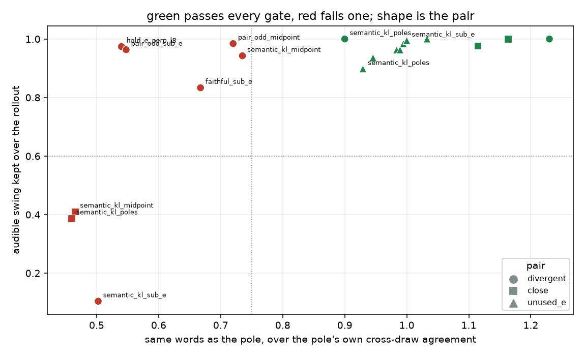
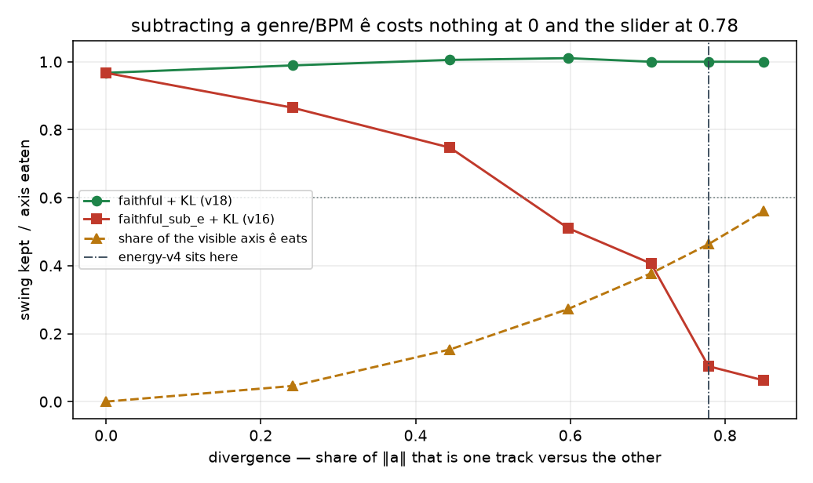
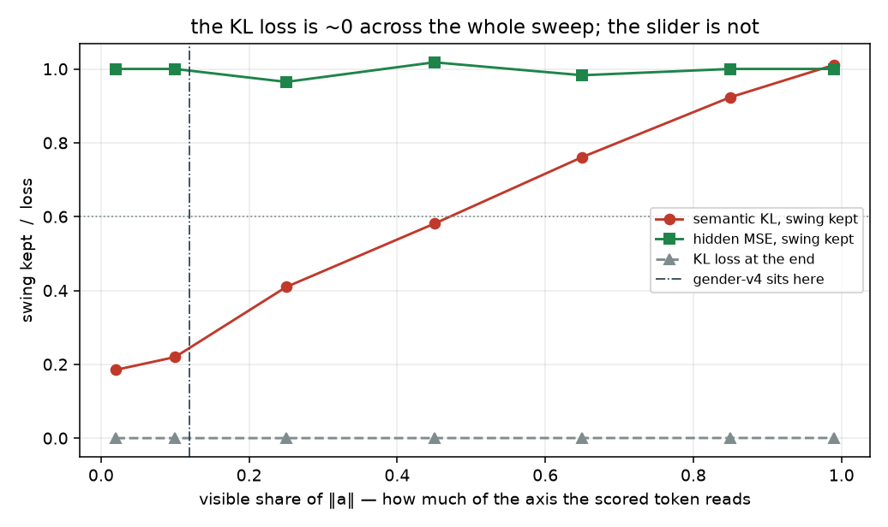

# The pair exam: divergent vs close poles, scored over a rollout

Generated by `analysis/slider2d/run_lm_exam.py`. CPU only, no Hub,
no GPU, no Music 3 weights. Does not change the live trainer default.

Three live Music 3 runs on 2026-08-25 landed in an order no cell in
this repo could produce, and no live log column can either.

| run | recipe | prompts | c+ | ±1 | p% / n% | loss | ears |
|---|---|---|---:|---:|---:|---:|---|
| `energy-lm-v16` | `--lm_target faithful_sub_e --pole_mode semantic_kl` | `prompts-energy-v4.yaml` | +0.690 | -0.313 | 0.73 / 0.76 | 0.0188 | FAIL — random words, like the midpoint got pulled |
| `energy-lm-v18` | `--lm_target faithful --pole_mode semantic_kl` | `prompts-energy-v4.yaml` | +0.797 | -0.354 | 0.60 / 0.70 | 0.0167 | PASS — sounds pretty good; a genre/BPM ride, and those are the poles |
| `gender-lm-v16` | `--lm_target faithful --pole_mode semantic_kl` | `prompts-gender-v4.yaml` | +0.854 | -0.458 | 0.52 / 0.78 | 0.0091 | FAIL — garbled lyrics; the KL loss is tiny and the hidden never arrived |

The run with the smallest loss (0.0091), the best
`c+` (+0.854) and the lowest `p%`
(0.523) is `gender-lm-v16`, and it is the one
whose lyrics came out garbled. The middle two rows are the **same
recipe** on two different prompt files. So the thing that has to go in
the score is not the loss, not the target's name and not any pair-odd
column — it is the pair, and what the student sings after the token
the loss looks at.

## The two pair coordinates

| pair | is | divergence | invisible share of `a` | logged pair cos | ‖c‖/‖a‖ | declared ê | ê·â / ‖a‖ | unpinned attribute |
|---|---|---:|---:|---:|---:|---|---:|---|
| `divergent` | two tracks (energy-v4), ê restates the pole difference | 0.778 | 0.385 | +0.015 | 1.015 | yes | 0.778 | no |
| `close` | one song, one attribute moved (gender-v4), axis is delivery | 0.000 | 0.993 | -0.080 | 0.923 | no | N/A | no |
| `unused_e` | one song plus an unpinned attribute inside a (the #22 cell) | 0.000 | 0.304 | +0.015 | 1.015 | yes | 0.391 | yes |

**divergence** is the share of `‖a‖` that is one track versus the
other. It is 0 on a close pair and
0.78 on the energy-v4 stand-in.
That number is what makes energy-v4's declared `ê` a problem:
`leak_positive: "Pop-punk mix, BPM 168."` names the same genre and
BPM the *poles* move — the yaml's own header says "genre, BPM, mood,
mix and instrumentation all move with the axis" — so `ê` overlaps `a`
by 0.78 of `‖a‖` and subtracting
`ê_⊥` deletes the slider rather than a leftover. On the same-song cell
the same construction gives an overlap of
0.39 and subtracting it is free.

**invisible share** is the share of `‖a‖` in the readout's null space,
where a semantic-KL loss has exactly zero gradient. It is
0.39 on the divergent pair and
0.99 on the close one, because
genre and BPM move the first semantic code hard and which of two
voices sings the same song does not — that arrives in the vocal
frames. So on a close pair the KL loss can reach its floor without the
axis arriving at all.

Both cells are calibrated to a logged number, not chosen: `shared` is
solved so each field prints the trainer's own
`cos(pos−neu, neg−neu)` — energy-v4 logs -0.11 … +0.14 (the
midpoint +0.015 is used), gender-v4 logs
-0.08.

## The gate

Everything scored here is something the student **sings over a
continuation**, decoded from its own ±1 hidden state for
8 tokens, 4 sampled draws, against the
real pole caption's own continuations.

- continuation overlap with the pole's words: `≥ 0.85`
- position-wise agreement, as a share of the pole's own cross-draw agreement: `≥ 0.75`
- off-caption mass — words no caption of this song sings: `≤ 0.05`
- coherence — consecutive words from the same song: `≥ 0.9`
- audible swing kept over the rollout: `≥ 0.6`

Logged and never scored: `c+`, `c−`, the ±1 collapse, `p%` / `n%` and
the pole loss. The unused-attribute leak column is logged here too and
scored on the #22 sheet cell (`≤ 0.2`): it reads the first
token, where an attribute tilt is visible, and this cell's rollout
commits after that token and averages the tilt away. The first-token
column reproduces the sheet cell's numbers to three places, which is
the cross-check that the two readouts agree about leak.

A verdict within 0.05 of the gate that decides it is
marked *(near …)*: it is not seed-robust and the table says so. None
of the three live exam rows is decided by a near-gate column at any
seed tested.

## Where each target point sits, with no optimizer in the loop

| pair | target | axis kept | visible axis kept | off-caption | to mid | blend teacher |
|---|---|---:|---:|---:|---:|---|
| `divergent` | `caption` | 1.000 | 1.000 | 0.000 | 1.000 | no |
| `divergent` | `pair_odd` | 1.000 | 1.000 | 1.015 | 1.425 | no |
| `divergent` | `pair_odd_sub_e` | 0.628 | 0.537 | 1.279 | 1.193 | **yes** |
| `divergent` | `faithful_sub_e` | 0.628 | 0.537 | 0.778 | 0.628 | **yes** |
| `close` | `caption` | 1.000 | 1.000 | 0.000 | 1.000 | no |
| `close` | `pair_odd` | 1.000 | 1.000 | 0.923 | 1.361 | no |
| `unused_e` | `caption` | 1.000 | 1.000 | 0.000 | 1.000 | no |
| `unused_e` | `pair_odd` | 1.000 | 1.000 | 1.015 | 1.425 | no |
| `unused_e` | `pair_odd_sub_e` | 0.920 | 0.912 | 1.088 | 1.370 | no |
| `unused_e` | `faithful_sub_e` | 0.920 | 0.912 | 0.391 | 0.920 | no |

`faithful_sub_e` is `mid ± â` with `mid = ½(h₊+h₋)`. On the same-song
cell `ê` names the unpinned attribute, `â` keeps
0.91 of the
visible axis and the target is not a blend. On the divergent cell `ê`
names the track, `â` keeps only
0.54 of it,
and the target is nearer `mid` than the pole it claims to be. `mid` on
a divergent pair is pop-punk-at-168 and ambient-lullaby-at-52 at once:
no caption says both, and the policy there is bimodal rather than
wrong-but-decided. One token cannot tell those apart. Eight can.

## The `divergent` cell — two tracks (energy-v4), ê restates the pole difference

| recipe | pole_mode | target | overlap | same-words | coherence | off-caption | swing | leak *(1st tok)* | c+ *(log)* | ±1 *(log)* | p% *(log)* | loss *(log)* | verdict |
|---|---|---|---:|---:|---:|---:|---:|---:|---:|---:|---:|---:|---|
| `pair_odd_midpoint` | hidden | `pair_odd` | 0.984 | 0.72 | 1.000 | 0.016 | +0.98 | N/A | +1.000 | -1.000 | 0.05 | 0.0031 | **FAIL** *(near same_words)* |
| `faithful_raw` | hidden | `faithful` | 1.000 | 1.23 | 1.000 | 0.000 | +1.00 | N/A | +0.702 | +0.015 | 0.05 | 0.0064 | **PASS** |
| `semantic_kl_midpoint` | semantic_kl | `pair_odd` | 0.943 | 0.73 | 1.000 | 0.005 | +0.94 | N/A | +0.922 | -0.996 | 0.39 | 0.0002 | **FAIL** *(near same_words)* |
| `semantic_kl_poles` | semantic_kl | `faithful` | 1.000 | 0.90 | 1.000 | 0.000 | +1.00 | N/A | +0.625 | +0.082 | 0.53 | 0.0003 | **PASS** |
| `hold_e_perp_l8` | hidden | `pair_odd` | 0.974 | 0.54 | 1.000 | 0.026 | +0.97 | N/A | +0.653 | -1.000 | 0.76 | 0.4356 | **FAIL** |
| `pair_odd_sub_e` | hidden | `pair_odd_sub_e` | 0.979 | 0.55 | 0.982 | 0.005 | +0.96 | N/A | +0.628 | -1.000 | 0.05 | 0.0012 | **FAIL** |
| `faithful_sub_e` | hidden | `faithful_sub_e` | 0.917 | 0.67 | 0.917 | 0.000 | +0.83 | N/A | +0.330 | +0.447 | 0.05 | 0.0045 | **FAIL** *(near coherence)* |
| `semantic_kl_sub_e` | semantic_kl | `faithful_sub_e` | 0.552 | 0.50 | 0.863 | 0.000 | +0.10 | N/A | +0.224 | +0.593 | 0.61 | 0.0002 | **FAIL** |

- `pair_odd_midpoint`: continuation drifts off the pole's own
- `faithful_raw`: on-continuation
- `semantic_kl_midpoint`: continuation drifts off the pole's own; because KL-small / hidden-far
- `semantic_kl_poles`: on-continuation (despite KL-small / hidden-far)
- `hold_e_perp_l8`: continuation drifts off the pole's own
- `pair_odd_sub_e`: continuation drifts off the pole's own; because blend teacher + axis eaten by ê
- `faithful_sub_e`: continuation drifts off the pole's own; because blend teacher + axis eaten by ê
- `semantic_kl_sub_e`: alternates between the two songs; no audible swing; because blend teacher + axis eaten by ê + KL-small / hidden-far

## The `close` cell — one song, one attribute moved (gender-v4), axis is delivery

| recipe | pole_mode | target | overlap | same-words | coherence | off-caption | swing | leak *(1st tok)* | c+ *(log)* | ±1 *(log)* | p% *(log)* | loss *(log)* | verdict |
|---|---|---|---:|---:|---:|---:|---:|---:|---:|---:|---:|---:|---|
| `pair_odd_midpoint` | hidden | `pair_odd` | 0.974 | 1.11 | 0.982 | 0.000 | +0.98 | N/A | +1.000 | -1.000 | 0.05 | 0.0010 | **PASS** |
| `faithful_raw` | hidden | `faithful` | 1.000 | 1.16 | 0.982 | 0.000 | +1.00 | N/A | +0.735 | -0.080 | 0.05 | 0.0018 | **PASS** |
| `semantic_kl_midpoint` | semantic_kl | `pair_odd` | 0.849 | 0.47 | 0.958 | 0.000 | +0.41 | N/A | +0.119 | -1.000 | 0.99 | 0.0000 | **FAIL** *(near continuation)* |
| `semantic_kl_poles` | semantic_kl | `faithful` | 0.906 | 0.46 | 0.958 | 0.000 | +0.39 | N/A | +0.017 | +0.958 | 0.95 | 0.0000 | **FAIL** |

- `pair_odd_midpoint`: on-continuation
- `faithful_raw`: on-continuation
- `semantic_kl_midpoint`: no audible swing; because KL-small / hidden-far
- `semantic_kl_poles`: no audible swing; because KL-small / hidden-far

## The `unused_e` cell — one song plus an unpinned attribute inside a (the #22 cell)

| recipe | pole_mode | target | overlap | same-words | coherence | off-caption | swing | leak *(1st tok)* | c+ *(log)* | ±1 *(log)* | p% *(log)* | loss *(log)* | verdict |
|---|---|---|---:|---:|---:|---:|---:|---:|---:|---:|---:|---:|---|
| `pair_odd_midpoint` | hidden | `pair_odd` | 0.969 | 0.98 | 0.988 | 0.021 | +0.96 | +0.227 | +1.000 | -1.000 | 0.05 | 0.0013 | **PASS** |
| `faithful_raw` | hidden | `faithful` | 1.000 | 1.03 | 1.000 | 0.000 | +1.00 | +0.228 | +0.702 | +0.015 | 0.05 | 0.0026 | **PASS** |
| `semantic_kl_midpoint` | semantic_kl | `pair_odd` | 0.990 | 0.95 | 1.000 | 0.000 | +0.94 | +0.227 | +0.951 | -0.994 | 0.31 | 0.0004 | **PASS** |
| `semantic_kl_poles` | semantic_kl | `faithful` | 1.000 | 0.93 | 1.000 | 0.000 | +0.90 | +0.227 | +0.691 | -0.053 | 0.66 | 0.0004 | **PASS** |
| `hold_e_perp_l8` | hidden | `pair_odd` | 0.984 | 0.99 | 0.988 | 0.016 | +0.98 | +0.005 | +0.925 | -1.000 | 0.39 | 0.0450 | **PASS** |
| `pair_odd_sub_e` | hidden | `pair_odd_sub_e` | 0.964 | 0.99 | 0.982 | 0.031 | +0.96 | +0.000 | +0.920 | -1.000 | 0.05 | 0.0011 | **PASS** |
| `faithful_sub_e` | hidden | `faithful_sub_e` | 0.974 | 1.00 | 0.982 | 0.021 | +0.99 | +0.000 | +0.618 | +0.098 | 0.05 | 0.0024 | **PASS** |
| `semantic_kl_sub_e` | semantic_kl | `faithful_sub_e` | 0.990 | 1.00 | 1.000 | 0.005 | +0.99 | +0.000 | +0.603 | +0.033 | 0.68 | 0.0005 | **PASS** |

- `pair_odd_midpoint`: on-continuation
- `faithful_raw`: on-continuation
- `semantic_kl_midpoint`: on-continuation (despite KL-small / hidden-far)
- `semantic_kl_poles`: on-continuation (despite KL-small / hidden-far)
- `hold_e_perp_l8`: on-continuation
- `pair_odd_sub_e`: on-continuation
- `faithful_sub_e`: on-continuation
- `semantic_kl_sub_e`: on-continuation (despite KL-small / hidden-far)

Every recipe passes here, and the leak column is why the cell is
still on the board: `faithful` and `semantic_kl` onto raw poles
carry +0.227 of the unpinned attribute, the three `sub_e` rows
carry +0.000, and hold-ê λ=8 carries +0.005 — the same numbers
the #22 sheet cell reports, from a different readout. Leak is
logged here and **scored there**: this cell's rollout commits
after the first token and averages an attribute tilt away.



## The live exam

| live run | fixture row | pair | predicted | ears | agrees | why the cell says so |
|---|---|---|---|---|---|---|
| `energy-lm-v16` | `semantic_kl_sub_e` | `divergent` | **FAIL** | **FAIL** | yes | alternates between the two songs; no audible swing; because blend teacher + axis eaten by ê + KL-small / hidden-far |
| `energy-lm-v18` | `semantic_kl_poles` | `divergent` | **PASS** | **PASS** | yes | on-continuation (despite KL-small / hidden-far) |
| `gender-lm-v16` | `semantic_kl_poles` | `close` | **FAIL** | **FAIL** | yes | no audible swing; because KL-small / hidden-far |

3 of 3 agree. The two `semantic_kl_poles` rows are the
same recipe: it is the energy win and the gender garble, and the cell
that separates them is the pair, not the loss.

## Divergence sweep: when does subtracting a declared ê cost the slider

`track` grows and the declared `ê` grows with it, because the yaml
writes `ê` out of the same genre and BPM the poles moved. `shared` is
re-solved at every point so the field keeps printing the logged
energy-v4 pair cos — this is a sweep of divergence, not of collapse.

Measured columns only. The pass booleans are in `metrics.json`; near a
gate they flip with the sampling, so the trend is the claim.

| divergence | ê eats (visible axis) | faithful+KL swing | faithful+KL overlap | sub_e+KL swing | sub_e+KL overlap | sub_e+KL coherence |
|---:|---:|---:|---:|---:|---:|---:|
| 0.000 | 0.00 | +0.97 | 0.927 | +0.97 | 0.927 | 0.994 |
| 0.241 | 0.05 | +0.99 | 0.953 | +0.86 | 0.979 | 0.899 |
| 0.444 | 0.15 | +1.01 | 0.974 | +0.75 | 0.927 | 0.923 |
| 0.597 | 0.27 | +1.01 | 1.000 | +0.51 | 0.781 | 0.887 |
| 0.704 | 0.38 | +1.00 | 1.000 | +0.41 | 0.703 | 0.821 |
| 0.778 | 0.46 | +1.00 | 1.000 | +0.10 | 0.552 | 0.863 |
| 0.850 | 0.56 | +1.00 | 1.000 | +0.06 | 0.521 | 0.881 |

`faithful_sub_e` + KL loses the audible swing monotonically as the
pair diverges, and drops below the
0.6 floor at divergence
0.60 — energy-v4 sits at
0.78. `faithful` + KL keeps the full
swing across the whole sweep. The falsifiable claim is the ordering
and the direction, not the number: the number is a property of this
readout.



## Visible-share sweep: KL-small while the hidden never arrived

A close pair at fixed `‖a‖`, moving the axis from the delivery block
(invisible to the scored token) into the readable block.

| visible share | KL loss | KL solved | invisible kept (KL) | p% (KL) | c+ (KL) | KL swing | invisible kept (MSE) | MSE swing |
|---:|---:|---:|---:|---:|---:|---:|---:|---:|
| 0.020 | 0.00001 | 0.999 | 0.000 | 0.97 | +0.000 | +0.18 | 1.000 | +1.00 |
| 0.100 | 0.00002 | 0.999 | 0.000 | 0.97 | +0.012 | +0.22 | 1.000 | +1.00 |
| 0.250 | 0.00006 | 0.998 | 0.000 | 0.95 | +0.072 | +0.41 | 1.000 | +0.96 |
| 0.450 | 0.00017 | 0.997 | 0.000 | 0.91 | +0.215 | +0.58 | 1.000 | +1.02 |
| 0.650 | 0.00031 | 0.997 | 0.000 | 0.83 | +0.402 | +0.76 | 1.000 | +0.98 |
| 0.850 | 0.00044 | 0.997 | 0.000 | 0.72 | +0.610 | +0.92 | 1.000 | +1.00 |
| 0.990 | 0.00050 | 0.997 | 0.000 | 0.61 | +0.762 | +1.01 | 1.000 | +1.00 |

The KL loss is essentially solved at every point in the sweep, and
`invisible kept` is 0 at every point: the loss has no gradient there,
so it never moves. What changes is how much of the axis was in that
block. Hidden MSE keeps all of it everywhere and passes everywhere.
Semantic KL onto the same real-caption target only reaches the swing
floor once about 0.65 of the axis
is readable. gender-v4 sits at 0.12.



## The mechanism, stated precisely

1. **`c` is only shared caption content when the poles are captions of
   the same song.** With `h± = h0 ± a + c`, the sheet cell reads
   `c = ½(h₊+h₋) − h0` as genre / BPM / mood — what both poles say and
   the neutral does not. On energy-v4 the two poles say *contradictory*
   things about genre and BPM, so half of `c` is half of each song at
   once, and `mid` is a point no caption occupies. That is why
   `faithful_sub_e`, whose target is `mid ± â`, sounds like the
   midpoint got pulled and not like a weaker slider.
2. **A declared `leak_*` pair is only leftover if the poles do not move
   it.** energy-v4's `ê` restates the poles' own genre and BPM, so
   `â = a − (a·ê̂_⊥)ê̂_⊥` keeps only
   0.54 of
   the axis the scored token can read. Both ends of the slider then
   land at `mid`, and which of the two songs' words wins is decided by
   residual noise — different per prompt row, which is what "random
   words" is.
3. **A small KL loss is a Goodhart metric, exactly like a perfect
   pair-odd lock.** `lm_semantic_pole_loss` is one next-token
   distribution over the semantic band. Its gradient on the readout's
   null space is zero, so whatever share of `a` lives there is simply
   not learned, and the loss reaches its floor regardless. On a close
   pair that share is
   0.99: the axis *is* the part the
   loss cannot see. `gender-lm-v16` printed loss 0.0091 and
   `p% / n% = 0.523 / 0.777` — the loss said solved and the hidden was
   most of the way un-arrived, on the same step.
4. **The three add up.** `energy-lm-v18` survives because a divergent
   pair puts most of `a` where the KL loss *can* see it. `gender-lm-v16`
   fails because a close pair does not. `energy-lm-v16` fails hardest
   because it removes the visible part of the axis on purpose and then
   asks a loss that cannot see the rest to make it up.

## What this cell still cannot see

- **Real Qwen semantic codes.** Ten tokens, one frozen linear readout,
  one hand-written transition. It says *that* a divergent pair and a
  close pair are different objects and *that* one scored token cannot
  separate them. It does not say which real codes a Music 3 slider
  substitutes.
- **The transition is a model, not a measurement.** `A = I + mix·(û⊗d̂)`
  asserts that content the semantic band does not read at
  `<|audio_start|>` reaches the tokens a few frames later. That is how a
  residual stream works, but the rate is invented. The prediction is
  the ordering.
- **Unused-attribute leak.** The rollout averages it away; the #22
  sheet cell is where leak is scored. This cell's first-token column
  agrees with it, which is the only claim being made.
- **The flow transformer and the depth decoder.** Everything downstream
  of the LM is out of scope here, as in every cell in this repo.

## The cheapest next live measurement

It needs no training. Encode the gender-v4 and energy-v4 pole and
neutral captions with `scripts/probe_lm_axis_signal.py`'s loader, take
the semantic band of `lm_head`, and compare `softmax` at `h₊` against
`softmax` at `h₋` on each pair. If the live poles behave like this
fixture, the gender pair's two policies are nearly the same
distribution and the energy pair's are not — which is the whole
argument, measured directly, with the model that trained the halves.

## Related cells

- [lm-2d-scoreboard.md](lm-2d-scoreboard.md) — the compiled board this
  cell is joined into.
- [lm-sheet-goodhart.md](lm-sheet-goodhart.md) — the single-token sheet
  readout and the pair-odd lock this cell inherits its discipline from.
- [lm-highd-leftover.md](lm-highd-leftover.md) — leftover ê, λ·D/2 and
  the trainer's `c+` ceiling.
- [lm-live-cells.md](lm-live-cells.md) — the live gender / energy hidden
  cells.

## How to run

```bash
PYTHONPATH=. python analysis/slider2d/run_lm_exam.py --out docs/lm-pair-exam
PYTHONPATH=. pytest tests/test_lm_pair_exam.py -q
```

CPU only. No Hub, no GPU, no Music 3 weights.

Seed `0`, `400` Adam steps, 3 prompt
rows, 8-token rollout, 4 draws,
nucleus `p = 0.9`.

