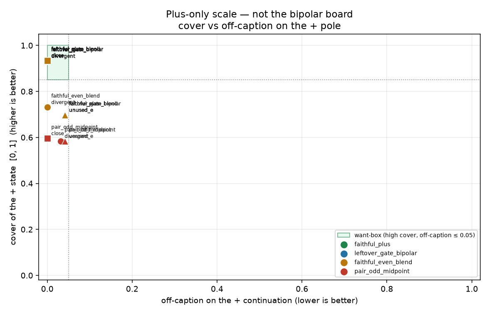

# Plus-only exam: cover the + pole, do not teach −1

Generated by `analysis/slider2d/run_lm_plus_exam.py`. CPU only, no Hub,
no GPU, no Music 3 weights. Does not change the live trainer default
(`--lm_target v9` / `--pole_mode hidden`). This is a **separate
scale** from pair-exam, leftover-sheet `leak_frac`, and the compiled
bipolar board. Those pages are not updated here.

Bipolar ±1 is where leak_frac, midpoint Goodhart, even-blend lyric
smear, and +/− same-dir leak live. The question is whether training
only the positive pole alleviates a lot of that on the + continuation.

**Does plus-only help? `yes`** — from the two scored numbers
on the same CPU fixture, not from an essay.

## Two scored numbers

1. **off-caption** on the + continuation: words neither the + caption
   nor the pair's shared song sings. Shared song is lyrics plus tokens
   both pole captions sing. Singing the − pole's unique track words
   is off-caption here. Gate: `≤ 0.05`. Lower is better.
2. **cover** of the + state:

   `cover = min(overlap_with_pos, 1 − blend_toward_mid)` in `[0, 1]`.

   `overlap_with_pos` is the share of + continuation tokens that the
   + caption itself sings. `blend_toward_mid` is
   `‖s+ − pos‖ / (‖s+ − pos‖ + min(‖s+ − mid‖, ‖s+ − neg‖))` — 0 at
   pos, 1 at mid or at neg. A hit is
   `cover ≥ 0.85` AND `off-caption ≤ 0.05`.

Not scored: `leak_frac`, collapse, pair-odd cos, minus overlap,
`exam_score`. −1 is an unconstrained canary in a labeled section
below.

## Train card (opt-in)

`--lm_target faithful_plus --pole_mode hidden`. Teacher is leftover-
gated `h+` (raw pos when leftover ê is unused or undeclared). Student
+1 fits that + state. No pair-odd, no `h0 ± a`, no minus MSE.
Inference may still expose a −1 fader; that fader is not trained.
Sidecar records `lm_target` and `plus_only`. Default stays
`--lm_target v9` / `--pole_mode hidden`.

```bash
python conceptmod/textsliders/train_lm_slider_music3.py \
  --name energy-lm-plus \
  --prompts_file conceptmod/textsliders/data/prompts-energy-v4.yaml \
  --lm_target faithful_plus --pole_mode hidden \
  --rank 8 --alpha 8 --lr 5e-4 --steps 800 --seed 7 \
  --no-early_stop --endreg_weight 1.0
```

Same card on gender-v4 (`--name gender-lm-plus`,
`prompts-gender-v4.yaml`). The yaml is not rewritten. No live listen
on this branch.

## The board (400 Adam steps, seed 0)

Per + pole, not a ± pair. `leftover_gate_bipolar` is the current
`faithful` / leftover-gate +/− teacher. `faithful_even_blend` is the
v21 bipolar even-blend (`α = 0.5`). `pair_odd_midpoint` is the known
fail.

### `divergent`

| recipe | train | cover | off-caption | overlap+ | blend→mid | hit |
|---|---|---:|---:|---:|---:|---|
| `faithful_plus` | plus-only | 0.932 | 0.000 | 1.000 | 0.068 | **HIT** |
| `leftover_gate_bipolar` | bipolar ± | 0.932 | 0.000 | 1.000 | 0.068 | **HIT** |
| `faithful_even_blend` | bipolar ± | 0.731 | 0.000 | 1.000 | 0.269 | — |
| `pair_odd_midpoint` | bipolar ± | 0.584 | 0.031 | 0.969 | 0.416 | — |

### `close`

| recipe | train | cover | off-caption | overlap+ | blend→mid | hit |
|---|---|---:|---:|---:|---:|---|
| `faithful_plus` | plus-only | 0.935 | 0.000 | 1.000 | 0.065 | **HIT** |
| `leftover_gate_bipolar` | bipolar ± | 0.935 | 0.000 | 1.000 | 0.065 | **HIT** |
| `faithful_even_blend` | bipolar ± | 0.935 | 0.000 | 1.000 | 0.065 | **HIT** |
| `pair_odd_midpoint` | bipolar ± | 0.596 | 0.000 | 1.000 | 0.404 | — |

### `unused_e`

| recipe | train | cover | off-caption | overlap+ | blend→mid | hit |
|---|---|---:|---:|---:|---:|---|
| `faithful_plus` | plus-only | 0.697 | 0.042 | 0.958 | 0.303 | — |
| `leftover_gate_bipolar` | bipolar ± | 0.697 | 0.042 | 0.958 | 0.303 | — |
| `faithful_even_blend` | bipolar ± | 0.697 | 0.042 | 0.958 | 0.303 | — |
| `pair_odd_midpoint` | bipolar ± | 0.584 | 0.042 | 0.958 | 0.416 | — |



Want-box is high cover, off-caption near 0. Title says this is the
plus-only scale, not the bipolar board.

## Unscored canary: what −1 does

Inference may still expose a −1 fader. Plus-only does not train it.
Logged here only. Not a score. `dangerous` is same-dir (landed on +)
or −1 off-caption above the 0.05 suggestion.

| cell | recipe | −1 landed | −1 overlap with − | −1 off-caption | dangerous? |
|---|---|---|---:|---:|---|
| `divergent` | `faithful_plus` | neu | 0.292 | 0.708 | **yes** |
| `divergent` | `leftover_gate_bipolar` | neg | 1.000 | 0.000 | no |
| `divergent` | `faithful_even_blend` | neg | 1.000 | 0.000 | no |
| `divergent` | `pair_odd_midpoint` | neu | 1.000 | 0.000 | no |
| `close` | `faithful_plus` | neu | 1.000 | 0.000 | no |
| `close` | `leftover_gate_bipolar` | neg | 1.000 | 0.000 | no |
| `close` | `faithful_even_blend` | neg | 1.000 | 0.000 | no |
| `close` | `pair_odd_midpoint` | neg | 1.000 | 0.000 | no |
| `unused_e` | `faithful_plus` | neu | 0.375 | 0.625 | **yes** |
| `unused_e` | `leftover_gate_bipolar` | neg | 0.990 | 0.010 | no |
| `unused_e` | `faithful_even_blend` | neg | 0.990 | 0.010 | no |
| `unused_e` | `pair_odd_midpoint` | neu | 1.000 | 0.000 | no |

## What the numbers say

- Plus-only hits both required pairs (divergent, close): **yes**.
- Leftover-gate bipolar also hits both required pairs: **yes** (same + cover / off-caption as plus-only; minus MSE was not what hurt +).
- even-blend / pair-odd miss a hit plus-only makes: **faithful_even_blend, pair_odd_midpoint**.

**Answer: yes.** Training only + does alleviate midpoint Goodhart and even-blend smear on the + continuation. It does not beat leftover-gate bipolar on + (tie). The unconstrained −1 canary is a different question — see below.

## Related cells (not this scale)

- [lm-pair-exam.md](lm-pair-exam.md) — bipolar continuation gates.
- [lm-even-leftover.md](lm-even-leftover.md) — leftover-sheet `leak_frac`.
- [lm-2d-scoreboard.md](lm-2d-scoreboard.md) — compiled bipolar board.

## How to run

```bash
PYTHONPATH=. python analysis/slider2d/run_lm_plus_exam.py --out docs/lm-plus-exam
PYTHONPATH=. pytest tests/test_lm_plus_exam.py tests/test_lm_trainer_v9.py -q
```

CPU only. No Hub, no GPU, no Music 3 weights. Seed `0`, `400` Adam steps.

