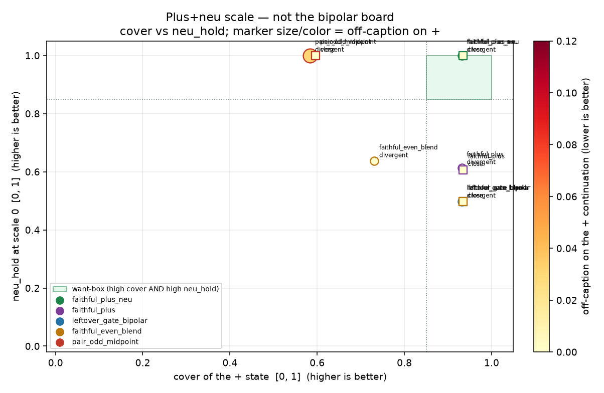

# Plus+neu exam: cover +, hold 0 on the song

Generated by `analysis/slider2d/run_lm_plus_neu_exam.py`. CPU only, no Hub,
no GPU, no Music 3 weights. Does not change the live trainer default
(`--lm_target v9` / `--pole_mode hidden`). This is a **separate
scale** from the plus-only exam, pair-exam, leftover-sheet `leak_frac`,
and the compiled bipolar board. Those pages are not updated here.

`faithful_plus` (+1 → leftover-gated `h+` only) is the live garble
card: no neu hold, the student left the song. UNI trains the
positive and the neutral only. No minus teacher. Not bipolar faithful.

**Does plus+neu beat `faithful_plus` on neu_hold? `yes`** — and
**does it keep + cover? `yes`** — from the three scored numbers
on the same CPU fixture, not from an essay.

## Three scored numbers

1. **cover** of the + state (same as plus-only):

   `cover = min(overlap_with_pos, 1 − blend_toward_mid)` in `[0, 1]`.

   Gate: `≥ 0.85`. Higher is better.
2. **off-caption** on the + continuation: words neither the + caption
   nor the pair's shared song sings. Shared song is lyrics plus tokens
   both pole captions sing. Singing the − pole's unique track words
   is off-caption here. Gate: `≤ 0.05`. Lower is better.
3. **neu_hold**: student at scale 0 stays on the yaml lyrics /
   neutral caption:

   `neu_hold = min(overlap_with_neu, 1 − drift_from_neu)` in `[0, 1]`.

   `overlap_with_neu` is the share of the scale-0 continuation that
   the lyrics field or the neu caption itself sings.
   `drift_from_neu` is
   `‖s0 − neu‖ / (‖s0 − neu‖ + min(‖s0 − pos‖, ‖s0 − mid‖))` — 0 at
   neu, 1 at pos or at mid. Gate: `≥ 0.85`.

A hit is all three. Not scored: `leak_frac`, collapse, pair-odd,
minus overlap, `exam_score`. −1 is an unscored canary.

The CPU student has a free origin (`δ(σ) = σ·w + |σ|·w_even + w0`)
so scale 0 can leave the song. UNI's `MSE(0)` pins `w0`; plus-only
and bipolar do not. A live multiplier LoRA has no `w0`; the live
card is still `MSE(+) + MSE(0)` onto raw `h+` / `h0`.

## Train card (opt-in)

`--lm_target faithful_plus_neu --pole_mode hidden`. Teacher is raw
`h+` (never leftover-gated, even if `leak_*` exists). Student +1
fits that + caption. Student scale 0 fits `h0`. No pair-odd, no
`h0 ± a`, no minus MSE. Sidecar records `lm_target` and `plus_neu`.
Default stays `--lm_target v9` / `--pole_mode hidden`.
`faithful_plus` is unchanged (still plus-only, still the garble card).

```bash
CUDA_VISIBLE_DEVICES=N python conceptmod/textsliders/train_lm_slider_music3.py \
  --name energy-lm-uni-v1 \
  --prompts_file conceptmod/textsliders/data/prompts-energy-v4.yaml \
  --lm_target faithful_plus_neu --pole_mode hidden \
  --rank 8 --alpha 8 --lr 5e-4 --steps 800 --seed 7 \
  --no-early_stop --endreg_weight 1.0 --device 0
```

v4 yaml is the fixture rank. Uni yamls can swap in later. The yaml
is not rewritten. No live listen on this branch.

## Combined rank (divergent + close)

In-box first (hit on both required pairs), then neu_hold, then
cover, then off-caption. Averages over the two required cells.
`unused_e` is logged below and is not in this rank.

| rank | recipe | train | in-box | neu_hold | cover | off-caption | hit Δ | hit close |
|---:|---|---|---|---:|---:|---:|---|---|
| 1 | `faithful_plus_neu` | plus+neu | **yes** | 1.000 | 0.933 | 0.000 | **HIT** | **HIT** |
| 2 | `pair_odd_midpoint` | bipolar ± | — | 1.000 | 0.590 | 0.016 | — | — |
| 3 | `faithful_plus` | plus-only | — | 0.610 | 0.933 | 0.000 | — | — |
| 4 | `faithful_even_blend` | bipolar ± | — | 0.567 | 0.833 | 0.000 | — | — |
| 5 | `leftover_gate_bipolar` | bipolar ± | — | 0.498 | 0.933 | 0.000 | — | — |

## The board (400 Adam steps, seed 0)

This is the plus+neu scale, not the bipolar board. `faithful_plus`
is the leftover-gated plus-only garble card. `leftover_gate_bipolar`
is the current `faithful` / leftover-gate +/− teacher.
`faithful_even_blend` is the v21 bipolar even-blend (`α = 0.5`).
`pair_odd_midpoint` is the known fail.

### `divergent`

| recipe | train | cover | off-caption | neu_hold | overlap+ | overlap0 | hit |
|---|---|---:|---:|---:|---:|---:|---|
| `faithful_plus_neu` | plus+neu | 0.932 | 0.000 | 1.000 | 1.000 | 1.000 | **HIT** |
| `pair_odd_midpoint` | bipolar ± | 0.584 | 0.031 | 1.000 | 0.969 | 1.000 | — |
| `faithful_even_blend` | bipolar ± | 0.731 | 0.000 | 0.637 | 1.000 | 1.000 | — |
| `faithful_plus` | plus-only | 0.932 | 0.000 | 0.613 | 1.000 | 1.000 | — |
| `leftover_gate_bipolar` | bipolar ± | 0.932 | 0.000 | 0.498 | 1.000 | 1.000 | — |

### `close`

| recipe | train | cover | off-caption | neu_hold | overlap+ | overlap0 | hit |
|---|---|---:|---:|---:|---:|---:|---|
| `faithful_plus_neu` | plus+neu | 0.935 | 0.000 | 1.000 | 1.000 | 1.000 | **HIT** |
| `pair_odd_midpoint` | bipolar ± | 0.596 | 0.000 | 1.000 | 1.000 | 1.000 | — |
| `faithful_plus` | plus-only | 0.935 | 0.000 | 0.606 | 1.000 | 1.000 | — |
| `faithful_even_blend` | bipolar ± | 0.935 | 0.000 | 0.498 | 1.000 | 1.000 | — |
| `leftover_gate_bipolar` | bipolar ± | 0.935 | 0.000 | 0.498 | 1.000 | 1.000 | — |

### `unused_e`

| recipe | train | cover | off-caption | neu_hold | overlap+ | overlap0 | hit |
|---|---|---:|---:|---:|---:|---:|---|
| `faithful_plus_neu` | plus+neu | 0.932 | 0.000 | 1.000 | 1.000 | 1.000 | **HIT** |
| `pair_odd_midpoint` | bipolar ± | 0.584 | 0.042 | 1.000 | 0.958 | 1.000 | — |
| `faithful_plus` | plus-only | 0.697 | 0.042 | 0.619 | 0.958 | 1.000 | — |
| `faithful_even_blend` | bipolar ± | 0.697 | 0.042 | 0.498 | 0.958 | 1.000 | — |
| `leftover_gate_bipolar` | bipolar ± | 0.697 | 0.042 | 0.498 | 0.958 | 1.000 | — |



Want-box is high cover AND high neu_hold. Marker size and color are
off-caption on the + continuation (smaller / cooler is cleaner).
Title says this is the plus+neu scale, not the bipolar board.
Required pairs only on the chart; `unused_e` stays in the table.

## Unscored canary: what −1 does

Inference may still expose a −1 fader. Plus+neu does not train it.
Logged here only. Not a score. `dangerous` is same-dir (landed on +)
or −1 off-caption above the 0.05 suggestion.

| cell | recipe | −1 landed | −1 overlap with − | −1 off-caption | dangerous? |
|---|---|---|---:|---:|---|
| `divergent` | `faithful_plus_neu` | neu | 0.292 | 0.708 | **yes** |
| `divergent` | `faithful_plus` | neu | 0.000 | 1.000 | **yes** |
| `divergent` | `leftover_gate_bipolar` | neg | 1.000 | 0.000 | no |
| `divergent` | `faithful_even_blend` | neg | 1.000 | 0.000 | no |
| `divergent` | `pair_odd_midpoint` | neu | 1.000 | 0.000 | no |
| `close` | `faithful_plus_neu` | neu | 1.000 | 0.000 | no |
| `close` | `faithful_plus` | neu | 1.000 | 0.000 | no |
| `close` | `leftover_gate_bipolar` | neg | 1.000 | 0.000 | no |
| `close` | `faithful_even_blend` | neg | 1.000 | 0.000 | no |
| `close` | `pair_odd_midpoint` | neg | 1.000 | 0.000 | no |
| `unused_e` | `faithful_plus_neu` | neu | 0.375 | 0.625 | **yes** |
| `unused_e` | `faithful_plus` | neu | 0.156 | 0.844 | **yes** |
| `unused_e` | `leftover_gate_bipolar` | neg | 0.990 | 0.010 | no |
| `unused_e` | `faithful_even_blend` | neg | 0.990 | 0.010 | no |
| `unused_e` | `pair_odd_midpoint` | neu | 1.000 | 0.000 | no |

## What the numbers say

- Plus+neu hits both required pairs (divergent, close): **yes**.
- Plus-only (`faithful_plus`) hits both required pairs: **no**.
- Plus+neu beats `faithful_plus` on neu_hold on both required pairs: **yes** (UNI 1.000, 1.000 vs plus-only 0.613, 0.606).
- Plus+neu keeps + cover: **yes** (UNI 0.932, 0.935 vs plus-only 0.932, 0.935).

**Answer: neu_hold yes, cover yes.** Training + and 0 holds the origin on the lyrics / neu caption. Plus-only still covers + but lets scale 0 leave the song — the live garble.

## Related cells (not this scale)

- [lm-plus-exam.md](lm-plus-exam.md) — plus-only cover / off-caption.
- [lm-pair-exam.md](lm-pair-exam.md) — bipolar continuation gates.
- [lm-even-leftover.md](lm-even-leftover.md) — leftover-sheet `leak_frac`.
- [lm-2d-scoreboard.md](lm-2d-scoreboard.md) — compiled bipolar board.

## How to run

```bash
PYTHONPATH=. python analysis/slider2d/run_lm_plus_neu_exam.py --out docs/lm-plus-neu-exam
PYTHONPATH=. pytest tests/test_lm_plus_neu_exam.py tests/test_lm_plus_exam.py tests/test_lm_trainer_v9.py -q
```

CPU only. No Hub, no GPU, no Music 3 weights. Seed `0`, `400` Adam steps.

