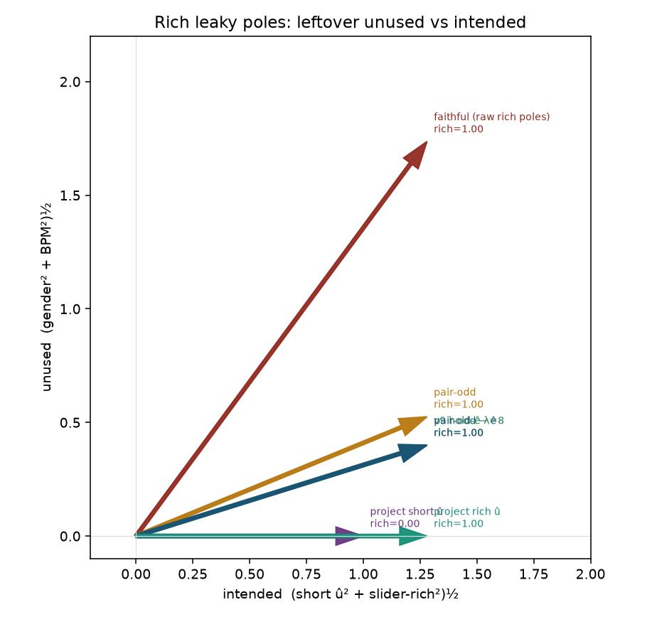
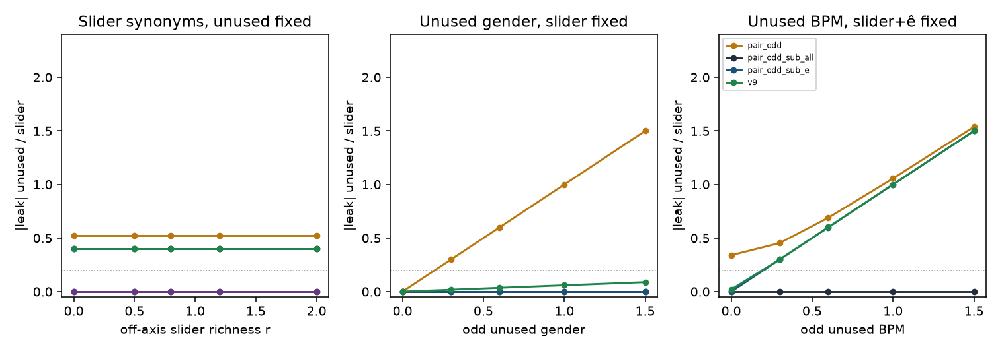
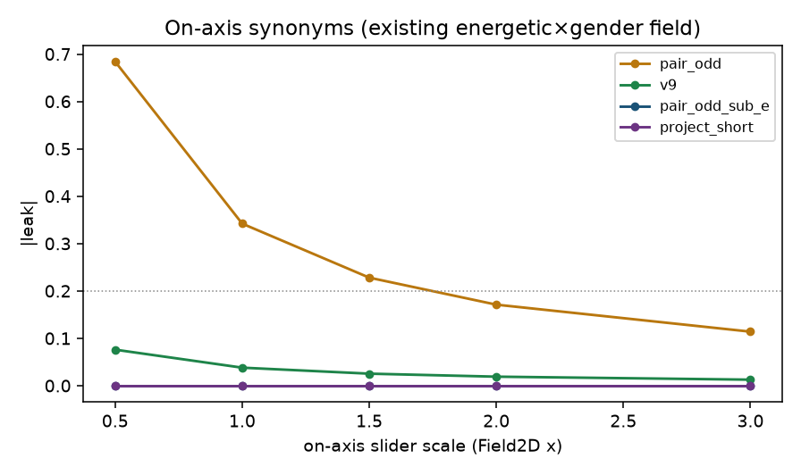
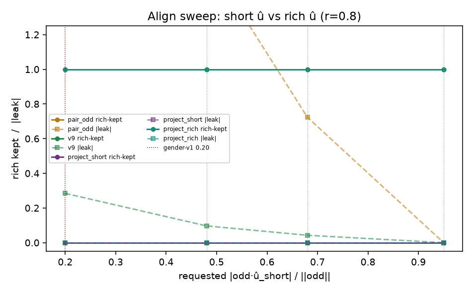

# Richer poles without hosing leak

Same CPU fixture as [lm-faithful-2d.md](lm-faithful-2d.md),
[lm-v9-2d.md](lm-v9-2d.md), [lm-live-cells.md](lm-live-cells.md).
Question: can Music 3-style structured poles keep slider detail
(mix/timbre/genre adjectives that belong to the slider) without
unused mix / BPM / gender riding along inside `h±`?

Faithful+attributes (leak 0, pole cos 1) *cleans* the poles by
pinning unused gender. This cell is the opposite direction:
keep or add slider-detail, drop only unused dimensions.

CPU only. No Hub, no GPU, no Music 3 weights. Live `--lm_target v9`
is unchanged.

## Verdict

**Yes, if the extra words lie on the intended axis — or we drop only unused ê.** Off-axis slider adjectives are kept by pair-odd − ê (rich kept 1.00, gender leak +0.000) and by current v9 hold-ê (rich kept 1.00, leftover leak +0.400). Project onto short û zeros that richness (rich kept 0.00) — the gender-v1 kill in slider-adjective clothing. Unused mix/BPM/gender words are not richness; they *are* leak. `project_rich` is leak +0.000 and rich-kept 1.00 here because û is the oracle intended span (hypothesis 4) — not a live default; short û at 0.20 still kills. `pair_odd_sub_all` / `v9_hold_all` (leak +0.000 / +0.031) is the same recipe with every unused axis declared. Current `--lm_target v9` leftover leak +0.400 on this cell is undeclared BPM (gender leftover +0.020); richness stays 1.00. Do not change the live default. ê is a YAML caption pair, not an oracle.

Default rich leaky poles: short û `1.00`, off-axis slider
richness `0.80`, odd gender `0.34`
(even gender `1.35`), odd BPM `0.40`.
Short-û align 0.723; rich-û align 0.925.

## Already scored baselines (energetic×gender Field2D, 250 Adam, seed 0)

Reused, not the only table. New subtract-ê rows are the hard v9.

| method | leak | ±1 cos | pole cos |
|---|---:|---:|---:|
| `lm_faithful_raw` | +1.692 | +0.253 | 1.000 |
| `lm_faithful_hold_l8` | +0.188 | -0.956 | 0.659 |
| `lm_faithful_attrs` | +0.000 | -1.000 | 1.000 |
| `lm_symmetric` | +0.342 | -1.000 | 0.760 |
| `lm_v9` | +0.038 | -1.000 | 0.541 |
| `lm_v9_project` | +0.000 | -1.000 | 0.509 |
| `lm_faithful_sub_e` | +0.000 | -1.000 | 0.509 |
| `lm_odd_sub_e` | +0.000 | -1.000 | 0.509 |

## Teacher variants on the same rich leaky poles

| method | slider | leak | ±1 | rich | slider cos | leak | ±1 cos | rich kept | gender leak | BPM leak |
|---|---|---|---|---|---:|---:|---:|---:|---:|---:|
| `faithful` | **needs_help** | **needs_help** | **needs_help** | **right** | 0.593 | +1.737 | -0.026 | 1.00 | +1.690 | +0.400 |
| `pair_odd` | **right** | **needs_help** | **right** | **right** | 0.925 | +0.525 | -1.000 | 1.00 | +0.340 | +0.400 |
| `faithful_sub_e` | **right** | **needs_help** | **right** | **right** | 0.955 | +0.400 | -1.000 | 1.00 | +0.000 | +0.400 |
| `pair_odd_sub_e` | **right** | **needs_help** | **right** | **right** | 0.955 | +0.400 | -1.000 | 1.00 | +0.000 | +0.400 |
| `pair_odd_sub_all` | **right** | **right** | **right** | **right** | 1.000 | +0.000 | -1.000 | 1.00 | +0.000 | +0.000 |
| `hold_e_l1` | **right** | **needs_help** | **right** | **right** | 0.951 | +0.416 | -1.000 | 1.00 | +0.113 | +0.400 |
| `hold_e_l4` | **right** | **needs_help** | **right** | **right** | 0.954 | +0.402 | -1.000 | 1.00 | +0.038 | +0.400 |
| `hold_e_l8` | **right** | **needs_help** | **right** | **right** | 0.954 | +0.400 | -1.000 | 1.00 | +0.020 | +0.400 |
| `hold_e_l16` | **right** | **needs_help** | **right** | **right** | 0.954 | +0.400 | -1.000 | 1.00 | +0.010 | +0.400 |
| `hold_e_l32` | **right** | **needs_help** | **right** | **right** | 0.955 | +0.400 | -1.000 | 1.00 | +0.005 | +0.400 |
| `v9` | **right** | **needs_help** | **right** | **right** | 0.954 | +0.400 | -1.000 | 1.00 | +0.020 | +0.400 |
| `v9_hold_all` | **right** | **right** | **right** | **right** | 1.000 | +0.031 | -1.000 | 1.00 | +0.020 | +0.024 |
| `project_short` | **needs_help** | **right** | **right** | **needs_help** | 0.781 | +0.000 | -1.000 | 0.00 | +0.000 | +0.000 |
| `project_rich` | **right** | **right** | **right** | **right** | 1.000 | +0.000 | -1.000 | 1.00 | +0.000 | +0.000 |
| `project_odd` | **right** | **needs_help** | **right** | **right** | 0.925 | +0.525 | -1.000 | 1.00 | +0.340 | +0.400 |

Seed 1 (same 250 steps), v9 leak +0.400 rich 1.00; pair-odd − ê leak +0.400 rich 1.00; project short rich 0.00.



## Slider richness at fixed unused

Off-axis structured adjectives (dim 3). Unused gender/BPM held at the
default. Slider synonyms that *lie on* û are the on-axis Field2D sweep.

| r | recipe | leak | rich kept | cos intended | short align |
|---:|---|---:|---:|---:|---:|
| 0.0 | `pair_odd` | +0.525 | 1.00 | 0.885 | 0.885 |
| 0.0 | `v9` | +0.400 | 1.00 | 0.928 | 0.885 |
| 0.0 | `pair_odd_sub_e` | +0.400 | 1.00 | 0.928 | 0.885 |
| 0.0 | `project_short` | +0.000 | 1.00 | 1.000 | 0.885 |
| 0.0 | `project_rich` | +0.000 | 1.00 | 1.000 | 0.885 |
| 0.8 | `pair_odd` | +0.525 | 1.00 | 0.925 | 0.723 |
| 0.8 | `v9` | +0.400 | 1.00 | 0.954 | 0.723 |
| 0.8 | `pair_odd_sub_e` | +0.400 | 1.00 | 0.955 | 0.723 |
| 0.8 | `project_short` | +0.000 | 0.00 | 0.781 | 0.723 |
| 0.8 | `project_rich` | +0.000 | 1.00 | 1.000 | 0.723 |
| 2.0 | `pair_odd` | +0.525 | 1.00 | 0.974 | 0.435 |
| 2.0 | `v9` | +0.400 | 1.00 | 0.984 | 0.435 |
| 2.0 | `pair_odd_sub_e` | +0.400 | 1.00 | 0.984 | 0.435 |
| 2.0 | `project_short` | +0.000 | 0.00 | 0.447 | 0.435 |
| 2.0 | `project_rich` | +0.000 | 1.00 | 1.000 | 0.435 |

On-axis Field2D: extra energetic/calm scale 1 → 2 drops v9 leak
+0.038 → +0.019 (same unused, more slider).
Pair-odd at scale 3 is leak +0.114. On-axis slider words are free.





## Unused richness at fixed slider

Extra gender (declared ê) vs extra BPM (undeclared unused). Slider
richness stays `0.80`.

| unused | axis | pair-odd leak | v9 leak | −ê leak | −all leak | v9 rich |
|---:|---|---:|---:|---:|---:|---:|
| 0.0 | gender | +0.000 | +0.000 | +0.000 | +0.000 | 1.00 |
| 0.6 | gender | +0.600 | +0.035 | +0.000 | +0.000 | 1.00 |
| 1.5 | gender | +1.500 | +0.088 | +0.000 | +0.000 | 1.00 |
| 0.0 | bpm | +0.340 | +0.020 | +0.000 | +0.000 | 1.00 |
| 0.6 | bpm | +0.690 | +0.600 | +0.600 | +0.000 | 1.00 |
| 1.5 | bpm | +1.538 | +1.500 | +1.500 | +0.000 | 1.00 |

v9 / −ê only see declared gender. Extra BPM is leftover leak unless
it is also declared (hold-all / −all) or pinned.

## Partial pin (leave slider adjectives rich)

| pin | recipe | leak | rich kept | gender leak | BPM leak |
|---|---|---:|---:|---:|---:|
| `free` | `faithful` | +1.737 | 1.00 | +1.690 | +0.400 |
| `free` | `pair_odd` | +0.525 | 1.00 | +0.340 | +0.400 |
| `free` | `v9` | +0.400 | 1.00 | +0.020 | +0.400 |
| `pin_gender` | `faithful` | +0.400 | 1.00 | +0.000 | +0.400 |
| `pin_gender` | `pair_odd` | +0.400 | 1.00 | +0.000 | +0.400 |
| `pin_gender` | `v9` | +0.400 | 1.00 | +0.000 | +0.400 |
| `pin_bpm` | `faithful` | +1.690 | 1.00 | +1.690 | +0.000 |
| `pin_bpm` | `pair_odd` | +0.340 | 1.00 | +0.340 | +0.000 |
| `pin_bpm` | `v9` | +0.020 | 1.00 | +0.020 | +0.000 |
| `pin_both` | `faithful` | +0.000 | 1.00 | +0.000 | +0.000 |
| `pin_both` | `pair_odd` | +0.000 | 1.00 | +0.000 | +0.000 |
| `pin_both` | `v9` | +0.000 | 1.00 | +0.000 | +0.000 |

Pinning unused gender (attributes-style) or unused BPM zeros that
axis in `h± − h0`. Slider richness stays. Pin-both + faithful is
the data fix: clean rich poles, leak 0. Pin-gender alone leaves BPM.

## Align sweep: rich û vs short û

Already-odd poles. Requested short-û aligns 0.20 / 0.48 / 0.68 / 0.95.
Off-axis richness r=0.80 caps short align at
`s/sqrt(s²+r²) = 0.781`
when unused is zero — that is why structured poles vs two-word û
print middling 0.48–0.68 even before unused mix.

| align | recipe | realized short | leak | rich kept | cos intended |
|---:|---|---:|---:|---:|---:|
| 0.20 | `pair_odd` | 0.200 | +4.833 | 1.00 | 0.256 |
| 0.20 | `v9` | 0.200 | +0.284 | 1.00 | 0.976 |
| 0.20 | `project_short` | 0.200 | +0.000 | 0.00 | 0.781 |
| 0.20 | `project_rich` | 0.200 | +0.000 | 1.00 | 1.000 |
| 0.48 | `pair_odd` | 0.480 | +1.643 | 1.00 | 0.615 |
| 0.48 | `v9` | 0.480 | +0.097 | 1.00 | 0.997 |
| 0.48 | `project_short` | 0.480 | +0.000 | 0.00 | 0.781 |
| 0.48 | `project_rich` | 0.480 | +0.000 | 1.00 | 1.000 |
| 0.68 | `pair_odd` | 0.680 | +0.723 | 1.00 | 0.871 |
| 0.68 | `v9` | 0.680 | +0.043 | 1.00 | 0.999 |
| 0.68 | `project_short` | 0.680 | +0.000 | 0.00 | 0.781 |
| 0.68 | `project_rich` | 0.680 | +0.000 | 1.00 | 1.000 |
| 0.95 | `pair_odd` | 0.781 | +0.000 | 1.00 | 1.000 |
| 0.95 | `v9` | 0.781 | +0.000 | 1.00 | 1.000 |
| 0.95 | `project_short` | 0.781 | +0.000 | 0.00 | 0.781 |
| 0.95 | `project_rich` | 0.781 | +0.000 | 1.00 | 1.000 |

Clean rich pair + tilted short û at 0.20 (gender-v1): project-short
rich kept 0.04, cos intended 0.200,
strength-like norm 0.288. Pair-odd on the same
clean pair: leak +0.000, rich kept 1.00.
Project onto short names still kills the singer / the extra adjectives.



## Energy-like + mismatch (do not overfit even∥ê)

On energy-like, poles are already odd. Faithful ≡ pair-odd.
Hard-subtract ê is the hard limit of current v9.
Mismatch is a clean pair: ê is not in the poles; subtract is a no-op.
Project short û still fails (gender-v1).

| cell | method | leak | ±1 cos | pass |
|---|---|---:|---:|---|
| energy-like | faithful λ=0 | +1.388 | -1.000 | False |
| energy-like | pair-odd λ=0 | +1.388 | -1.000 | False |
| energy-like | v9 hold-ê λ=8 | +0.154 | -1.000 | True |
| energy-like | pair-odd − ê | +0.000 | -1.000 | True |
| mismatch | faithful | +0.000 | -1.000 | True |
| mismatch | pair-odd | +0.000 | -1.000 | True |
| mismatch | project short û | +4.899 | -1.000 | False |
| mismatch | subtract junk | +0.000 | -1.000 | True |

## Why a wrong ê should not become the live default

Hard-subtract of *oracle* ê looks like a win (gender leak 0, richness kept).
Live ê is `leak_positive` / `leak_negative` captions, not this basis vector.
Tilt ê by mixing 0.25 of û: subtract slider_kept 0.86
(true ê 1.00); hold-ê λ=8 slider_kept
0.87 (true 1.00).
Hold is the soft version. Wiring hard-subtract would make a bad ê caption
eat slider — the gender-v1 failure mode with a different name.

## Geometry

```
h± = h0 ± s û_short ± r ê_rich + even_unused + odd_unused
leak            = unused sitting inside h±
slider richness = r ê_rich  (⊥ short û, still intended)
on-axis richness= extra s   (energetic/calm synonyms on û)
faithful        t± = h±                         # copies unused
pair-odd        t± = h0 ± (h+−h−)/2             # drops even unused
pair-odd − ê    t± = h0 ± (a − (a·ê)ê)          # drops declared unused, keeps r
v9 hold-ê       L += λ ((h±−h0)·ê)²             # leftover ê / (1+λ)
project short û â = (a·û)û                      # drops r and unused
project rich û  â = (a·û_rich)û_rich            # keeps span{û, r}, drops unused
project pair-odd â = a                          # identity cheat; unused stays
```

Recipe that works on rich leaky captions without rewriting them:
**pair-odd + hold declared ê (current v9)**, or pin unused axes in the
captions and leave slider adjectives. Declare every unused axis you
care about (`leak_positive` / `leak_negative`); undeclared BPM is leak.
Do not project onto two-word û.

## What this field cannot see

- Real Music 3 hidden geometry and noisy ê from actual leak captions.
- AR endreg / planreg / semantic-KL.
- Multi-row yaml averaging that is not parallel.

## How to run

```bash
PYTHONPATH=. python analysis/slider2d/run_lm_rich.py --out docs/lm-rich-2d
PYTHONPATH=. pytest tests/test_lm_rich_2d.py tests/test_lm_faithful_2d.py -q
```

CPU only. No Hub, no GPU, no Music 3 weights.

Seed `0`, `250` Adam steps; seed 1 rerun of the teacher table.

