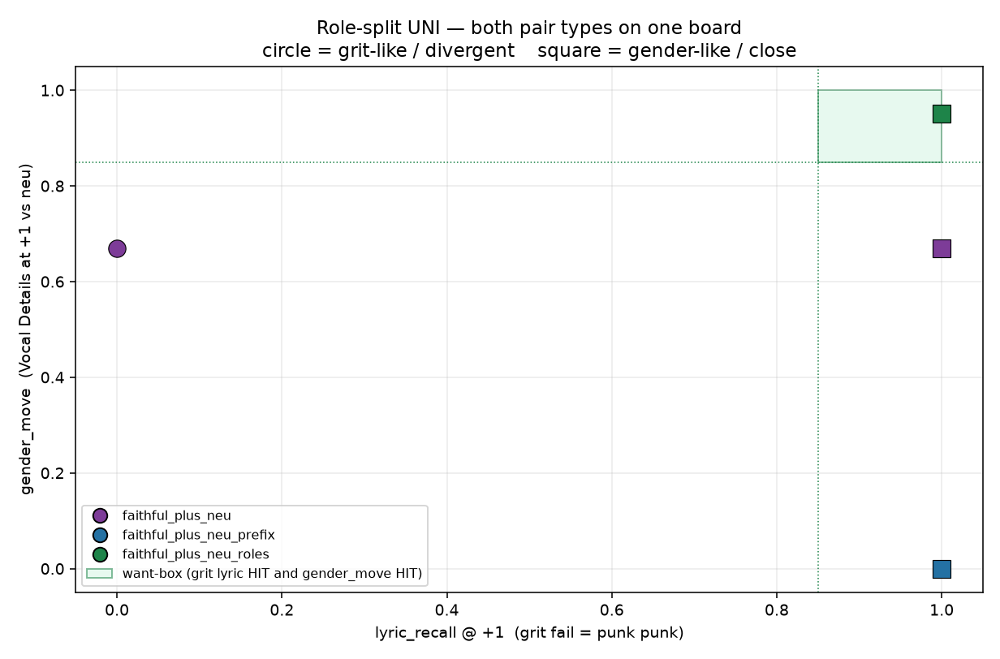

# Role-split UNI: lyrics stay, Vocal Details may move

Generated by `analysis/slider2d/run_lm_roles.py`. CPU only, no Hub,
no GPU, no Music 3 weights. Does not change the live trainer default
(`--lm_target v9` / `--pole_mode hidden`). Third UNI family: not
whole-prefix hold, not lyric-token hold-to-neu, not last-delta
projected off the lyric span.

Two failures on one board:

1. **Grit-like / divergent** — last-token UNI transplants the
   prefix KV. Sung line becomes `punk punk` instead of the yaml
   lyric. Fail = `lyric_recall@+1` below 0.85.
2. **Gender-like / close** — whole-prefix hold pins Vocal Details
   to ungendered neu, so woman cannot move on a neu listen.
   Fail = `gender_move` below 0.85 (Vocal Details at +1 still
   equals encode(neu)).

**Want-box: grit lyric HIT and gender_move HIT → `HIT`**



## How spans are found

Assembled prompt is
`<|im_start|><|caption_start|>…<|caption_end|><|lyrics_start|>…`
`<|lyrics_end|><|im_end|><|audio_start|>`. The tokenizer can
locate those special tokens as unique ids.

- **Lyrics** — exclusive span between `<|lyrics_start|>` and
  `<|lyrics_end|>`. Same yaml line on neu and pos, so token-wise
  MSE is aligned. Fail closed if empty.
- **Concept** — prefer Vocal Details: after the `Vocal Details:`
  heading, until `Arrangement:` or `<|caption_end|>`. Woman lives
  here on gender-v4. If that heading is not a unique token run,
  fall back to the exclusive caption span. Fail closed if empty.
- **Last** — must be `<|audio_start|>`. Fail closed when the
  tokenizer can say.

Pos Vocal Details is longer than neu on gender-v4 (extra woman
text), so concept MSE is pooled when lengths differ. Lyrics stay
token-wise. No minus teacher, no leftover-gate.

Why not only Vocal Details taught and everything else lyric-held?
The heading search can miss (BPE of `Vocal Details:` is not a
special token). The caption special-token span is the split the
tokenizer can always locate. When the heading is found, concept
narrows to Vocal Details; Global Metadata / Arrangement are then
unconstrained (shared LoRA only).

## Train card (opt-in)

`--lm_target faithful_plus_neu_roles --pole_mode hidden`. Teacher
is raw `h+` at last. +1 lyrics → encode(neu). +1 Vocal Details /
caption → encode(pos). Scale 0 → `h0`.

```bash
CUDA_VISIBLE_DEVICES=N python conceptmod/textsliders/train_lm_slider_music3.py \
  --name energy-lm-uni-roles \
  --prompts_file conceptmod/textsliders/data/prompts-energy-v4.yaml \
  --lm_target faithful_plus_neu_roles --pole_mode hidden \
  --rank 8 --alpha 8 --lr 5e-4 --steps 800 --seed 7 \
  --no-early_stop --endreg_weight 1.0 --device 0
```

Default stays `--lm_target v9` / `--pole_mode hidden`.
`faithful_plus_neu` and `faithful_plus_neu_prefix` are unchanged.

## Rank (lyric_recall, cover, neu_hold, gender_move)

| rank | recipe | in want-box | lyric_recall | cover | neu_hold | gender_move | grit lyric | gender_move (close) |
|---:|---|---|---:|---:|---:|---:|---|---|
| 1 | `faithful_plus_neu_roles` | **yes** | 1.000 | 0.933 | 1.000 | 0.951 | **HIT** | **HIT** |
| 2 | `faithful_plus_neu_prefix` | no | 1.000 | 0.933 | 1.000 | 0.000 | **HIT** | miss |
| 3 | `faithful_plus_neu` | no | 0.500 | 0.933 | 1.000 | 0.670 | miss | miss |

## Per-cell rows

### grit-like / divergent

| recipe | lyric_recall | cover | neu_hold | gender_move | sings lyrics | sings Vocal Details |
|---|---:|---:|---:|---:|---|---|
| `faithful_plus_neu` | 0.000 | 0.932 | 1.000 | 0.670 | `punk punk punk punk | punk punk punk punk | punk punk punk punk` | `punk punk punk | punk punk punk | punk punk punk` |
| `faithful_plus_neu_prefix` | 1.000 | 0.932 | 1.000 | 0.000 | `lyric0 lyric0 lyric0 lyric0 | lyric1 lyric1 lyric1 lyric1 | lyric2 lyric2 lyric2 lyric2` | `lead lead lead | lead lead lead | lead lead lead` |
| `faithful_plus_neu_roles` | 1.000 | 0.932 | 1.000 | 0.951 | `lyric0 lyric0 lyric0 lyric0 | lyric1 lyric1 lyric1 lyric1 | lyric2 lyric2 lyric2 lyric2` | `punk punk punk | punk punk punk | punk punk punk` |

### gender-like / close

| recipe | lyric_recall | cover | neu_hold | gender_move | sings lyrics | sings Vocal Details |
|---|---:|---:|---:|---:|---|---|
| `faithful_plus_neu` | 1.000 | 0.935 | 1.000 | 0.670 | `lyric0 lyric0 lyric0 lyric0 | lyric1 lyric1 lyric1 lyric1 | lyric2 lyric2 lyric2 lyric2` | `woman woman woman | woman woman woman | woman woman woman` |
| `faithful_plus_neu_prefix` | 1.000 | 0.935 | 1.000 | 0.000 | `lyric0 lyric0 lyric0 lyric0 | lyric1 lyric1 lyric1 lyric1 | lyric2 lyric2 lyric2 lyric2` | `lead lead lead | lead lead lead | lead lead lead` |
| `faithful_plus_neu_roles` | 1.000 | 0.935 | 1.000 | 0.951 | `lyric0 lyric0 lyric0 lyric0 | lyric1 lyric1 lyric1 lyric1 | lyric2 lyric2 lyric2 lyric2` | `woman woman woman | woman woman woman | woman woman woman` |

## Verdict

- last-token UNI grit lyric: miss (`punk punk punk punk | punk punk punk punk | punk punk punk punk`)
- whole-prefix hold gender_move: miss (close VD `lead lead lead | lead lead lead | lead lead lead`)
- role-split grit lyric: **HIT** (`lyric0 lyric0 lyric0 lyric0 | lyric1 lyric1 lyric1 lyric1 | lyric2 lyric2 lyric2 lyric2`)
- role-split gender_move: **HIT** (close VD `woman woman woman | woman woman woman | woman woman woman`)
- want-box: **HIT**

Not scored: `exam_score`, `leak_frac`, `c+`, `p%`.

## Related cells

- [lm-lyric-recall.md](lm-lyric-recall.md) — existing-metric OOD + last-token transplant.
- [lm-plus-neu-exam.md](lm-plus-neu-exam.md) — last-hidden cover / neu_hold / off-caption.
- [lm-plus-exam.md](lm-plus-exam.md) — plus-only cover / off-caption.
- [lm-2d-scoreboard.md](lm-2d-scoreboard.md) — compiled bipolar board (not updated).

## How to run

```bash
PYTHONPATH=. python analysis/slider2d/run_lm_roles.py --out docs/lm-roles
PYTHONPATH=. pytest tests/test_lm_roles.py tests/test_lm_lyric_recall.py tests/test_lm_plus_neu_exam.py tests/test_lm_trainer_v9.py -q
```

CPU only. No Hub, no GPU, no Music 3 weights. Seed `0`, `400` Adam steps.

