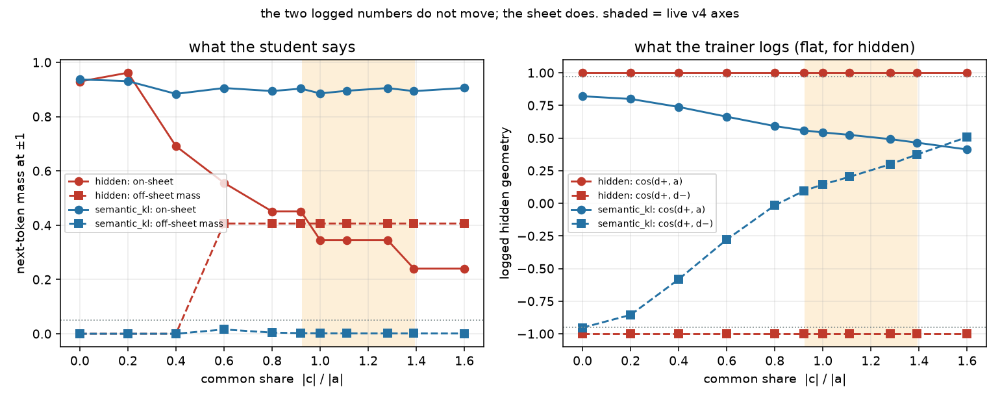
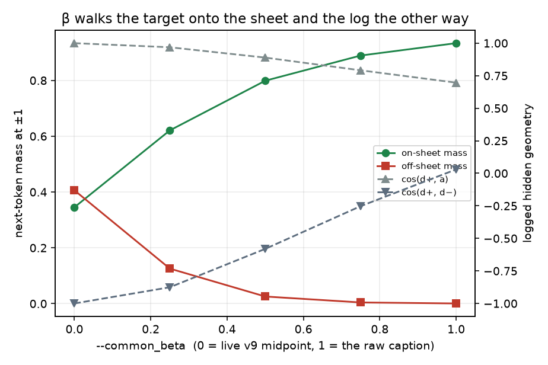
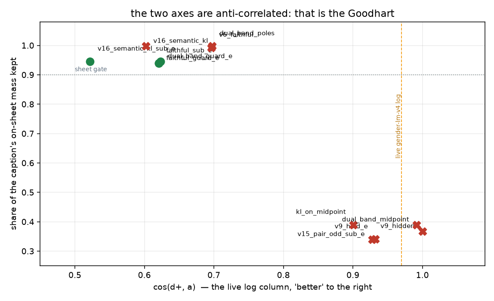

# The sheet cell: hidden-only fields cannot see lyric garble

Generated by `analysis/slider2d/run_lm_sheet.py`. CPU only, no Hub, no
GPU, no Music 3 weights. Does not change the live trainer default.

Every other 2-D / high-D cell in this repo scores a residual against
hidden geometry alone, so none of them can tell "the student reached
the teacher point" from "the student reached a point no caption
occupies". This cell adds the smallest structure that can: a frozen
linear next-token readout over a tiny vocabulary, which turns each
hidden state into a policy and gives the poles a **sheet** — the
nucleus of what a real caption would say next, plus the written lyric.

## The geometry, in one line

With `a = ½(h+−h−)` and `c = ½(h++h−) − h0`, the poles are exactly
`h± = h0 ± a + c`. So the live default target `t± = h0 ± a`
(`--lm_target v9`) is the real pole **minus its whole common
component**. `c` is what both pole captions say and the neutral
skeleton does not: genre, BPM, mood, mix, instruments — the
Structured-Caption specificity that makes the continuation a song.

The live trainer already prints the size of `c`. For `c ⊥ a`,
`cos(pos−neu, neg−neu) = (‖c‖²−‖a‖²)/(‖c‖²+‖a‖²)`, so the
**common share** `‖c‖/‖a‖` is `√((1+cos)/(1−cos))`. Reading the v4
probe table in MUSIC3.md that way:

| axis | logged cos | common share | warned? |
|---|---:|---:|---|
| rapslow | -0.08 | 0.923 | no |
| gender | -0.08 | 0.923 | no |
| rhyme | -0.05 | 0.951 | no |
| distortion | -0.03 | 0.970 | no |
| energy | +0.03 | 1.030 | no |
| tempo | +0.06 | 1.062 | no |
| triphop | +0.10 | 1.106 | no |
| breath | +0.24 | 1.277 | no |
| live | +0.32 | 1.393 | yes |

Every shipped LM axis has a common component between
**0.92× and 1.39×** the norm of the whole
pair-odd axis, and v9 throws all of it away. `--common_beta` is the
flag that would put it back, and `--lm_target v9` ignores it (the
trainer prints a note and drops it).

The only warning the trainer emits fires above cos
+0.3, so it treats a *large* `c` as the problem
(collapse inherited from the raw targets) and a cos near 0 as
healthy. Near 0 is the case where the deleted piece is the same size
as the signal. Only `live-lm-v5` was ever warned, and it also has the
campaign's worst logged cos± and collapse.

## The target points, with no optimizer in the loop

Sheet numbers read straight off the hidden state each recipe aims at,
on the energy-like field (common share 1.030, the
live energy probe). `off-caption` is the distance from the target to
the pole it claims to represent, in units of `‖a‖`.

| target | is a caption | off-caption | c kept | on-sheet | garble | argmax | KL to pole | says at ±1 |
|---|---|---:|---:|---:|---:|---:|---:|---|
| `caption` | yes | 0.000 | 1.00 | 0.941 | 0.001 | 1.00 | 0.000 | `slam,hush,slam,hush,slam,hush` |
| `faithful_sub_e` | no | 0.373 | 1.00 | 0.892 | 0.001 | 1.00 | 0.096 | `slam,hush,slam,hush,slam,hush` |
| `pair_odd_beta1` | yes | 0.000 | 1.00 | 0.941 | 0.001 | 1.00 | 0.000 | `slam,hush,slam,hush,slam,hush` |
| `pair_odd_beta05` | no | 0.515 | 0.50 | 0.822 | 0.026 | 1.00 | 0.127 | `slam,hush,slam,hush,slam,hush` |
| `pair_odd` | no | 1.030 | 0.00 | 0.372 | 0.406 | 0.33 | 1.132 | `garble_hi,garble_lo,lyric1,lyric1,garble_hi,garble_lo` |
| `pair_odd_sub_e` | no | 1.096 | 0.00 | 0.348 | 0.415 | 0.33 | 1.291 | `garble_hi,garble_lo,lyric1,lyric1,garble_hi,garble_lo` |

The v9 target sits 1.03·`‖a‖` from the caption
it claims to represent — the whole slider axis away — keeps none of
`c`, and hands 41% of its next-token mass to
words on neither pole's sheet, against the caption's own
0.1%. At ±1 it says an off-sheet token outright.
`pair_odd_sub_e` (#20) is very slightly worse, because subtracting
`ê_⊥` moves it further from the caption, not closer. No fitting is
involved in that table: a *perfect* hidden fit lands here.

## Fitted recipes

One shared residual per recipe (`δ(σ) = σ·w_odd + |σ|·w_even`, the
`train.py` LM student), three prompt rows with different written
lyrics and pole strengths. Gates are on-sheet share, off-sheet mass,
argmax, token-space leak and audible swing. `cos±` and `±1` are
**logged, never scored** — that is the point of the cell.

### Gender-like: clean pair, no declared ê, hold 0

| recipe | pole_mode | target | cos± | ±1 | on-sheet | kept | garble | argmax | swing | leak_tok | null | KL | verdict |
|---|---|---|---:|---:|---:|---:|---:|---:|---:|---:|---:|---:|---|
| `v9_hidden` | hidden | `pair_odd` | +1.000 | -1.000 | 0.540 | 0.575 | 0.415 | 0.00 | 0.27 | +0.000 | 0.00 | 0.984 | **FAIL** |
| `hidden_beta1` | hidden | `pair_odd` | +0.735 | -0.080 | 0.938 | 0.997 | 0.005 | 1.00 | 1.02 | +0.000 | 0.00 | 0.023 | **PASS** |
| `v6_faithful` | hidden | `faithful` | +0.735 | -0.080 | 0.938 | 0.997 | 0.005 | 1.00 | 1.02 | +0.000 | 0.00 | 0.023 | **PASS** |
| `kl_on_midpoint` | semantic_kl | `pair_odd` | +0.988 | -0.953 | 0.539 | 0.573 | 0.415 | 0.33 | 0.27 | +0.000 | 0.00 | 0.983 | **FAIL** |
| `v16_semantic_kl` | semantic_kl | `faithful` | +0.727 | -0.056 | 0.934 | 0.994 | 0.005 | 1.00 | 1.00 | +0.000 | 0.00 | 0.011 | **PASS** |

### Energy-like: unused gender inside `a`, ê declared, invisible mix detail

| recipe | pole_mode | target | cos± | ±1 | on-sheet | kept | garble | argmax | swing | leak_tok | null | KL | verdict |
|---|---|---|---:|---:|---:|---:|---:|---:|---:|---:|---:|---:|---|
| `v9_hidden` | hidden | `pair_odd` | +1.000 | -1.000 | 0.345 | 0.367 | 0.406 | 0.00 | 0.27 | +0.228 | 1.00 | 1.134 | **FAIL** |
| `v9_hold_e` | hidden | `pair_odd` | +0.932 | -1.000 | 0.320 | 0.340 | 0.415 | 0.00 | 0.27 | +0.006 | 1.00 | 1.289 | **FAIL** |
| `v15_pair_odd_sub_e` | hidden | `pair_odd_sub_e` | +0.928 | -1.000 | 0.320 | 0.340 | 0.415 | 0.00 | 0.27 | +0.000 | 1.00 | 1.294 | **FAIL** |
| `v6_faithful` | hidden | `faithful` | +0.696 | +0.030 | 0.934 | 0.993 | 0.001 | 1.00 | 1.01 | +0.228 | 1.00 | 0.017 | **FAIL** |
| `faithful_sub_e` | hidden | `faithful_sub_e` | +0.621 | +0.105 | 0.883 | 0.939 | 0.001 | 1.00 | 1.11 | +0.000 | 1.00 | 0.111 | **PASS** |
| `kl_on_midpoint` | semantic_kl | `pair_odd` | +0.901 | -0.960 | 0.366 | 0.390 | 0.406 | 0.33 | 0.26 | +0.227 | 0.00 | 1.139 | **FAIL** |
| `v16_semantic_kl` | semantic_kl | `faithful` | +0.602 | +0.125 | 0.938 | 0.997 | 0.001 | 1.00 | 1.00 | +0.226 | 0.00 | 0.008 | **FAIL** |
| `v16_semantic_kl_sub_e` | semantic_kl | `faithful_sub_e` | +0.522 | +0.209 | 0.889 | 0.945 | 0.001 | 1.00 | 1.09 | +0.000 | 0.00 | 0.101 | **PASS** |

## What that table says

1. **The lock is real and it is misleading.** `v9_hidden` prints
   `cos(d+, a) = +1.000` and
   `cos(d+, d−) = -1.000` — a flawless bipolar lock, the
   live gender-lm-v4 log rounded up — while keeping only
   37% of the caption's on-sheet mass and
   putting 41% on words the song has no sheet for.
   Its argmax at ±1 is off the sheet on every row it can be. The
   cell flags this as `misleading_lock`.
2. **The #20 leak fix does not touch it.** `pair_odd_sub_e` drives
   token-space leak to +0.000 (from
   +0.228) and leaves off-sheet mass at
   42%. Fixing which *unused axis* the target
   carries cannot fix the fact that the target is not a caption.
3. **KL is not the fix on its own.** `kl_on_midpoint` — semantic KL
   onto the *midpoint's* policy — is just as garbled
   (41% off-sheet, `cos(d+, a) = +0.901`). The load-bearing change is the
   target point.
4. **Two recipes pass, and they share the target, not the loss.**
   `faithful_sub_e` (hidden MSE onto ê-cleaned real poles) and
   `v16_semantic_kl_sub_e` both land on-sheet
   (94% and 95% of the ceiling) with token-space
   leak at +0.000 / +0.000.
   Both print *worse* pair-odd numbers than v9
   (+0.621 / +0.522 and ±1 at +0.105 / +0.209).
5. **The swing is a second Goodhart.** Every hidden-MSE row delivers
   about 27% of the caption's own concept-token
   swing while claiming a perfect hidden-space cosine, because the
   mass it should have spent on the axis words went off-sheet instead.

## The mechanism, stated precisely

A tiny vocabulary and one linear readout from the hidden state are
enough. No curved student is needed, and the curved one is worse: the
softmax is the only nonlinearity the argument uses.

It is tempting to describe the midpoint as "a blend of the two poles,
so its softmax prefers some third token". That is not what happens
here, and the distinction is the whole result. `h0 + a` is not between
`h+` and `h−` — it is `h+` with `c` removed, i.e. *outside* the region
any caption occupies, along the one direction all captions share. The
off-sheet token `garble_hi` wins there because it is further along the
concept direction û than `slam` (1.30 vs 1.00) and anti-loaded on the
shared direction ŝ (−1.50). Real captions never reach that far along û
alone, because they always carry `c`; strip `c` and the most extreme
word on the axis wins even though nothing on the sheet would say it.

That is why the `common = 0` row passes: with a perfectly odd pair
there is no `c` to strip, the midpoint *is* the caption, and v9 is
exactly right. The failure is not "MSE", not "symmetry", and not
"blending" — it is deleting the shared component of two real
captions and then aiming at where they aren't.

## Where semantic KL earns its keep: the readout's null space

Hidden MSE has to match the pole on every dim, including the ones no
token reads. Semantic KL cannot see them and leaves them at zero.

| recipe | on-sheet | garble | invisible pole content copied | leak_tok | KL |
|---|---:|---:|---:|---:|---:|
| `hidden_faithful` | 0.934 | 0.001 | 1.00 | +0.228 | 0.017 |
| `kl_faithful` | 0.938 | 0.001 | 0.00 | +0.226 | 0.008 |
| `kl_faithful_sub_e` | 0.889 | 0.001 | 0.00 | +0.000 | 0.101 |

On this fixture the invisible block is 2 dims of 8 and copying it is
harmless — it cannot change a token either way. Live the readout's row
space is small next to a 3584-wide hidden state, so that is where most
of the MSE budget goes: pole content that cannot change what the model
says. That, not the sheet, is the argument for KL over MSE once both
are aiming at a real caption.

## The flip point, and where live sits

Sweeping the common share with everything else fixed. A share of 0 is
a perfectly odd pair: the midpoint *is* the caption and v9 is exactly
right. Off-sheet behaviour arrives in two stages. The argmax leaves
its own pole's sheet at share **0.40** (implied
logged cos -0.724) — the student starts singing
another row's lyric. Mass leaves the song's vocabulary altogether at
share **0.60**. The nine live axes sit at
0.92 … 1.39, every one of them past both.

| common share | implied cos | hidden on-sheet | hidden garble | hidden cos± | hidden ±1 | KL on-sheet | KL garble | KL cos± | KL ±1 |
|---:|---:|---:|---:|---:|---:|---:|---:|---:|---:|
| 0.00 | -1.000 | 0.929 | 0.000 | +1.000 | -1.000 | 0.937 | 0.000 | +0.820 | -0.953 |
| 0.20 | -0.923 | 0.962 | 0.000 | +1.000 | -1.000 | 0.931 | 0.000 | +0.799 | -0.855 |
| 0.40 | -0.724 | 0.691 | 0.000 | +1.000 | -1.000 | 0.884 | 0.000 | +0.738 | -0.582 |
| 0.60 | -0.471 | 0.556 | 0.406 | +1.000 | -1.000 | 0.905 | 0.016 | +0.663 | -0.278 |
| 0.80 | -0.220 | 0.451 | 0.406 | +1.000 | -1.000 | 0.894 | 0.004 | +0.591 | -0.016 |
| 0.92 | -0.083 | 0.451 | 0.406 | +1.000 | -1.000 | 0.903 | 0.002 | +0.558 | +0.094 |
| 1.00 | +0.000 | 0.345 | 0.406 | +1.000 | -1.000 | 0.885 | 0.002 | +0.543 | +0.144 |
| 1.11 | +0.104 | 0.345 | 0.406 | +1.000 | -1.000 | 0.895 | 0.002 | +0.524 | +0.202 |
| 1.28 | +0.242 | 0.345 | 0.406 | +1.000 | -1.000 | 0.905 | 0.001 | +0.491 | +0.298 |
| 1.39 | +0.318 | 0.240 | 0.406 | +1.000 | -1.000 | 0.894 | 0.001 | +0.465 | +0.373 |
| 1.60 | +0.438 | 0.240 | 0.406 | +1.000 | -1.000 | 0.905 | 0.001 | +0.412 | +0.507 |

`hidden`'s two logged columns are *constant* across the whole sweep
while its on-sheet mass falls by a factor of four. No hidden-geometry
metric can see this axis, which is why no existing cell caught it.



## `--common_beta`: the dial that already exists

`lm_hidden_targets` with `target_mode=symmetric` and `common_beta=1`
returns exactly `(pos, neg)` — the identity `h0 ± a + c = h±`. So β
interpolates the hidden-MSE target from the v9 midpoint to the raw
caption, and the ladder is monotone in both directions at once:

| β | on-sheet | garble | argmax | cos(d+, a) | cos(d+, d−) | leak_tok | KL |
|---:|---:|---:|---:|---:|---:|---:|---:|
| 0.00 | 0.345 | 0.406 | 0.00 | +1.000 | -1.000 | +0.228 | 1.134 |
| 0.25 | 0.621 | 0.126 | 1.00 | +0.968 | -0.876 | +0.228 | 0.423 |
| 0.50 | 0.799 | 0.026 | 1.00 | +0.889 | -0.580 | +0.228 | 0.131 |
| 0.75 | 0.889 | 0.004 | 1.00 | +0.791 | -0.252 | +0.228 | 0.033 |
| 1.00 | 0.934 | 0.001 | 1.00 | +0.696 | +0.030 | +0.228 | 0.017 |

β does not fix leak — it is the same `a` plus a shared term, so the
unused-attribute component rides along untouched (that is what
`ê`-cleaning is for). It fixes the sheet, and it is reachable today
with `--lm_target symmetric --common_beta 1`. It is *not* reachable
with `--lm_target v9`, which hard-codes β = 0.





## Reproducing the live log columns

The free-even student prints an exact 1.000 / −1.000 on a symmetric
pair-odd teacher, because that teacher has no even part to learn.
Live prints +0.97 / -0.95 (gender-lm-v4) because a real stack's ±1 replies are not exact
mirrors — `highd`'s `bend`. Swapping the student for that caricature
reproduces the live pair, and it lands *further* off the sheet, not
closer:

| cell | student | cos± | ±1 | on-sheet | kept | garble | argmax |
|---|---|---:|---:|---:|---:|---:|---:|
| gender | `odd_even` | +1.000 | -1.000 | 0.540 | 0.575 | 0.415 | 0.00 |
| gender | `bend` | +0.987 | -0.950 | 0.441 | 0.469 | 0.521 | 0.00 |
| energy | `odd_even` | +1.000 | -1.000 | 0.345 | 0.367 | 0.406 | 0.00 |
| energy | `bend` | +0.987 | -0.950 | 0.289 | 0.307 | 0.448 | 0.00 |

So the campaign's best log and the off-sheet failure are the same fit.

## Verdict

- Hidden MSE onto `t± = h0 ± a` **does** go off-sheet while looking
  locked, on both the clean and the leaky cell, at the live common
  share, and the flag for it is `misleading_lock`.
- Semantic KL onto a real caption's policy **does** stay on-sheet,
  and its logged pair-odd cos and ±1 collapse are worse. Under a
  caption target the ±1 collapse approaches
  `cos(pos−neu, neg−neu)` itself, so a v16 run logging collapse near
  −1 has *not* recovered the common component.
- The load-bearing change is the **target point**, not the loss:
  hidden MSE onto ê-cleaned real poles passes every gate here too.
  KL's own contribution is that it ignores the readout's null space,
  which live is most of the hidden width.
- `pair_odd_cos` is not a success metric on any of these rows. It is
  maximized by the recipe that garbles most.

## What this cell still cannot see

- **Real Qwen lyrics.** The vocabulary here is nine tokens and the
  readout is one frozen linear map with a hand-written structure. It
  says *that* a sheet exists and *that* deleting `c` leaves it; it
  does not say which real tokens a Music 3 slider substitutes. The
  flip point at common share 0.40 is a property of
  this readout, not a measured live threshold — the falsifiable
  prediction is the *ordering*, not the number.
- **Autoregressive sampling.** One next-token policy at the
  audio-start position, never a rollout. Garble that only appears
  after error accumulates over a hundred frames is invisible here,
  and so is anything the flow transformer does downstream.
- **Semantic-code geometry.** Live the readout is the semantic band of
  `lm_head`, whose rows are not a hand-chosen basis. Whether real
  semantic-code rows anti-align with the shared caption component the
  way `garble_*` does here is exactly the measurement to run next,
  and it needs no training: encode the v4 pole captions, build
  `t± = h0 ± a`, and compare the two policies.
- **Whether the live fix is the default.** `--pole_mode` and
  `--lm_target faithful_sub_e` are wired; the default is still
  `--lm_target v9` / `--pole_mode hidden`. See the note below.

## The live path

`--pole_mode semantic_kl` and `--lm_target faithful_sub_e` are now
live flags. The default is still `--lm_target v9` and
`--pole_mode hidden` (`lm_slider_loss`, hidden MSE). The v16 card is
gender: `--lm_target faithful --pole_mode semantic_kl` (no leak_*);
leaky: `--lm_target faithful_sub_e --pole_mode semantic_kl` (leftover
ê from YAML, hold 0). That is the wiring the fixture asked for —
ê-cleaned *real pole* hiddens, and the semantic band of `lm_head`
via `lm_semantic_pole_loss` / `lm_semantic_kl` /
`lm_next_token_logits` — not "KL instead of MSE" onto the midpoint.
`pair_odd_sub_e` stays the midpoint-minus-ê teacher. Do not retune
the pair-odd early-stop gates to KL; `--no-early_stop` is the
train-card choice.

The cheapest next measurement needs no training and no new code path:
encode the v4 pole and neutral captions with
`scripts/probe_lm_axis_signal.py`'s loader, build `t± = h0 ± a`, and
compare `softmax` over the semantic band at `t+` against `h+`. If the
live poles behave like this fixture, the two policies disagree about
as much as the caption and the midpoint do here.

## Related cells

- [lm-2d-scoreboard.md](lm-2d-scoreboard.md) — one compiled table of
  every scored 2-D / high-D / sheet recipe, with this cell's gate.
- [lm-v9-2d.md](lm-v9-2d.md) — the pair-odd teacher and hold-ê on the
  orthonormal 2-D field, where a perfect lock is the success metric.
- [lm-faithful-2d.md](lm-faithful-2d.md) — why raw-pole MSE (v6) was
  abandoned: it leaks the unused axis. This cell says it was also the
  only live target that was a caption.
- [lm-highd-leftover.md](lm-highd-leftover.md) — `bend`, λ·D/2, and the
  short-û-is-a-probe split. The student here borrows its `bend`.
- [lm-live-cells.md](lm-live-cells.md) — the live gender / energy
  policy tables these two fields are shaped after.

## How to run

```bash
PYTHONPATH=. python analysis/slider2d/run_lm_sheet.py --out docs/lm-sheet-goodhart
PYTHONPATH=. pytest tests/test_lm_sheet_goodhart.py -q
```

Seed `0`, `400` Adam steps, 3 prompt rows, 8 hidden dims, 9 tokens, nucleus `p = 0.9`.

