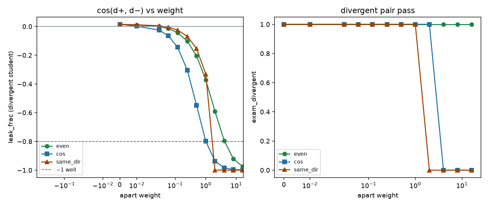

# Student-apart regularizer: caption teacher, push ±1 apart

Generated by `analysis/slider2d/run_lm_apart.py`. CPU only, no Hub,
no GPU, no Music 3 weights. Does not change the live trainer default.

The teacher stays a real caption (`t± = h±`, `--lm_target faithful`).
The new term is on the **student**: +1 and −1 are pushed apart so
`leak_frac = cos(d+, d−)` of the fitted leftover-bipolar residual
goes down, without moving the target to the midpoint. Three kinds:

- `even` — `‖½(d+ + d−)‖²` (mean-squared, same scale as pole MSE)
- `cos` — `cos(d+, d−)` itself (leak_frac)
- `same_dir` — `‖even‖ / (‖even‖ + ‖odd‖)`

Caption poles pass `exam_divergent` and sit at leak_frac +0.03 to
+0.12. Pair-odd / midpoint / hub / project sit at −1 and fail energy.
`faithful_attrs` (leak_frac −0.08, divergent pass) is a data pin,
not a train recipe. leak_frac ≈ −1 that fails divergent is the
midpoint Goodhart (v14/v15). Banned. A regularizer that secretly
implements pair-odd fails the same way and is not a win.

## The criterion

`exam_divergent` must be True. `leak_frac` of the fitted ±1 student
on that pair must be negative, and must stay above
`-0.8` so the row is not the −1 well.

## Verdict

**`faithful_apart_even_w0.25`** — `--lm_target faithful --pole_mode hidden` 
plus `--apart_kind even --apart_weight 0.25`.
exam_divergent **pass**, leak_frac -0.102,
exam_close pass, leftover leak
+0.228.
Teacher is still the caption. Live default is unchanged.

```bash
python conceptmod/textsliders/train_lm_slider_music3.py \
  --name energy-lm-apart \
  --prompts_file conceptmod/textsliders/data/prompts-energy-v4.yaml \
  --lm_target faithful --pole_mode hidden \
  --apart_kind even --apart_weight 0.25 \
  --rank 8 --alpha 8 --lr 5e-4 --steps 800 --seed 7 \
  --no-early_stop --endreg_weight 1.0
```

This is not a live listen. The card is the CPU exam only.

## Weight sweep

Teacher `faithful`, pole_mode `hidden`. `leak_frac` is
`leftover_bipolar` of the divergent-pair student. leftover leak
is unused-ê `leak_tok` on the #22 leftover sheet, same teacher
and regularizer. Neither leftover leak nor pair-odd cos is scored.

| kind | weight | exam_divergent | exam_close | leak_frac | leftover leak | same_dir | tag |
|---|---:|---|---|---:|---:|---:|---|
| `even` | 0 | pass | pass | +0.015 | +0.228 | 0.504 | divergent, leak_frac≥0 |
| `even` | 0.01 | pass | pass | +0.010 | +0.228 | 0.503 | divergent, leak_frac≥0 |
| `even` | 0.03 | pass | pass | +0.000 | +0.228 | 0.500 | divergent, leak_frac≥0 |
| `even` | 0.06 | pass | pass | -0.015 | +0.228 | 0.496 | **win** |
| `even` | 0.12 | pass | pass | -0.043 | +0.228 | 0.489 | **win** |
| `even` | 0.25 | pass | pass | -0.102 | +0.228 | 0.474 | **win** |
| `even` | 0.5 | pass | pass | -0.205 | +0.228 | 0.448 | **win** |
| `even` | 1 | pass | pass | -0.372 | +0.228 | 0.404 | **win** |
| `even` | 2 | pass | pass | -0.590 | +0.228 | 0.337 | **win** |
| `even` | 4 | pass | pass | -0.795 | +0.228 | 0.253 | **win** |
| `even` | 8 | pass | pass | -0.921 | +0.228 | 0.169 | divergent+neg (in −1 well) |
| `even` | 16 | pass | pass | -0.975 | +0.228 | 0.101 | divergent+neg (in −1 well) |
| `cos` | 0 | pass | pass | +0.015 | +0.228 | 0.504 | divergent, leak_frac≥0 |
| `cos` | 0.01 | pass | pass | +0.002 | +0.224 | 0.500 | divergent, leak_frac≥0 |
| `cos` | 0.03 | pass | pass | -0.025 | +0.218 | 0.494 | **win** |
| `cos` | 0.06 | pass | pass | -0.065 | +0.209 | 0.484 | **win** |
| `cos` | 0.12 | pass | pass | -0.145 | +0.194 | 0.464 | **win** |
| `cos` | 0.25 | pass | pass | -0.305 | +0.179 | 0.422 | **win** |
| `cos` | 0.5 | pass | pass | -0.549 | +0.177 | 0.351 | **win** |
| `cos` | 1 | pass | pass | -0.799 | +0.191 | 0.251 | **win** |
| `cos` | 2 | pass | pass | -0.937 | +0.206 | 0.153 | divergent+neg (in −1 well) |
| `cos` | 4 | **fail** | pass | -0.983 | +0.216 | 0.085 | pair-odd (banned) |
| `cos` | 8 | **fail** | pass | -0.996 | +0.222 | 0.045 | pair-odd (banned) |
| `cos` | 16 | **fail** | pass | -0.999 | +0.225 | 0.029 | pair-odd (banned) |
| `same_dir` | 0 | pass | pass | +0.015 | +0.228 | 0.504 | divergent, leak_frac≥0 |
| `same_dir` | 0.01 | pass | pass | +0.012 | +0.227 | 0.503 | divergent, leak_frac≥0 |
| `same_dir` | 0.03 | pass | pass | +0.005 | +0.225 | 0.501 | divergent, leak_frac≥0 |
| `same_dir` | 0.06 | pass | pass | -0.005 | +0.222 | 0.499 | **win** |
| `same_dir` | 0.12 | pass | pass | -0.025 | +0.218 | 0.494 | **win** |
| `same_dir` | 0.25 | pass | pass | -0.069 | +0.208 | 0.483 | **win** |
| `same_dir` | 0.5 | pass | pass | -0.154 | +0.192 | 0.461 | **win** |
| `same_dir` | 1 | pass | pass | -0.331 | +0.224 | 0.415 | **win** |
| `same_dir` | 2 | **fail** | pass | -0.999 | +0.220 | 0.018 | pair-odd (banned) |
| `same_dir` | 4 | **fail** | pass | -1.000 | +0.210 | 0.006 | pair-odd (banned) |
| `same_dir` | 8 | **fail** | pass | -1.000 | +0.210 | 0.004 | pair-odd (banned) |
| `same_dir` | 16 | **fail** | pass | -1.000 | +0.207 | 0.006 | pair-odd (banned) |



## What each kind does

The student is `δ(σ) = σ·w_odd + |σ|·w_even`, so
`d+ = w_odd + w_even`, `d− = −w_odd + w_even`, and
`leak_frac = (‖even‖² − ‖odd‖²) / (‖even‖² + ‖odd‖²)`.
Faithful MSE wants `w_even = c`. The regularizer wants
`w_even → 0`. Equilibrium is `w_even = c / (1 + λ')`. At
`λ' = 0` leak_frac is the caption value (slightly positive on
energy-v4). At `λ' → ∞` the student is pair-odd and sings both
tracks. The question is whether leak_frac crosses 0 while the
continuation still stays on one song.

## Live default

Unchanged: `--lm_target v9` / `--pole_mode hidden`. v4 yamls are
not rewritten. No live listen is invented.

## How to run

```bash
PYTHONPATH=. python analysis/slider2d/run_lm_apart.py --out docs/lm-student-apart
PYTHONPATH=. pytest tests/test_lm_student_apart.py -q
```

CPU only. No Hub, no GPU, no Music 3 weights.

Pair-exam `400` steps, 8-token rollout, 4 draws; leftover sheet
`400` Adam steps. Seed `0`.
