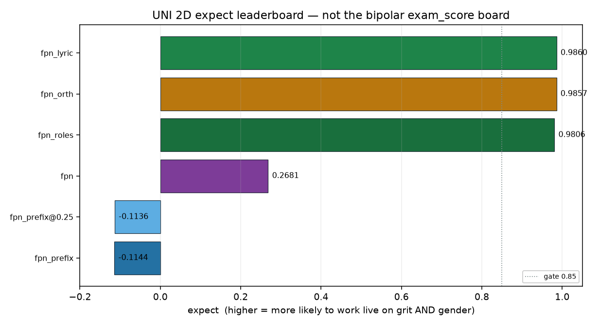

# UNI 2D expect leaderboard

Generated by `analysis/slider2d/run_lm_expect.py`. CPU only, no Hub,
no GPU, no Music 3 weights. Does not change the live trainer default
(`--lm_target v9` / `--pole_mode hidden`). This is **not** the
compiled bipolar `exam_score` board and is not ranked on
`leak_frac` or last-50 `c+` / `p%`.

One sortable number per live UNI recipe: **how good we expect it
to be live on both grit lyrics and gender.** Same fixture, same
seed. Joint cell is the PR #52 lyric/gender exam, scored with the
live `--lm_target` losses already on main (`#50` lyric, `#49`
roles, `#51` orth). Those flags are not re-implemented here.

**#1 is `faithful_plus_neu_lyric` at expect `0.9860`.**

## Sorted expect

1. `faithful_plus_neu_lyric` — **0.9860**
2. `faithful_plus_neu_orth` — **0.9857**
3. `faithful_plus_neu_roles` — **0.9806**
4. `faithful_plus_neu` — **0.2681**
5. `faithful_plus_neu_prefix@0.25` — **-0.1136**
6. `faithful_plus_neu_prefix` — **-0.1144**

## Table

Sorted by `expect` descending. `cover` is the mean of grit and
gender covers. `neu_hold` is the worse of the two cells.

| rank | recipe | expect | grit lyric | gender_move | cover | neu_hold |
|---:|---|---:|---:|---:|---:|---:|
| 1 | `faithful_plus_neu_lyric` | 0.9860 | 1.0000 | 1.0000 | 0.9808 | 1.0000 |
| 2 | `faithful_plus_neu_orth` | 0.9857 | 1.0000 | 1.0000 | 0.9808 | 1.0000 |
| 3 | `faithful_plus_neu_roles` | 0.9806 | 1.0000 | 0.9753 | 0.9808 | 1.0000 |
| 4 | `faithful_plus_neu` | 0.2681 | 0.3333 | 0.8716 | 1.0000 | 1.0000 |
| 5 | `faithful_plus_neu_prefix@0.25` | -0.1136 | 1.0000 | 0.0000 | 0.9958 | 1.0000 |
| 6 | `faithful_plus_neu_prefix` | -0.1144 | 1.0000 | 0.0000 | 0.9859 | 1.0000 |



## The number

Gates are the existing pair-exam floor: lyric_recall ≥ `0.85`, gender_move ≥ `0.85`, cover ≥ `0.85`, neu_hold ≥ `0.85`.

```
bottleneck = min(grit_lyric_recall, gender_move, grit_cover, gender_cover, neu_hold)
expect     = bottleneck
           - 0.15 * max(0, 0.85 - grit_lyric_recall)
           - 0.15 * max(0, 0.85 - gender_move)
           + 0.02 * (0.35 * leftover_cover
                          + 0.20 * leftover_neu_hold
                          + 0.15 * unused_off_caption_slack
                          + 0.15 * caption_move
                          + 0.10 * lyric_pin
                          + 0.05 * leftover_cover_digits)
```

Why the extra term: the suggested `min` plus miss penalties already
rank a cover-collapse lyric-saver below a recipe that keeps `h+`.
Without a leftover, two HITs with the same bottleneck print the
same 1.000. Residual cover / neu_hold / unused off-caption slack /
caption_move / lyric_pin / leftover cover digits are scaled by
`0.02` so they cannot flip a gate miss (`0.15`) or a
`0.05` bottleneck gap.

Required live recipes: `faithful_plus_neu`, `faithful_plus_neu_prefix`, `faithful_plus_neu_lyric`, `faithful_plus_neu_roles`, `faithful_plus_neu_orth`. Optional ablation: `faithful_plus_neu_prefix@0.25` via the
already-wired `prefix_weight` on `lm_plus_neu_prefix_loss`.

## Both pair types, one board

1. **Grit-like / divergent** — yaml lyrics in the prefix, concept
   words in the + caption. Fail = sings `punk punk`.
2. **Gender-like / close** — same room, only Vocal Details flips
   woman vs ungendered. Fail = pinned to neu / `gender_move` miss.

## Per-cell rows

### grit-like / divergent

| recipe | lyric_recall | cover | neu_hold | sings lyrics |
|---|---:|---:|---:|---|
| `faithful_plus_neu_lyric` | 1.0000 | 0.9804 | 1.0000 | `lyric0 lyric0 lyric0 lyric0 | lyric1 lyric1 lyric1 lyric1 | lyric2 lyric2 lyric2 lyric2` |
| `faithful_plus_neu_orth` | 1.0000 | 0.9804 | 1.0000 | `lyric0 lyric0 lyric0 lyric0 | lyric1 lyric1 lyric1 lyric1 | lyric2 lyric2 lyric2 lyric2` |
| `faithful_plus_neu_roles` | 1.0000 | 0.9804 | 1.0000 | `lyric0 lyric0 lyric0 lyric0 | lyric1 lyric1 lyric1 lyric1 | lyric2 lyric2 lyric2 lyric2` |
| `faithful_plus_neu` | 0.3333 | 1.0000 | 1.0000 | `punk punk punk punk | lyric1 lyric1 lyric1 lyric1 | punk punk punk punk` |
| `faithful_plus_neu_prefix@0.25` | 1.0000 | 0.9957 | 1.0000 | `lyric0 lyric0 lyric0 lyric0 | lyric1 lyric1 lyric1 lyric1 | lyric2 lyric2 lyric2 lyric2` |
| `faithful_plus_neu_prefix` | 1.0000 | 0.9856 | 1.0000 | `lyric0 lyric0 lyric0 lyric0 | lyric1 lyric1 lyric1 lyric1 | lyric2 lyric2 lyric2 lyric2` |

### gender-like / close

| recipe | gender_move | cover | neu_hold | Vocal Details @ +1 |
|---|---:|---:|---:|---|
| `faithful_plus_neu_lyric` | 1.0000 | 0.9813 | 1.0000 | `female | female | female` |
| `faithful_plus_neu_orth` | 1.0000 | 0.9813 | 1.0000 | `female | female | female` |
| `faithful_plus_neu_roles` | 0.9753 | 0.9813 | 1.0000 | `female | female | female` |
| `faithful_plus_neu` | 0.8716 | 1.0000 | 1.0000 | `female | female | female` |
| `faithful_plus_neu_prefix@0.25` | 0.0000 | 0.9959 | 1.0000 | `— | — | —` |
| `faithful_plus_neu_prefix` | 0.0000 | 0.9862 | 1.0000 | `— | — | —` |

## Recipe cards (opt-in, already on main)

- `faithful_plus_neu` — last-hidden UNI only (#46)
- `faithful_plus_neu_prefix` — whole encode(neu) prefix hold (#48)
- `faithful_plus_neu_prefix@0.25` — same prefix hold, lower prefix_weight (already wired)
- `faithful_plus_neu_lyric` — yaml lyrics → encode(neu); caption span free (#50)
- `faithful_plus_neu_roles` — lyrics → encode(neu), Vocal Details → encode(pos) (#49)
- `faithful_plus_neu_orth` — live last-delta / lyric-span UNI (#51); last token still raw h+

Default stays `--lm_target v9` / `--pole_mode hidden`.
No Music 3 train, no GPU, no Hub, no weights on this page.

## Related cells

- [lm-lyric-hold.md](lm-lyric-hold.md) — lyric-token hold board (#50).
- [lm-roles.md](lm-roles.md) — role-split board (#49).
- [lm-lyric-orth.md](lm-lyric-orth.md) — last-delta / lyric-span board (#51).
- [lm-plus-neu-exam.md](lm-plus-neu-exam.md) — last-hidden cover / neu_hold.
- [lm-2d-scoreboard.md](lm-2d-scoreboard.md) — compiled bipolar board (not updated).

## How to run

```bash
PYTHONPATH=. python analysis/slider2d/run_lm_expect.py --out docs/lm-uni-expect
PYTHONPATH=. pytest tests/test_lm_uni_expect.py -q
```

CPU only. No Hub, no GPU, no Music 3 weights. Seed `0`, `400` Adam steps.

Winner: `faithful_plus_neu_lyric` expect 0.9860 (grit lyric 1.0000, gender_move 1.0000, cover 0.9808, neu_hold 1.0000).

