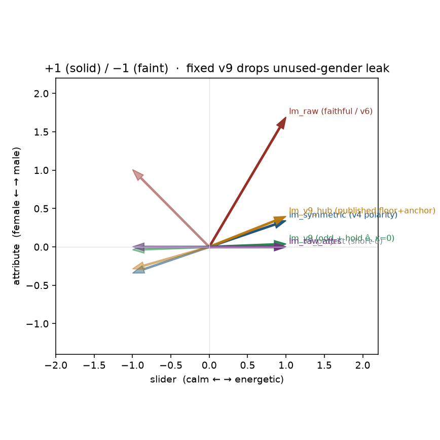
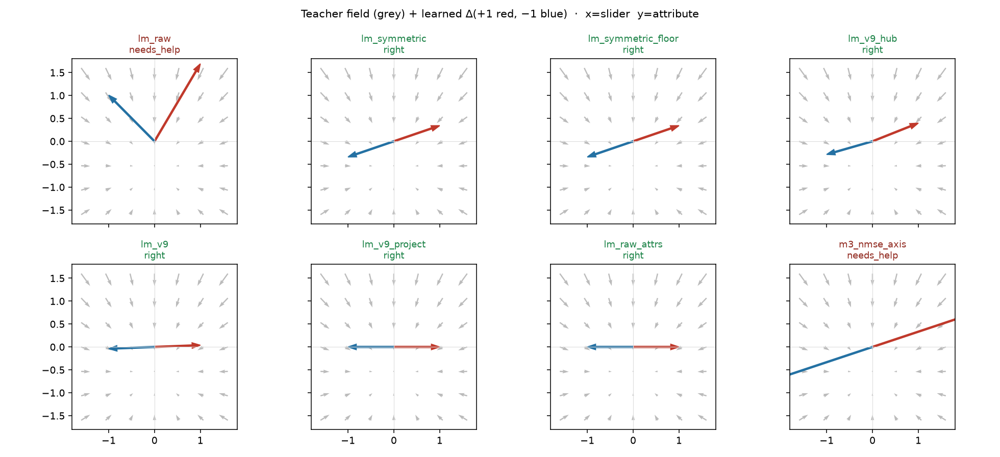
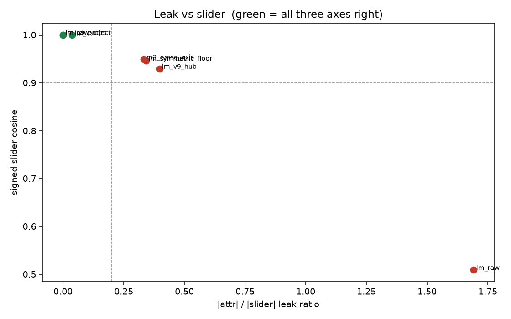

# LM v9 formulation on the 2-D CPU field

Same geometry as [2d-analysis.md](2d-analysis.md): energetic ↔ calm
versus unused male ↔ female. This scores the **loss / target math**,
not Hub weights and not caption BPM.

Published Hub v9 (`leakage_floor` + `anchor_weight`) cannot see
unused-gender leak: that component already lives in the odd teacher
`(pos − neg) / 2`. The default scored here (`lm_v9`) keeps Hub
positives (odd ±1, slider-axis track, κ = 0) and **holds a declared
leak axis ê** — penalize `(h(±1)−h0) · ê`. Teacher stays the full
pair-odd. Short û project is `lm_v9_project`, not the default.
Ungated captions only; `--attributes` is not used.

The live `train_lm_slider_music3.py` default (`--lm_target v9`)
is this hold-ê recipe. Gender/energy cells are in
[lm-live-cells.md](lm-live-cells.md). Endreg / planreg /
semantic-KL poles are AR-only and are not on this field.

## Verdict

**`lm_v9` is right on all three.** Slider **right**,
unused-gender leak **right**, ±1 collapse
**right**. Published Hub v9 (`lm_v9_hub`) stays
slider **right**, leak **needs_help**,
collapse **right** — same leak as `--symmetric`.

| method | slider | leak | ±1 collapse | slider cos | leak ratio | ±1 cos |
|---|---|---|---|---:|---:|---:|
| `lm_raw` | **needs_help** | **needs_help** | **needs_help** | 0.509 | 1.692 | 0.253 |
| `lm_symmetric` | **right** | **needs_help** | **right** | 0.946 | 0.342 | -1.000 |
| `lm_symmetric_floor` | **right** | **needs_help** | **right** | 0.946 | 0.342 | -1.000 |
| `lm_v9_hub` | **right** | **needs_help** | **right** | 0.929 | 0.397 | -0.995 |
| `lm_v9` | **right** | **right** | **right** | 0.999 | 0.038 | -1.000 |
| `lm_v9_project` | **right** | **right** | **right** | 1.000 | 0.000 | -1.000 |
| `lm_raw_attrs` | **right** | **right** | **right** | 1.000 | 0.000 | -1.000 |
| `m3_nmse_axis` | **right** | **needs_help** | **right** | 0.949 | 0.333 | -1.000 |







## What each flag does here

- `lm_raw` / v6 `target_mode: faithful`: poles are raw `pos`/`neg`.
  ±1 cos=0.253 (even-mode collapse).
  Leak 1.692 — both poles sit above quiet `song`
  *and* `energetic` already leaks male.
- `lm_symmetric` / v4 polarity: `tgt(±1) = neu ± (pos−neg)/2`.
  Collapse **right** (-1.000). Leak
  0.342 remains — it lives in the odd teacher.
- `lm_symmetric_floor`: `leakage_floor=-0.9` with `anchor_weight=0`.
  Identical to symmetric (leak 0.342,
  ±1 -1.000). The floor is inert
  without an anchor term.
- `lm_v9_hub`: published Hub recipe (symmetric + `anchor_weight=0.3`
  + autocal κ from `leakage_floor=-0.9`). On this pair r=0.253,
  κ=0.177. Leak 0.397 —
  same leaked odd axis as `--symmetric`. Blend-back can make leak
  slightly *worse* than plain symmetric.
- `lm_v9` (default): κ=0 (no even blend-back) + full odd teacher
  + hold along unused-attr ê (λ=8). Leak 0.038,
  ±1 -1.000,
  slider cos 0.999. Ungated captions.
- `lm_v9_project`: old short-û project+hold. Leak-0 on this cell
  because û *is* the pole names — not energy, not the default.
- `lm_raw_attrs`: `--attributes male,female` also zeros leak
  (0.000) by changing the *captions*.
  That row is the paper disentangle, not the v9 formulation.
- TF `nmse`+`axis`: leak 0.333, already
  measured in [tf-leak.md](tf-leak.md). Default TF is not the v9 question.

## Why the published floor cannot kill unused-gender leak

Hub v9 as shipped:

```
a = (h+ − h−) / 2
t± = h0 ± a                         # still the leaked pos−neg
κ = √(ρ² · (1 + floor) / (1 − floor))
anchor± = (1 − κ)(h0 ± a) + κ h±    # even blend-back only
```

Ungated pair: r = 0.253, odd leak = 0.342.
`leakage_floor` sizes how much even mode may return. Unused gender
is already inside `a`.

Fixed default:

```
a = (h+ − h−) / 2
t± = h0 ± a                         # full pair-odd, κ = 0
L = MSE(h(±1), t±) + λ · ((h(±1)−h0) · ê)²
```

ê is a declared unused axis (mix / BPM / genre / unused gender),
not short `slider_positive`. On this field ê = male↔female.
If yaml `attributes` already pin the unused axis, omit ê and hold
is 0. Old `(a·û)û` project is `--lm_target v9_project`.

## What this field cannot see

- **Declared û ≠ pole names.** This field sets û from energetic↔calm
  polarity, so project-odd is nearly identity on the intended axis
  (`|odd·û|/||odd|| ≈ 0.95`) and cannot reproduce gender-v1. That
  failure is the mismatch cell in [lm-v9-mismatch.md](lm-v9-mismatch.md).
- AR endreg / planreg / `pole_mode: semantic_kl` / `collapse_weight`
  (v6 had those; v9 turns planreg and collapse off).
- Real Music 3 hidden geometry, Hub weights, v7 prompt yamls.
- Caption-BPM leak (that is a TF pair fact; see tf-leak.md).

## How to run

```bash
PYTHONPATH=. python analysis/slider2d/run_lm_v9.py --out docs/lm-v9-2d
PYTHONPATH=. pytest tests/test_lm_v9_2d.py tests/test_2d_slider_geometry.py -q
```

CPU only. No Hub, no GPU, no Music 3 weights.

Seed `0`, `200` Adam steps.

