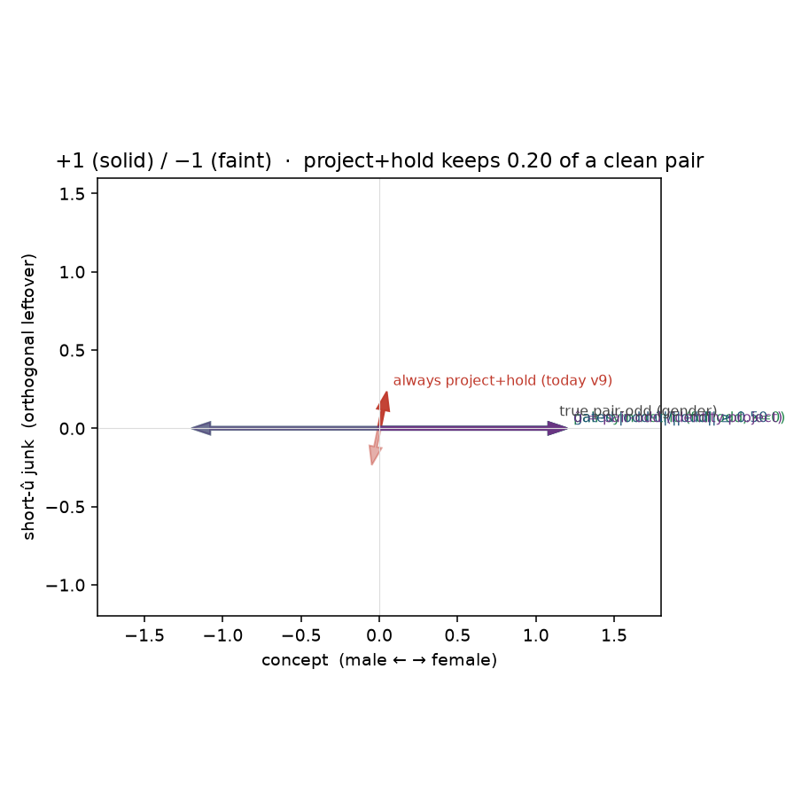
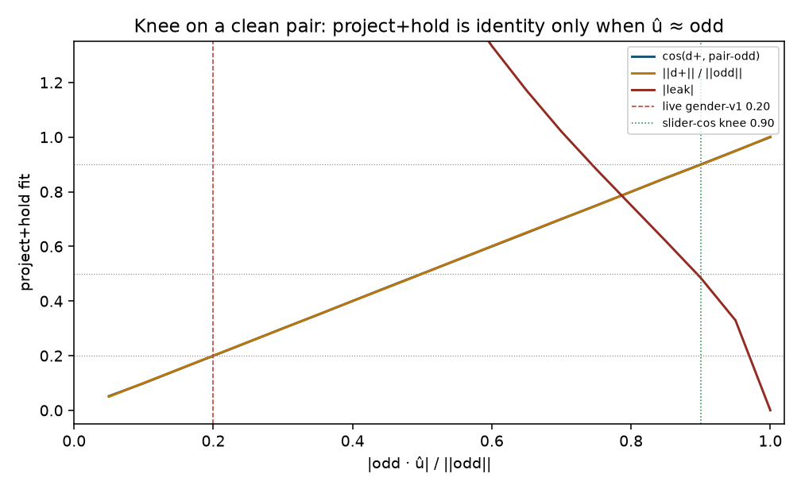

# LM v9 mismatch: clean pair vs a short declared û

The energetic×gender cell in [lm-v9-2d.md](lm-v9-2d.md) sets û from
the pole names (energetic↔calm). There û **is** the intended slider,
so `project_odd` + hold looks leak-0 and **cannot see gender-v1**.
Someone who only checks “û = pole names” will re-blind the suite.

Energy is a different geometry (leaky pair, short û at 0.48/0.68).
Do not read the leak-0 row below as energy — û there is still the
pole names. Both live cells and the one default loss are in
[lm-live-cells.md](lm-live-cells.md).

This cell is the live gender geometry. Poles are a rich/clean pair
whose `(pos − neg)` is already the concept. Declared û is a
*different* short phrase with `|odd·û|/||odd|| ≈ 0.20` — the number
logged on gender-v1 against
`A woman is singing, her voice is feminine.` /
`A man is singing, his voice is masculine.`. Current `lm_v9`
(always project + hold) **fails**. Hub / pair-symmetric **passes**.

CPU only. No Hub, no GPU, no Music 3 weights.

## Why the old fixture was blind

On the leak cell, `pair_slider_dir` returns `E_SLIDER` from the
energetic/calm polarity. Ungated `energetic − calm` already lies
mostly on that axis (`|odd·û|/||odd|| = 0.946`), so
projecting drops unused gender and the hold has nothing left to
eat. Gender-v1 is the opposite: the structured poles *are* the
singer, and the short declared captions are a weak, tilted û.
Projecting keeps `0.20` of the pair; hold treats the other `80%`
as unused leak. Slider *strength* after hold — `||d+|| / ||odd||`
— is the measurement the leak-ratio-only suite omitted.

## Verdict

**Current `lm_v9` fails this cell.** `odd·û/||odd|| = 0.20`,
`||d+|| = 0.240` (strength 0.200),
`cos(d+, pair-odd) = 0.20`, leak +4.899.
Pair-symmetric keeps the concept (`||d+|| = 1.200`,
cos 1.000, leak +0.000,
collapse -1.000).
2-D collapse stays −1 for both (targets remain odd); live gender-v1’s
−0.562 is high-D / LoRA capacity, not this field.

Mismatch cell (clean pair, short û at 0.20):

| policy | slider | leak | ±1 | strength | odd·û | ||d+|| | ||d+||/||odd|| | cos | leak | collapse |
|---|---|---|---|---|---:|---:|---:|---:|---:|---:|
| `pair_symmetric` | **right** | **right** | **right** | **right** | 1.000 | 1.200 | 1.000 | 1.000 | +0.000 | -1.000 |
| `always_project_hold` | **needs_help** | **needs_help** | **right** | **needs_help** | 0.200 | 0.240 | 0.200 | 0.200 | +4.899 | -1.000 |
| `gated_align` | **right** | **right** | **right** | **right** | 0.200 | 1.200 | 1.000 | 1.000 | +0.000 | -1.000 |
| `u_is_pair_odd` | **right** | **right** | **right** | **right** | 1.000 | 1.200 | 1.000 | 1.000 | +0.000 | -1.000 |

Leak cell (energetic×gender, û = pole names) — `lm_v9` must stay leak-0:

| policy | slider | leak | ±1 | strength | odd·û | ||d+|| | strength | cos | leak | collapse |
|---|---|---|---|---|---:|---:|---:|---:|---:|---:|
| `pair_symmetric` | **right** | **needs_help** | **right** | **right** | 0.946 | 1.057 | 1.057 | 0.946 | +0.342 | -1.000 |
| `always_project_hold` | **right** | **right** | **right** | **right** | 0.946 | 1.000 | 1.000 | 1.000 | +0.000 | -1.000 |
| `gated_align` | **right** | **right** | **right** | **right** | 0.946 | 1.000 | 1.000 | 1.000 | +0.000 | -1.000 |
| `u_is_pair_odd` | **right** | **needs_help** | **right** | **right** | 1.000 | 1.057 | 1.057 | 0.946 | +0.342 | -1.000 |





## Knee

On a clean pair, an exact project onto û realizes
`cos(d+, odd) = |odd·û|/||odd||` and `||d+||/||odd||` equal to the
same number. Sweeping û’s tilt:

- slider-cos ≥ 0.90 at align **0.95**
- strength ≥ 0.50 at align **0.55**
- |leak| ≤ 0.20 at align **1.0**
- all four right at align **1.0**

Live gender-v1 sat at **0.20** — well below every
knee. The leak cell sits at **0.946**. Any floor in
`(0.20, 0.95)` is right on both
scored cells. The opt-in `--project_align_min 0.5`
is the majority-of-odd rule in that gap. The slider-cos knee
(0.9) is the stricter “û must already be
the pair” line; at 0.90, projecting only drops a small residual.

|odd·û|/||odd|| **alone cannot tell energy from gender** in the
abstract: a leaky pair + a clean û can print the same 0.20 as a
clean pair + a weak û. The two cells we have are not that tie.
The leak cell’s short û *is* the pole polarity and is already
0.95-aligned; gender-v1’s short û was not. When the
number is small, the conservative fallback (keep the pair, drop
hold) is what gender needed. Do not treat 0.20 as “û is the
intended concept, pair is junk” without another check.

## What each policy does

- `pair_symmetric` / Hub-on-pair (full odd, κ=0): **pass** mismatch,
  **fail** leak (unused gender stays in `(pos−neg)/2`).
- `always_project_hold` / today’s `--lm_target v9`: **fail** mismatch
  (strength 0.200, cos 0.20),
  **pass** leak (leak-0).
- `gated_align` (`--project_align_min 0.5`):
  **pass** both. Mismatch alignment 0.20 < 0.50
  → pair-symmetric, hold off. Leak alignment 0.946 ≥ 0.50 → project+hold.
- `u_is_pair_odd`: project onto `(pos−neg)` itself. Identity on a
  clean pair (**pass** mismatch) and a no-op on a leaky pair
  (**fail** leak). Same geometry as pair-symmetric.

## Train recommendation (gender vs energy)

This cell is gender. Energy is **not** the leak-0 row above — that
row still sets û from pole names (0.95). Live energy was 0.48 / 0.68
and a hard per-row 0.50 gate mixed teachers. The one default that is
right on both live cells is slider-level `--lm_target v9` (mean
`|odd·û|/||odd||` ≥ 0.5, same teacher on
every row). See [lm-live-cells.md](lm-live-cells.md). Old
always-project is `--lm_target v9_always`. Hub still leaks unused
attr on a leaky pair.

## How to run

```bash
PYTHONPATH=. python analysis/slider2d/run_lm_mismatch.py --out docs/lm-v9-mismatch
PYTHONPATH=. pytest tests/test_lm_live_cells.py tests/test_lm_v9_mismatch.py tests/test_lm_v9_2d.py tests/test_lm_trainer_v9.py -q
```

Seed `0`, `200` Adam steps.

